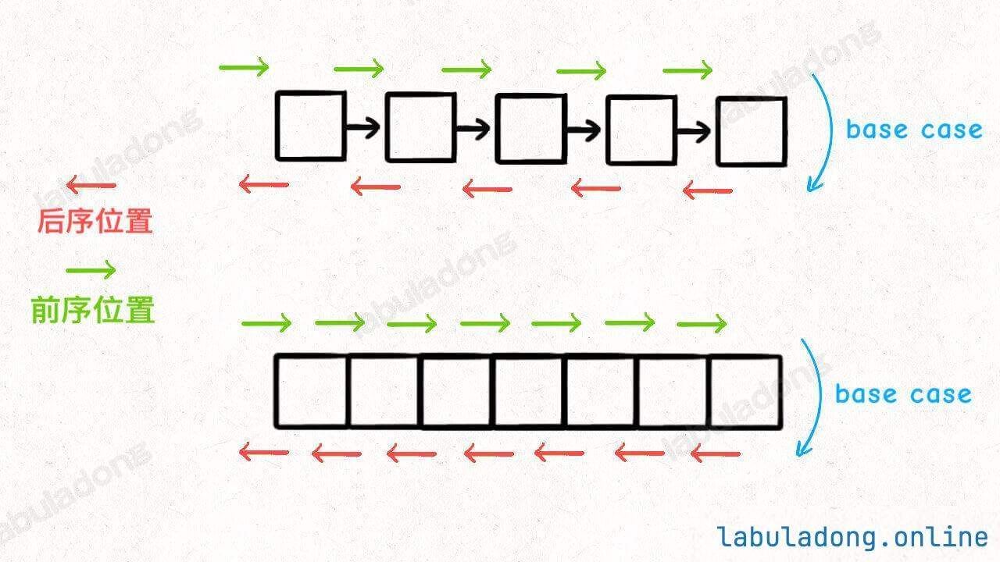
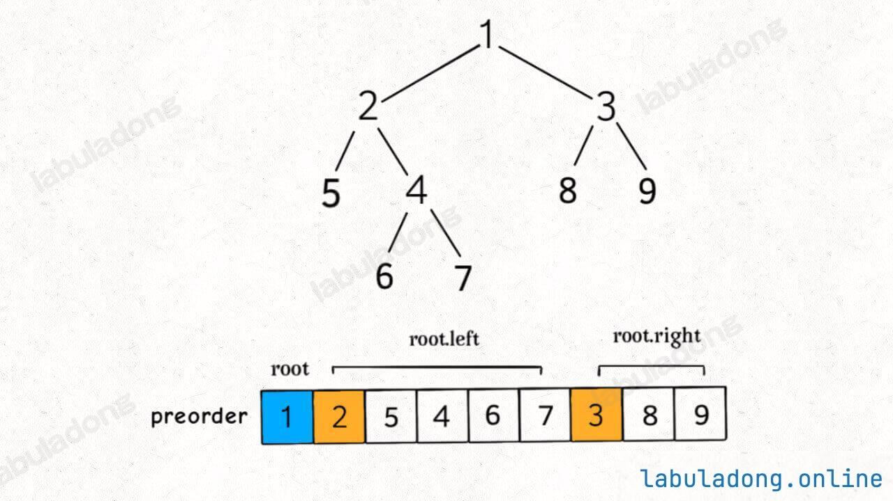

# 二叉树算法的核心纲领

先在开头总结一下，二叉树解题的思维模式分两类：

1. 是否可以通过遍历一遍二叉树得到答案？如果可以，用一个 `traverse` 函数配合外部变量来实现，这叫「遍历」的思维模式。
2. 是否可以定义一个递归函数，通过子问题（子树）的答案推导出原问题的答案？如果可以，写出这个递归函数的定义，并充分利用这个函数的返回值，这叫「分解问题」的思维模式。

无论使用哪种思维模式，我们都需要思考：
如果单独抽出一个二叉树节点，它需要做什么事情？需要在什么时候（前/中/后序位置）做？其他的节点不用你操心，递归函数会帮你在所有节点上执行相同的操作。

## 深入理解前中后序

首先，回顾一下 二叉树的 DFS/BFS 遍历 中说到的二叉树递归遍历框架：

```java
// 二叉树的遍历框架
void traverse(TreeNode root) {
    if (root == null) {
        return;
    }
    // 前序位置
    traverse(root.left);
    // 中序位置
    traverse(root.right);
    // 后序位置
}
```

先不管所谓前中后序，单看 traverse 函数，你说它在做什么事情？

其实它就是一个能够遍历二叉树所有节点的一个函数，和你遍历数组或者链表本质上没有区别：

```java
// 迭代遍历数组
void traverse(int[] arr) {
    for (int i = 0; i < arr.length; i++) {

    }
}

// 递归遍历数组
void traverse(int[] arr, int i) {
    if (i == arr.length) {
        return;
    }
    // 前序位置
    traverse(arr, i + 1);
    // 后序位置
}

// 迭代遍历单链表
void traverse(ListNode head) {
    for (ListNode p = head; p != null; p = p.next) {

    }
}

// 递归遍历单链表
void traverse(ListNode head) {
    if (head == null) {
        return;
    }
    // 前序位置
    traverse(head.next);
    // 后序位置
}
```

单链表和数组的遍历可以是迭代的，也可以是递归的，二叉树这种结构无非就是二叉链表，它没办法简单改写成 for 循环的迭代形式，所以我们遍历二叉树一般都使用递归形式。

你也注意到了，只要是递归形式的遍历，都可以有前序位置和后序位置，分别在递归之前和递归之后。

所谓前序位置，就是刚进入一个节点（元素）的时候，后序位置就是即将离开一个节点（元素）的时候，那么进一步，你把代码写在不同位置，代码执行的时机也不同：



比如说，如果让你倒序打印一条单链表上所有节点的值，你怎么搞？

实现方式当然有很多，但如果你对递归的理解足够透彻，可以利用后序位置来操作：

```java
// 递归遍历单链表，倒序打印链表元素
void traverse(ListNode head) {
    if (head == null) {
        return;
    }
    traverse(head.next);
    // 后序位置
    print(head.val);
}
```

本质上是利用递归的堆栈帮你实现了倒序遍历的效果。

前中后序是遍历二叉树过程中处理每一个节点的三个特殊时间点，绝不仅仅是三个顺序不同的 List：

**前序位置的代码在刚刚进入一个二叉树节点的时候执行；**
**后序位置的代码在将要离开一个二叉树节点的时候执行；**
**中序位置的代码在一个二叉树节点左子树都遍历完，即将开始遍历右子树的时候执行。**

与常说的前中后序「遍历」有所区别：你可以在前序位置写代码往一个 List 里面塞元素，那最后得到的就是前序遍历结果；但并不是说你就不可以写更复杂的代码做更复杂的事。

二叉树的所有问题，就是让你在前中后序位置注入巧妙的代码逻辑，去达到自己的目的，你只需要单独思考每一个节点应该做什么，其他的不用你管，抛给二叉树遍历框架，递归会在所有节点上做相同的操作。

## 两种解题思路

[leetcode 144](https://leetcode.cn/problems/binary-tree-preorder-traversal/description/)

这题只是让我们去解决一下关于二叉树的前序遍历。常规的处理方式是直接使用**递归**的方法去处理。

```java
class Solution {
    List<Integer> list = new ArrayList<>();

    public void traverse(TreeNode root) {
        if (root == null) {
            return;
        }

        list.add(root.val);
        traverse(root.left);
        traverse(root.right);
    }

    public List<Integer> preorderTraversal(TreeNode root) {
        traverse(root);
        return list;
    }
}
```

那么有没有其他办法可以不在定义其他函数的情况下处理这个问题呢？



那这不就可以分解问题了么，**一棵二叉树的前序遍历结果 = 根节点 + 左子树的前序遍历结果 + 右子树的前序遍历结果**。


