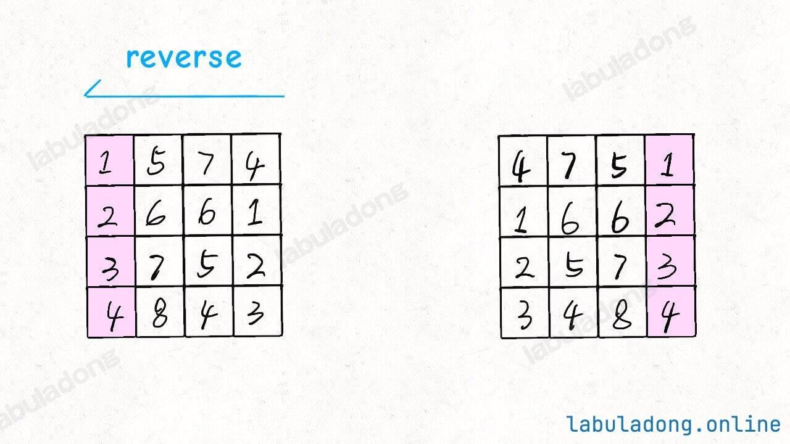

# 二维数组遍历

这篇笔记是写关于如何去处理一些常见的二维数组题目。

## 前置如何去反转字符串
[151 如何去反转一个字符串](https://leetcode.cn/problems/reverse-words-in-a-string/description/)

## 顺/逆时针旋转矩阵
[48题旋转图像](https://leetcode.cn/problems/rotate-image/)

我们先来看一下这题的例子:


那我们的解决步骤是什么样的呢？


1. 先将这个二维数组以对角线进行对折(对调数值)。
2. 每一行的数据再进一次反转。

经过上面的两步就可以把一个二维数组进行反转了。


```java
/**
 * 对一个二维数组做左上到右下的对称交换
 *
 * @param matrix 二维数组
 */
public void symmetry(int[][] matrix) {
    for (int i = 0; i < matrix.length; i++) {
        for (int j = i + 1; j < matrix.length; j++) {
            int temp = matrix[i][j];
            matrix[i][j] = matrix[j][i];
            matrix[j][i] = temp;
        }
    }
}
```

>[!note]
> 我们需要注意观察一下如果对称交换数据，如果一个 `n*n` 的矩阵，从左上角到右下角的对角线，即 `int[0][0] -> int[1][1] ->.....-> int[n][n]` ，对角线是不需要我们去交换的。
> 
> 所以这里的循环是 `for (int j = i + 1; j < matrix.length; j++)` ，我们只处理右半部分。



```java
/*
 * 反转一个一维数组
 *
 * @param array 一维数组
 */
public void reverse(int[] array) {
    int left = 0, right = array.length - 1;
    while (left <= right) {
        int temp = array[left];
        array[left] = array[right];
        array[right] = temp;

        left++;
        right--;
    }
}
```

>[!note]
> 上面的代码不做过多的解释了，很简单。


### 如何逆时针去旋转二维数组呢？


如上图的方式，我们可以沿右上角到左下角的方式进行"对折交换"，然后再对这个数组每一行做反转的处理也可以反方向旋转90度的结果了。
```java
public void symmetry2(int[][] matrix) {
    int n = matrix.length;
    // 沿左下到右上的对角线镜像对称二维矩阵
    for (int i = 0; i < n; i++) {
        for (int j = 0; j < n - i; j++) {
            // swap(matrix[i][j], matrix[n-j-1][n-i-1])
            int temp = matrix[i][j];
            matrix[i][j] = matrix[n - j - 1][n - i - 1];
            matrix[n - j - 1][n - i - 1] = temp;
        }
    }
}
```

## 矩阵的螺旋遍历

[leetcode 54 螺旋矩阵](https://leetcode.cn/problems/spiral-matrix/)

> 给你一个 m 行 n 列的矩阵 matrix ，请按照 顺时针螺旋顺序 ，返回矩阵中的所有元素。
> 
> **示例1**
> 
> 输入：`matrix = [[1,2,3],[4,5,6],[7,8,9]]`
> 输出：`[1,2,3,6,9,8,7,4,5]`
> 
> 
> **示例2**
> 
> 输入：`matrix = [[1,2,3,4],[5,6,7,8],[9,10,11,12]]`
> 输出：`[1,2,3,4,8,12,11,10,9,5,6,7]`
> 

下面给出解释的思路，我们这里可以使用**边界法**，四个边都使用边界对这个矩阵进行缩小，最终得到结果。


实现的方法为:

```java
public int[][] generateMatrix(int n) {
    int leftBounder = 0, rightBounder = n - 1;
    int upperBounder = 0, lowerBounder = n - 1;

    int[][] matrix = new int[n][n];
    // 矩阵中的值
    int num = 1;
    while (num <= n * n) {
        // 从左至右
        if (upperBounder <= lowerBounder) {
            for (int j = leftBounder; j <= rightBounder; j++) {
                matrix[upperBounder][j] = num++;
            }

            upperBounder++;
        }

        // 从上至下
        if (leftBounder <= rightBounder) {
            for (int i = upperBounder; i <= lowerBounder; i++) {
                matrix[i][rightBounder] = num++;
            }

            rightBounder--;
        }

        // 从右至左
        if (upperBounder <= lowerBounder) {
            for (int j = rightBounder; j >= leftBounder; j--) {
                matrix[lowerBounder][j] = num++;
            }
            lowerBounder--;
        }

        // 从下至上
        if (leftBounder <= rightBounder) {
            for (int i = lowerBounder; i >= upperBounder; i--) {
                matrix[i][leftBounder] = num++;
            }
            leftBounder++;
        }
    }

    return matrix;
}
```

还有一个变种的题目是 [同样是对于矩阵进行螺旋处理](https://leetcode.cn/problems/spiral-matrix-ii/)

对于这个问题我们只需要定义一下 `num` 变量然后往矩阵里加入数据即可。

```java
public int[][] generateMatrix(int n) {
    int leftBounder = 0, rightBounder = n - 1;
    int upperBounder = 0, lowerBounder = n - 1;

    int[][] matrix = new int[n][n];
    // 矩阵中的值
    int num = 1;
    while (num <= n * n) {
        // 从左至右
        if (upperBounder <= lowerBounder) {
            for (int j = leftBounder; j <= rightBounder; j++) {
                matrix[upperBounder][j] = num++;
            }

            upperBounder++;
        }

        // 从上至下
        if (leftBounder <= rightBounder) {
            for (int i = upperBounder; i <= lowerBounder; i++) {
                matrix[i][rightBounder] = num++;
            }

            rightBounder--;
        }

        // 从右至左
        if (upperBounder <= lowerBounder) {
            for (int j = rightBounder; j >= leftBounder; j--) {
                matrix[lowerBounder][j] = num++;
            }
            lowerBounder--;
        }

        // 从下至上
        if (leftBounder <= rightBounder) {
            for (int i = lowerBounder; i >= upperBounder; i--) {
                matrix[i][leftBounder] = num++;
            }
            leftBounder++;
        }
    }

    return matrix;
}
```

