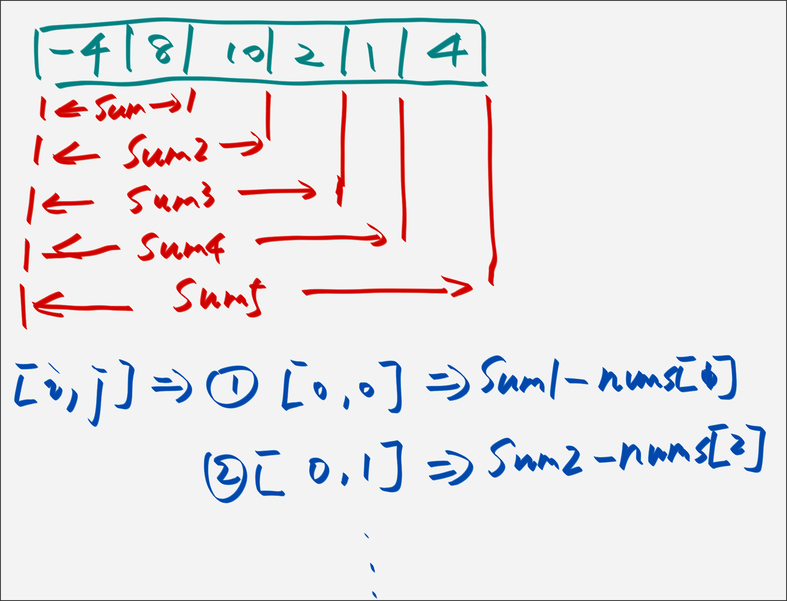

# 数组前缀和的小算法

前缀和技巧适用于快速、频繁地计算一个索引区间内的元素之和。

## 一维数组的前缀和

[leetcode 303 区域和检索](https://leetcode.cn/problems/range-sum-query-immutable/)

```
输入：
["NumArray", "sumRange", "sumRange", "sumRange"]
[[[-2, 0, 3, -5, 2, -1]], [0, 2], [2, 5], [0, 5]]
输出：
[null, 1, -1, -3]
```

我的解法就是比较常规的去处理。

```java
class NumArray {
    private int[] nums;
    private int[] preSums;

    public NumArray(int[] nums) {
        this.nums = nums;
    }

    public int sumRange(int left, int right) {
        int result = 0;

        for (int i = left; i <= right; i++) {
            result += this.nums[i];
        }

        return result;
    }
}
```

这种处理办法时间复杂度是 $O(N)$ ，但是因为测试的时候调用的次数较高，那么这种做法就不太好了。

较好的解决办法是使用区间去求和，然后再根据传入的值再去计算。




