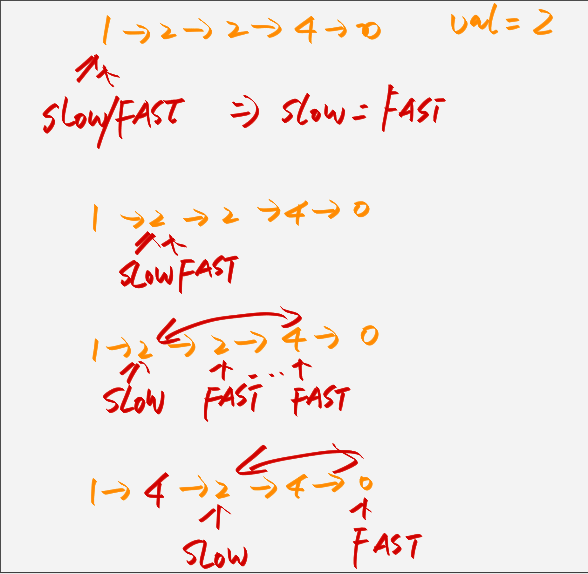
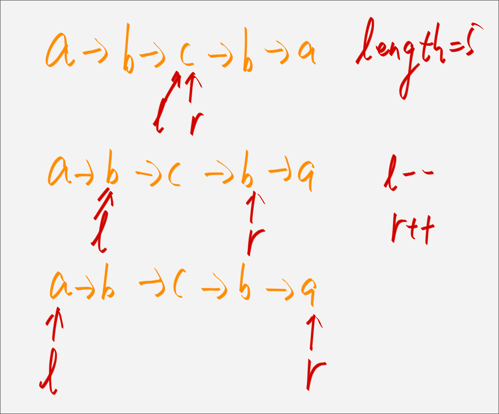
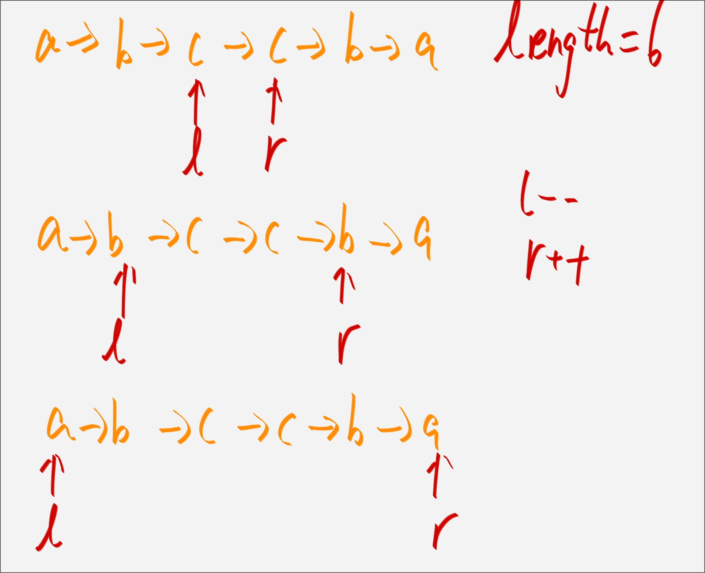

# 双指针解决数组相关问题

在处理数组和链表相关问题时，双指针技巧是常用的([[双指针链表]])，双指针技巧主要分为两类: **<u>左右指针</u>, <u>快慢指针</u>**。

<u>左右指针</u>，就是两个指针相向而行或者相背而行；而所谓快慢指针，就是两个指针同向而行，一快一慢。

对于单链表来说，大部分技巧都属于快慢指针。

在数组中并没有真正意义上的指针，但我们可以把索引当做数组中的指针，这样也可以在数组中施展双指针技巧。

## 快慢指针技巧

### 删除有序数组中的重复项

[删除有序数组中的重复项](https://leetcode.cn/problems/remove-duplicates-from-sorted-array/)

比如上面的链接的题目，就是让我们删除一个数组中的重复项。

但是要求原地删除，不允许new新数组。由于数组已经排序，所以重复的元素连在一起，找出它们其实还是比较简单的，但如果每找到一个重复元素就立即原地删除它，由于数组中删除元素涉及数据搬移，整个时间复杂度是会达到 $O(N^2)$ 。

高效解决这道题就要用到快慢指针技巧：

我们让慢指针 `slow` 走在后面，快指针 `fast` 走到前面去探路，找到一个不重复的元素就赋值给 `slow` 并让 `slow` 前进一步。

这样，就保证了 `nusm[0...slow]` 都是无重复的元素，当 `fast` 指针遍历完整个数组 `nums` 后，`nums[0...slow]` 就是整个数组去重之后的结果。

```java
public int removeDuplicates(int[] nums) {
    if (nums.length == 0) {
        return 0;
    }
    int slow = 0;
    int fast = slow + 1;

    while (fast < nums.length) {
        if (nums[slow] == nums[fast]) {
            fast++;
        } else {
            nums[++slow] = nums[fast];
        }
    }

    return slow + 1;
}
```

### 删除指定的某个元素

[移除元素 leetcode 27](https://leetcode.cn/problems/remove-element/description/)

这一题其实还是需要使用快慢指针去解决。


```java
public int removeElement(int[] nums, int val) {
    if (nums.length == 0) {
        return 0;
    }

    int slow = 0, fast = 0;
    while (fast < nums.length) {
        if (nums[fast] != val) {
            nums[slow] = nums[fast];
            slow++;
        }
        fast++;
    }

    return slow;
}
```

### 移除0元素

[移动0元素](https://leetcode.cn/problems/move-zeroes/description/)

首先的想法还是延续上面的第二章节的做法，先去除0元素，`slow` 的位置就是需要*填*0的位置，然后让 `i` 从 `slow -> length` 这个长度内全部赋值为0即可。

```java
public void moveZeroes(int[] nums) {
    int slow = 0, fast = slow;

    // 移除0元素
    while (fast < nums.length) {
        if (nums[fast] != 0) {
            nums[slow] = nums[fast];
            slow++;
        }

        fast++;
    }

    // 从slow->length把0填上
    for (int i = slow; i < nums.length; i++) {
        nums[i] = 0;
    }
}
```

### 滑动窗口

<!--  TODO: 滑动窗口 -->

## 左右指针常用算法
即一个 `left` 一个 `right` 索引指针。

### 二分查找
二分查找就是一个典型使用左右两个指针去处理问题的。

```java
int left = 0, right = nums.length - 1;
int middle = (left + right) / 2;
```

>[!tip]
> 上面我们计算 `middle` 的时候是使用 `(left + right) / 2` 的这种形式，不过为了防止溢出的情况发生，一般会写作 `left + (right - left) / 2` 。

```java
int binarySearch(int[] nums, int target) {
    // 一左一右两个指针相向而行
    int left = 0, right = nums.length - 1;
    while(left <= right) {
        int mid = (right + left) / 2;
        if(nums[mid] == target)
            return mid; 
        else if (nums[mid] < target)
            left = mid + 1; 
        else if (nums[mid] > target)
            right = mid - 1;
    }
    return -1;
}
```

具体的内容我们可以去看[[二分查找]]相关的内容。

### `n` 数之和

[leetcode 167题 两数之和II](https://leetcode.cn/problems/two-sum-ii-input-array-is-sorted/)<++>

我的解法:
```java
public int[] twoSum(int[] numbers, int target) {
    int left = 0, right = numbers.length - 1;

    while (left < right) {
        int sum = numbers[left] + numbers[right];
        if (sum == target) {
            break;
        }
        // 如果大于的话，表明右侧的数的要进行递减
        if (sum > target) {
            right--;
        }
        if (sum < target) {
            left++;
        }
    }

    if (left > right) {
        return new int[] { left, right };
    }
    return new int[] { left + 1, right + 1 };
}
```

主要是这里说明了题干，只有唯一的一个解。

需要说明的一点是之前的一次提交的时候，我是使用了下面的这种代码。

```java
if (numbers[left] + numbers[right] == target) {
    break;
}

if (numbers[left] + numbers[right] > target) {
    ....
}

...

```

其实这种做法，虽然时间复杂度还是 $O(N)$ 级别的，不过还是不如先定义一个变量 `sum` ，然后再处理。算是一个自己在优化上面没有注意的一个点吧。

最终的优化版本是:

```java
public int[] twoSum(int[] numbers, int target) {
    int left = 0, right = numbers.length - 1;

    while (left < right) {
        int sum = numbers[left] + numbers[right];
        if (sum == target) {
            return new int[] { left + 1, right + 1 };
        } else if (sum > target) {
            right--;
        } else {
            left++;
        }
    }

    return new int[] { -1, -1 };
}
```

### 反转字符串

[leetcode 344 反转字符串](https://leetcode.cn/problems/reverse-string/description/)

```java
public void reverseString(char[] s) {
    // 左右两个index指针
    int left = 0, right = s.length - 1;

    while (left <= right) {
        char temp = s[left];
        s[left] = s[right];
        s[right] = temp;

        left++;
        right--;
    }

}
```

这个题目还是比较简单的，只需要使用 `left` 和 `right` 两个指针完成交换即可。

### 最长回文字符串

```java
public boolean judge(String str) {
    int left = 0, right = str.length() - 1;

    while (left <= right) {
        char leftChar = str.charAt(left);
        char rightChar = str.charAt(right);

        // 只要不相等则直接返回false
        if (leftChar != rightChar) {
            return false;
        }

        left++;
        right--;
    }
    return true;
}
```

判断也是比较简单的，我们只需要两边指针然后 `left` 向右展开，`right` 向左展开。

[最长回文字符串](https://leetcode.cn/problems/longest-palindromic-substring/description/)

这个题目我们需要从两方面去分析：
1. 回文子串是**奇数** 我们从中间去展开，`l` 和 `r` 值是相等的。
2. 回文子串是**偶数** 我们从中间去展开的时候 `l` 和 `r` 并不相同。

>[!important]
> **关键点在找回文的<u>中心点</u>**，所以去注意回文的长度是奇数还是偶数。

从下两个图可以看到这种解决方案。




从左右分别向两个方向进行展开可以使用下面的代码来找到最回文字符串。

```java
public String middleSubString(String s, int l, int r) {
    while (l >= 0 && r < s.length() && s.charAt(l) == s.charAt(r)) {
        l--;
        r++;
    }

    return s.subString(l + 1, r);
}
```

>[!important]
> 我们这里需要注意边界的判断 `l >= 0 && r < s.length()` ，即左右两个指针分别到达最左侧和最右侧的时候也需要跳出节点。

```java
public String longestPalindrome(String s) {

    String longestSubString = "";
    for (int i = 0; i < s.length(); i++) {
        // 奇数长度
        String subString1 = middleSubString(s, i, i);
        // 偶数长度
        String subString2 = middleSubString(s, i, i + 1);

        String longestSubStringTemp = subString1.length() > subString2.length() ? subString1 : subString2;

        longestSubString = longestSubString.length() > longestSubStringTemp.length() ? longestSubString
                : longestSubStringTemp;
    }

    return longestSubString;
}
```


