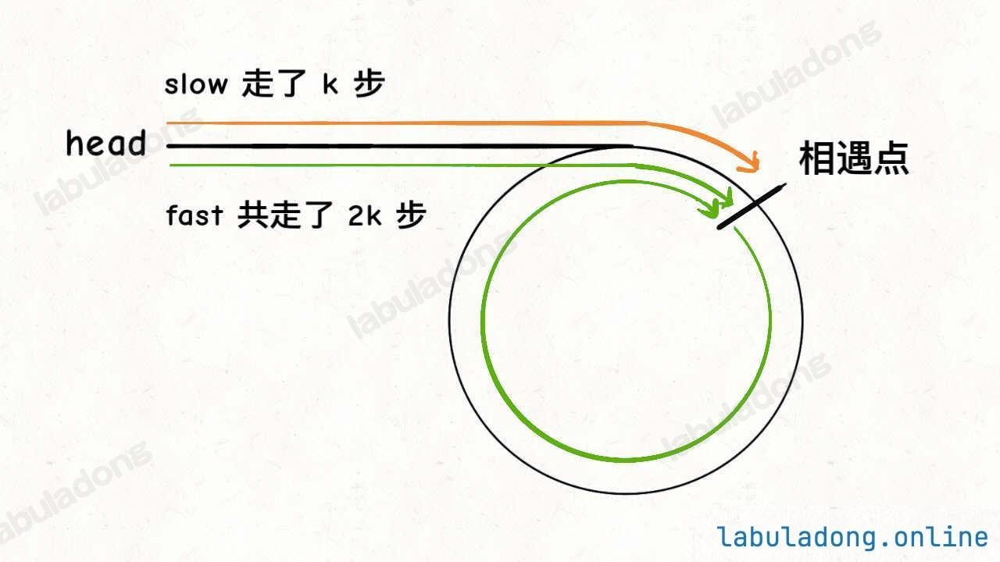

# 双指针处理链表相关的题目

这里是总结一下单链表的技巧，每个技巧对应着算法例题:

1. 合并两个有序链表
2. 链表的分解
3. 合并`k`个有序链表
4. 寻找单链表的倒数第`k`个节点
5. 寻找单链表的中点
6. 判断单链表是否包含环并找出环的起点
7. 判断两个单链表是否相交并找出交点

这些解法都用到了双指针技巧。

## 合并两个有序链表

[21号题目:合并两个有序链表](https://leetcode.cn/problems/merge-two-sorted-lists/description/)

对于这个问题，我们可以比较简单做出处理，需要考虑的是可以使用两个*指针* 分别对两个链表进行遍历，然后判断哪个小，把小的数据添加到需要返回的链表中。

```java
public ListNode mergeTwoLists(ListNode list1, ListNode list2) {

    ListNode dummy = new ListNode(-1), p = dummy;
    ListNode p1 = list1, p2 = list2;

    while (p1 != null && p2 != null) {
        if (p1.val > p2.val) {
            p.next = p2;
            p2 = p2.next;
        } else {
            p.next = p1;
            p1 = p1.next;
        }

        // 向后找相应的节点
        p = p.next;
    }

    if (p1 != null) {
        p.next = p1;
    }

    if (p2 != null) {
        p.next = p2;
    }

    return dummy.next;
}
```

>[!tip]
> 这里的关键点是我们使用了`dummy` 也就是虚拟的头节点去处理，因为不使用这种方式可能需要去判断`p` 或者单独的一个`header` 去处理。

## 链表的分解

[86题:分隔链表](https://leetcode.cn/problems/partition-list/description/)

这个题目也比较简单思路如下:

* 创建两个链表，其中链表`p1` 存储的是比`x` 值小的所有数据，链表`p2` 存储的是比`x` 大或等于的链表。
* 最后合并两个链表。

```java
public ListNode partition(ListNode head, int x) {
    // 虚拟头节点
    ListNode dummy1 = new ListNode(-1);
    ListNode dummy2 = new ListNode(-1);

    // p1表存是小于x的节点 p2表存的是>=x的节点
    ListNode p1 = dummy1, p2 = dummy2;
    ListNode p = head;

    while (p != null) {
        // 判断现在p的值是否>=x如果是的话，则添加到p2这个链表中，否则为p1
        if (p.val >= x) {
            p2.next = p;
            p2 = p2.next;
        } else {
            p1.next = p;
            p1 = p1.next;
        }

        // 这里需要将原来的链接给去除掉
        ListNode temp = p.next;
        p.next = null;
        p = temp;
    }

    p1.next = dummy2.next;

    return dummy1.next;
}
```

上面的代码中还有一个关键点:

>[!important]
> 
> ```java
>     ListNode temp = p.next;
>     p.next = null;
>     p = temp;
> ```
> 
> 这里是为了处理最后的节点指针不要再去指向原有的节点，相当于<u>**断连**</u> 。

## 合并`k`个有序链表

[23题:合并k个有序链表](https://leetcode.cn/problems/merge-k-sorted-lists/description/)

在处理这个题目的时候，可以使用小顶堆结构来解决，我第一次在写的时候，**很蠢** 的是把所有的数据都加入到顶堆中，效率并不高，因为堆是需要堆化的。

我们可以动态的往[[二叉堆]]顶堆中加入数据。一边加一边取，始终这堆的大小保持在<=3的状态。

先来看一看我之前实现的方法。
```java
public ListNode mergeKLists(ListNode[] lists) {
    if (lists == null || lists.length == 0) {
        return null;
    }

    ListNode dummy = new ListNode(-1), p = dummy;

    // 使用二叉堆来进行处理
    // 小顶堆的方式去做
    // 往里添加的数据会按照小顶堆的方式进行排列
    PriorityQueue<ListNode> queue = new PriorityQueue<>((a, b) -> a.val - b.val);

    for (ListNode node : lists) {
        while (node != null) {
            queue.offer(node);
            node = node.next;
        }
    }

    // 从小顶堆中依次拿出数据即可
    while (!queue.isEmpty()) {
        ListNode node = queue.poll();
        p.next = node;

        p = p.next;
    }

    p.next = null;

    return dummy.next;
}
```

这种实现方式是真的有点蠢了。^_^

那么如果改成动态去添加的方式去做呢，查看下面的代码即可。

```java
public ListNode mergeKLists(ListNode[] lists) {
    if (lists == null || lists.length == 0) {
        return null;
    }

    ListNode dummy = new ListNode(-1), p = dummy;

    // 初始化长度为3的堆
    PriorityQueue<ListNode> queue = new PriorityQueue<>(3, (a, b) -> a.val - b.val);
    for (ListNode node : lists) {
        if (node != null) {
            queue.offer(node);
        }
    }

    while (!queue.isEmpty()) {
        ListNode node = queue.poll();
        p.next = node;

        node = node.next;
        if (node != null) {
            queue.offer(node);
        }
        p = p.next;
    }

    return dummy.next;
}
```

优先列表`queue` 中的元素个数最多是$k$，所以一次`poll` 或者`add` 方法的时间复杂度是$O(logk)$；所有的链表节点都会被加入和弹出`queue` ，所以算法整体的时间复杂度是$O(Nlogk)$，其中$k$是链表条数，$N$是这些链表节点总数。

>[!tip]
> 这里的思想有点像去遍历多叉树的处理，队列在这里是一个动态大小的，`size() <= 3` ，这样我们去堆化的时候效率会更高一点。因为树的高度始终是可控的。上下两种方式的效率可以差到一倍左右。

## 寻找单链表的倒数第`k`个节点

[19题：删除链表的倒数第N个节点](https://leetcode.cn/problems/remove-nth-node-from-end-of-list/description/)

首先我的思路是使用`Map` 来存储节点的位置，然后再根据`index` 删除指定的位置节点。

```text
Success:
	Runtime:1 ms, faster than 4.29% of Java online submissions.
	Memory Usage:41.3 MB, less than 5.30% of Java online submissions.
```

不过这种时间效率尽然还是有点低的

```java
public ListNode removeNthFromEnd(ListNode head, int n) {
    Map<Integer, ListNode> map = new HashMap<>();
    int index = 1, size = 0;
    ListNode p = head;

    while (p != null) {
        map.put(index, p);
        p = p.next;
        index++;
    }

    size = map.size();
    int removeIndex = size - n + 1;
    int removeIndexPrev = size - n;
    ListNode prev = map.get(removeIndexPrev);
    ListNode remove = map.get(removeIndex);
    if (prev == null) {
        return remove.next;
    } else {

        prev.next = remove.next;
    }

    return head;
}
```

从前往后寻找单链表的第`k` 个节点很简单，一个for循环遍历过去就找到了，但是如何寻找从后往前数的第`k` 个节点呢？

假设链表有`n` 个节点，倒数第`k` 个节点就是正数第`n - k + 1` 个节点，不也就是一个for循环的事情吗？

但是算法题一般只给一个`ListNode` 头结点代表一条单链表，不能直接得出这条链表长度`n` ，而需要先遍历一遍链表算出`n` 的值，然后再遍历链表计算第`n - k + 1` 个节点。

也就是说，这个解法需要遍历两次链表才能得到出倒数第`k` 个节点。

那么，我们能不能只遍历一次链表，就算出倒数第`k` 个节点呢？

这个解法就比较巧妙了，假设`k = 2` ，思路如下：


* 首先，我们让一个指针`p1` 指向链表的头节点`head` ，然后走`k` 步：
* 现在的`p1` ，只要再走`n - k` 步，就能走到链表末尾的空指针了。
* 趁这个时候，再用一个指针`p2` 指向链表头节点`head` 。
* 接下来就很简单了，让`p1` 和`p2` 同时向前走，`p1` 走到链表末尾的空指针前进了`n - k`步，`p2` 也从`head` 开始前进了`n - k` 步，停留在第`n - k + 1` 个节点上，即恰好停链表的倒数第`k` 个节点上。

通过上面的步骤，只遍历了一次链表，就获得了倒数第`k` 个节点`p2` 。

```java
ListNode findFromEnd(ListNode head, int k) {
    ListNode p1 = head;
    // p1 先走 k 步
    for (int i = 0; i < k; i++) {
        p1 = p1.next;
    }
    ListNode p2 = head;
    // p1 和 p2 同时走 n - k 步
    while (p1 != null) {
        p2 = p2.next;
        p1 = p1.next;
    }
    // p2 现在指向第 n - k + 1 个节点，即倒数第 k 个节点
    return p2;
}
```

当然使用一次遍历链表和遍历两次链表的时间复杂度都是$O(N)$，但上面的方法更具有技巧性。

```java
public ListNode removeNthFromEnd(ListNode head, int n) {
    // 虚拟头结点
    ListNode dummy = new ListNode(-1);
    dummy.next = head;
    // 删除倒数第 n 个，要先找倒数第 n + 1 个节点
    // 之前我这里传入的是findFromEnd(head, n + 1)
    // 或 findFromEnd(head, dummy.next);

    // 这种在处理[1], 1这种情况时则会出现Exception
    ListNode x = findFromEnd(dummy, n + 1);
    // 删掉倒数第 n 个节点
    x.next = x.next.next;
    return dummy.next;
}

public ListNode findFromEnd(ListNode head, int k) {
    // 上面的代码
}
```

这个逻辑就比较简单了，要删除倒数第`n` 个节点，就得获得倒数第`n + 1` 个节点的引用，可以用我们实现的`findFromEnd` 来操作。

>[!important]
> 
> 不过注意我们这里使用了虚拟头结点的技巧，也是为了防止出现空指针的情况，比如说链表总共5个节点，题目就让我们删除倒数第5个节点，也就是第一个节点，那按照算法逻辑，应该首先找到倒数第6个节点。但第一个节点前面已经没有节点了，就会出错。
> 
> **但是我们定义了`dummy` 存在，就避免了这个问题，能够对这种情况进行正确删除。**

## 单链表的中点

[876题：查找链表的中间节点](https://leetcode.cn/problems/middle-of-the-linked-list/description/)

我们截取一个链表从中间点开始，跟上一节一样，我们可以使用双次循环的方式去处理，时间复杂度也是$O(N)$。沿着这个思路，我们可以写出下面的代码。

```java
public ListNode middleNode(ListNode head) {
    if (head == null) {
        return null;
    }
    int length = 0;
    ListNode p = head;

    // 遍历所有的节点，拿到这个链表的长度
    while (p != null) {
        length += 1;
        p = p.next;
    }

    // 得到链表的中间点
    int rtnIndex = length / 2 + 1;
    p = head;
    // 截取
    for (int i = 0; i < rtnIndex - 1; i++) {
        p = p.next;
    }

    return p;
}
```

巧妙的办法是，如果我们想一次遍历就得到中间节点，可以使用**<u>慢快指针</u> ** 的技巧：

我们让两个指针`slow` 和`fast` 分别指向链表的头节点`head` 。

每当慢指针`slow` 前进一步，快指针`fast` 就前进两步，这样，当`fast` 走到链表末尾时，`slow` 就指向了链表中点。


```java
public ListNode middleNode(ListNode head) {
    ListNode slow = head;
    ListNode fast = head;

    while (fast != null && fast.next != null) {
        slow = slow.next;
        // 这里会抛一个null exception的吧?
        fast = fast.next.next;
    }

    return slow;
}
```

>[!tip]
> 需要注意的是，如果链表长度为偶数，也就是说中点有两个时候，我们这个解决返回的节点是靠后的那个节点。
> 
> 另外我们这种解法，稍加修改就可以直接用到判断链表成环的算法问题上。

## 判断链是否包含环

[141题：环形链表](https://leetcode.cn/problems/linked-list-cycle/description/)

判断链表是否包含环属于经典的问题，解决方案也是用<u>快慢指针</u> :

每当慢指针`slow` 前进一步，快指针`fast` 就前进两步。

如果`fast` 最终能正常走到链表末尾，说明链表中没有环，如果`fast` 走着走着竟然和`slow` 相遇了，那肯定是`fast` 在链表中转圈了，说明链表中含有环。

我们把上一节的代码稍加修改:

```java
class Solution {
    public boolean hasCycle(ListNode head) {
        ListNode slow = head, fast = head;

        // 如果能跳出循环则表示fast走的比slow 快，到达末尾的节点了
        while (fast != null && fast.next != null) {
            slow = slow.next;
            fast = fast.next.next;

            // 相遇表明fast赶上了slow，即两个指针相遇了，这个链表有环
            if (slow == fast) {
                return true;
            }
        }

        // 没有环
        return false;
    }
}

```

[环形链表 II](https://leetcode.cn/problems/linked-list-cycle-ii)

这个题目是为了让我们去找到循环链表的起点位置，对上面的算法稍加修改则可以达到要求。

```java
public ListNode detectCycle(ListNode head) {
    ListNode slow = head, fast = slow;

    // 找到交汇点
    while (fast != null && fast.next != null) {
        slow = slow.next;
        fast = fast.next.next;

        // 交汇之后break跳出循环
        if (slow == fast) {
            break;
        }
    }

    // 表明现在这个链表并不是一个循环链表
    if (fast == null || fast.next == null) {
        return null;
    }

    // slow重回head，两者同步以1的速度向前进，交汇之后就是循环的起点
    slow = head;
    while (slow != fast) {
        slow = slow.next;
        fast = fast.next;
    }

    return slow;
}
```

可以看到，当快慢指针相遇时，让其中任一个指针指向头节点，然后让它俩相同速度前进，再次相遇时所在的节点位置就是环开始的位置。

这里来总结一下原理，我们假设快慢指针相遇时，慢指针`slow` 走了`k` 步，那么快指针`fast` 一定走了`2k` 步。



`fast` 一定比`slow` 多走了`k` 步，这多走的`k` 步其实就是`fast` 指针在环里转圈，所以`k` 的值就是环长度的<u>整数倍</u> 。

假设相遇点距环的起点的距离为`m` ，那么结合上图的`slow` 指针,环的起点距离`head` 的距离为`k-m` ，也就是说如果从`head` 前进`k-m` 步就能到达环的起点。

巧的是，如果从相遇点继续前进`k-m` 步，也恰好到达环起点。因为结合上图的`fast` 指针，从相遇点开始走`k` 步可以转回到相遇点，那走`k-m` 步肯定就走到了环起点了。


所以，只要我们把快慢指针中的任一个重新指向`head` ，然后两个指针同速前进，`k-m` 步后一定会相遇，相遇之外就是环的起点了。

## 两个链表是否相交

[160题:相交链表](https://leetcode.cn/problems/intersection-of-two-linked-lists/description/)

```java
ListNode getIntersectionNode(ListNode headA, ListNode headB);
```
这个题目就是判断两个链表的相交点。

如果相交则，则返回相交的那个节点，如果没相交则返回`null`。

这个问题直接的想法是可以直接使用`HashSet` 记录一个链表的所有节点，然后和另一个链表对比，但这就需要额外的空间。

如果不使用额外空间，只使用两个指针呢？

难度在于，由于两条链表的长度可能不同，两条链表之间的节点无法对应。


如果两个指针`p1` 和`p2` 分别在两条链表上前进，并不能同时走到公共节点，也就无法得到相交节点`c1` 。

解决这个问题的关键是，通过某些方式，让`p1` 和`p2` 能够同时到达相交节点`c1` 。

所以，我们可以让`p1` 遍历完链表`A` 之后开始遍历链表`B` ，让`p2` 遍历完链表之后开始遍历链表`A` ，这样相当于<u>逻辑上</u> 两条链表连接在了一起。

如果这样进行拼接，就可以让`p1` 和`p2` 同时进入公共部分，也就是同时到达相交节点`c1` 。


```java
public ListNode getIntersectionNode(ListNode headA, ListNode headB) {
    ListNode p1 = headA, p2 = headB;

    while (p1 != p2) {
        if (p1 == null) {
            p1 = headB;
        } else {
            p1 = p1.next;
        }

        if (p2 == null) {
            p2 = headA;
        } else {
            p2 = p2.next;
        }
    }

    return p1;
}
```

这样，这道题就解决了，空间复杂度为$O(1)$，时间复杂度为$O(N)$。
