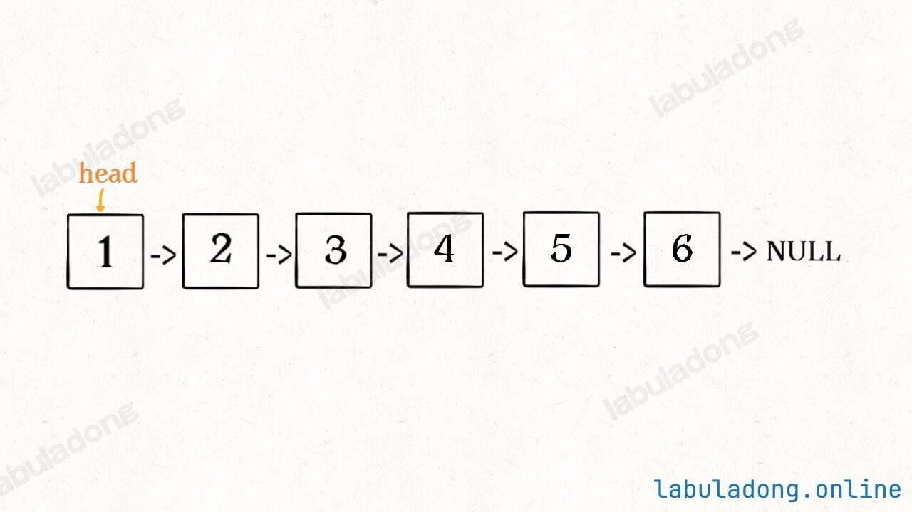
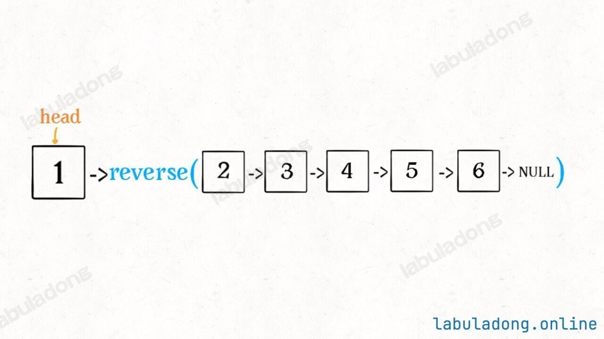
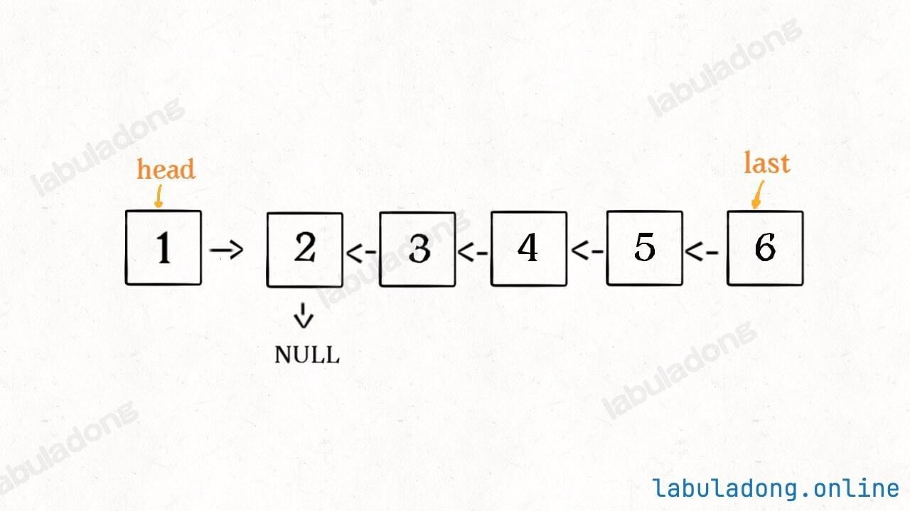
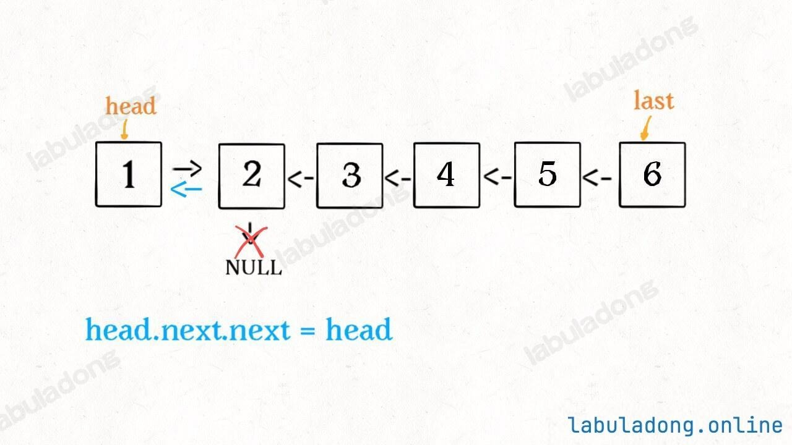
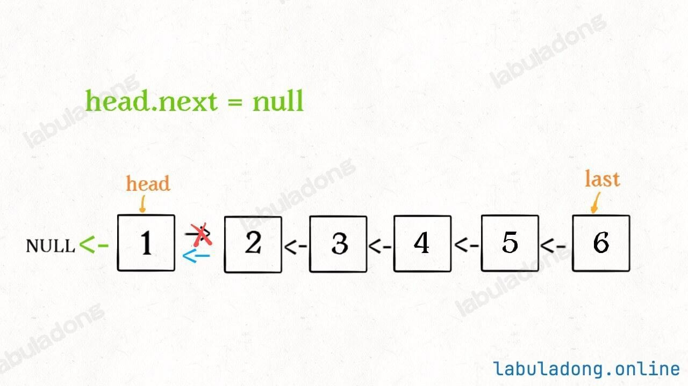
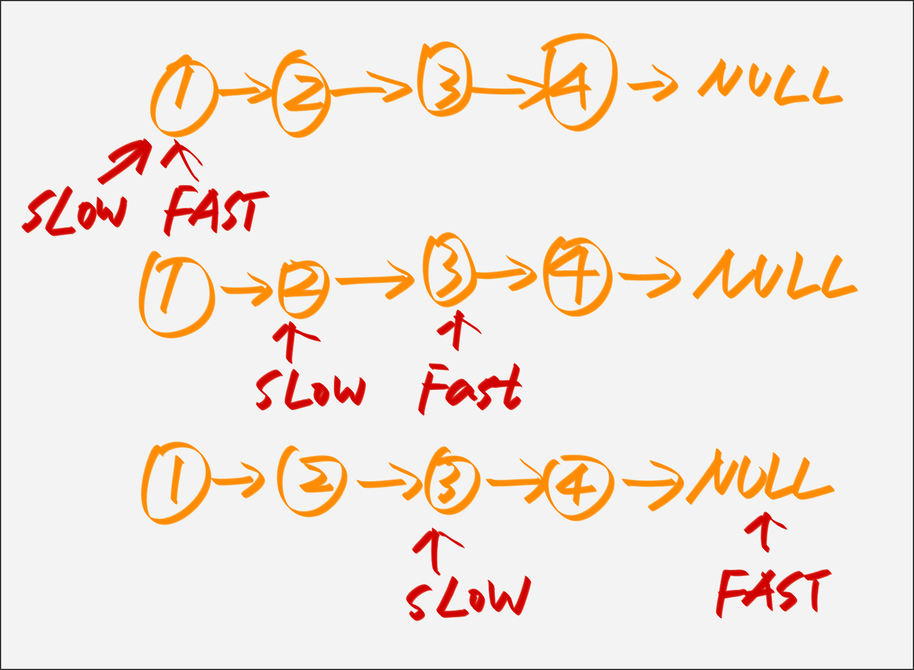

# 反转链表

这篇笔记主要记录是如何去反转链表，这里指的是单向链表是如何去反转的。一般的处理办法就两种:
* 迭代法
* 递归法

[力扣206题反转链表](https://leetcode.cn/problems/reverse-linked-list/)

```java
// 单链表节点的相关定义
public class ListNode {
    int val;
    ListNode next;
    ListNode() {}
    ListNode(int val) { this.val = val; }
    ListNode(int val, ListNode next) { this.val = val; this.next = next; }
}
```

## 迭代法反转
先来看一下如何使用迭代法去反转链表

```java
public ListNode reverseList(ListNode head) {
    ListNode dummy = new ListNode(-1);

    ListNode cur = head, p = head;
    while (p != null) {
        cur = p;
        p = p.next;
        cur.next = dummy.next;
        dummy.next = cur;
    }

    return dummy.next;
}
```

只需要我们去定义一个 `dummy` 头节点然后在这个头节点前不断的去插入数据就可以了。

## 递归法反转链表

上面的迭代解法操作虽然有一些繁琐，但是思路还是比较清晰的。

递归的思想是把问题分解化，比方说，现在输入一个以 `1` 为头节点单链表 `1->2->3->4` ，那么如果我忽略这个头节点 `1` ，只拿出 `2->3->4` 这个子链表，它也是个单链表。

那么这个 `reverseList` 函数，只要输入一个单链表，就能给反转。

```java
reverseList(1->2->3->4) = reverseList(2->3->4)->1
```

**这就是<u>分解问题</u>的思路，通过递归函数的定义，把原问题分解成若干规模更小、结构相同的子问题，最后通过子问题的答案组装成原问题的解。**


实现代码如下:

```java
public ListNode reverseList(ListNode head) {
    if (head == null || head.next == null) {
        return head;
    }

    ListNode last = reverseList(head.next);
    head.next.next = head;
    head.next = null;

    return last;
}
```

**上面的代码很有意思，也很巧妙，我在这里的时候感觉编程是真的妙啊。**



```java
ListNode last = reverseList(head.next);
```

通过上面的这一步会产生下面的结果。



并且根据函数定义，`reverseList` 函数会返回反转之后的头节点，我们用变量 `last` 接收。



```java
head.next.next = head;
```



接下来:
```java
head.next = null;
return last;
```



需要注意以下几个地方：

>[!tip]
> 1. 递归函数要有base case

```java
if (head == null || head.next == null) {
    return head;
}
```

>[!note]
> 2. 当链表递归反转之后，新的头节点是 `last` ，而之前的 `head` 变成了最后一个节点，所以链表的末尾要指向 `null` 。

```java
head.next = null;
```

这样整个链表就是完成了反转。

>[!important]
> 
> 需要注意的是，递归操作链表并不高效。
> 
> 递归解法和迭代解法相比，时间复杂度都是$O(N)$，但是迭代解法的空间复杂度是$O(1)$，而递归解法需要堆栈，空间复杂度是$O(N)$。
> 
> 所以递归操作链表可以用来练习递归思维，但是考虑效率的话还是使用迭代算法更好。

## 反转前N个链表的节点

如果需要反转一个链表的前N个节点，只需要对原先的方法稍微改一下就可以了。

**迭代法**：

```java
public ListNode reverseNList(ListNode head, int n) {
    // 链表为空或者链表的长度为1
    if (head == null || head.next == null) {
        return head;
    }

    ListNode dummy = new ListNode(-1), p = head;
    int k = n;
    while (p != null && k > 0) {
        ListNode cur = p;
        p = p.next;
        cur.next = dummy.next;
        dummy.next = cur;

        k--;
    }

    // 如果为null表示整个链表已经全部处理完了反转的长度就是链表的长度
    if (p == null) {
        return dummy.next;
    } else {
        return dummy.next.next;
    }

}
```

## 按K个一组来进行反转

### 反转N个节点
我们首先要处理反转 `N` 个节点，这个方法我们已经处理过了。

```java
public ListNode reverseNodes(ListNode head, int n) {
    ListNode dummy = new ListNode(-1);
    ListNode p = head, cur = null;

    int k = n;
    while (p != null && k > 0) {
        cur = p;
        p = p.next;
        cur.next = dummy.next;
        dummy.next = cur;

        k--;
    }

    return dummy.next;
}
```

上面的代码就是按 `N` 个数量反转节点。然后返回新的头节点。


### 递归反转 `K` 个数量一组节点
这里先直接看代码是如何处理的。

```java
public ListNode reverseKGroup(ListNode head, int k) {
    if (head == null || head.next == null) {
        return head;
    }

    ListNode a = head, b = head;
    for (int i = 0; i < k; i++) {
        // 表明已经到了节点的最后
        if (b == null) {
            return head;
        }

        b = b.next;
    }

    // 拿到新的节点，反转前K个节点
    ListNode newHead = reverseNodes(a, k);
    // 此时的b已经指向了后一个节点了
    // 因为上面的for循环已经找到下一个了
    // 这时候a节点已经被反转到最后一个了，这时候a.next就是递归后的结果
    a.next = reverseKGroup(b, k);

    return newHead;
}
```

### 判断是否还可以按要求即 `K` 个数量的节点进行反转

```java

ListNode a = head, b = head;
for (int i = 0; i < k; i++) {
    // 表明已经到了节点的最后
    if (b == null) {
        return head;
    }

    b = b.next;
}
```

这段代码完成了两件事:
1. 判断现在的链表长度是否可以按照 `K` 个节点数量反转了，如果 `length <= k` 这个时候 `b == null` 则会直接返回。
2. 当这段 `for` 循环结束之后，`b` 这时候已经是下一个需要反转链表的起始位置了。

### 递归去反转

```java

ListNode newHead = reverseNodes(a, k);
a.next = reverseKGroup(b, k);

return newHead;
```

这里还是分两个部分。

1. `ListNode newHead = reverseNodes(a, k)` 这段代码不需要再去解释了，即调用第一个章节的方法，其实就是对一个链前 `N` 个节点进行反转。
2. `a.next = reverseKGroup(b, k)` 因为 **`a` 这时候已经是反转过的了，从头到尾，另外 `b` 这个节点经过上面的 `for` 循环已经<u>指向下一组了</u>。**


## 判断链表是否为一个回文链表

[leetcode 234题: 判断链表是否为回文](https://leetcode.cn/problems/palindrome-linked-list/description/)


### 暴力较为容易想到的解法

我的解法有一点问题，就是使用 `TreeMap` 这种有序的哈希表来实现。

记录 `index -> ListNode` 的键值对，然后再使用 `i, j` 两个指针去分别从前和后一个递增一个递减再进行比较。

```java
int i = 0, j = map.size() - 1;
while (i <= j) {
    if (map.get(i).val != map.get(j).val) {
        return false;
    }

    i++;
    j--;
}

return true;
```

当然这里使用 `TreeMap` 就是有点脱裤子放屁了，我们也可以直接使用 `ArrayList` 效果是一样的。


### 递归处理回文判断
二叉树中有三种遍历的方式 **前序、中序、后序**。

```java
public void traverse(Tree tree) {
    // 前序位置
    traverse(tree.left);
    // 中序位置
    traverse(tree.right);
    // 后序
}

```

树大多时候都是用链表去实现的，那么对于链表来讲，同样的我们也可以使用这种方式去遍历。

```java
class Solution {
    ListNode left;
    boolean result = true;

    public boolean isPalindrome(ListNode head) {
        left = head;

        traverse(head);
        return result;
    }

    public void traverse(ListNode right) {
        if (right == null) {
            return;
        }

        traverse(right.next);
        if (left.val != right.val) {
            result = false;
            return;
        }

        left = left.next;
    }
}
```

上面代码的核心逻辑是：实际是把链表放入一个栈中，然后再拿出来，这时候元素顺序就是反的，只不过我们是利用<u>递归函数的堆栈</u>而已。

但是这种做法时间复杂度上面并不好，运行时间还是比较多，相当于是练习一下。

### 如何优化一下时间空间复杂度呢？

核心的步骤如下:
1. 找到整个链表的中间节点 `middle` 。
2. 从中间节点 `middle` 到 `right` 节点之间链表进行反转。
3. 反转后再比较 `right` 和 `left` 的值，如果有不相等的则表示这个不是回文链表。

**链表的长度为奇数:**


**链表的长度为偶数:**


>[!note]
这里需要注意的一点是，如果是奇数的话，中间那个节点我们不需要关心是啥，比较是中间后面的部分。所以反转值应该是 `slow.next` 。

```java
public boolean isPalindrome(ListNode head) {
    if (head == null) {
        return false;
    }

    ListNode left = head;
    // 找到中间节点
    ListNode middle = findMiddle(head);

    // 中间节点到链表的尾部这一半的链表进行反转操作
    ListNode right = reverse(middle);

    while (right != null) {
        // 左右两侧的链表进行遍历比较
        if (right.val != left.val) {
            return false;
        }

        // 左右两则同时开始向 'next' 进行递进
        right = right.next;
        left = left.next;
    }

    return true;
}
```


