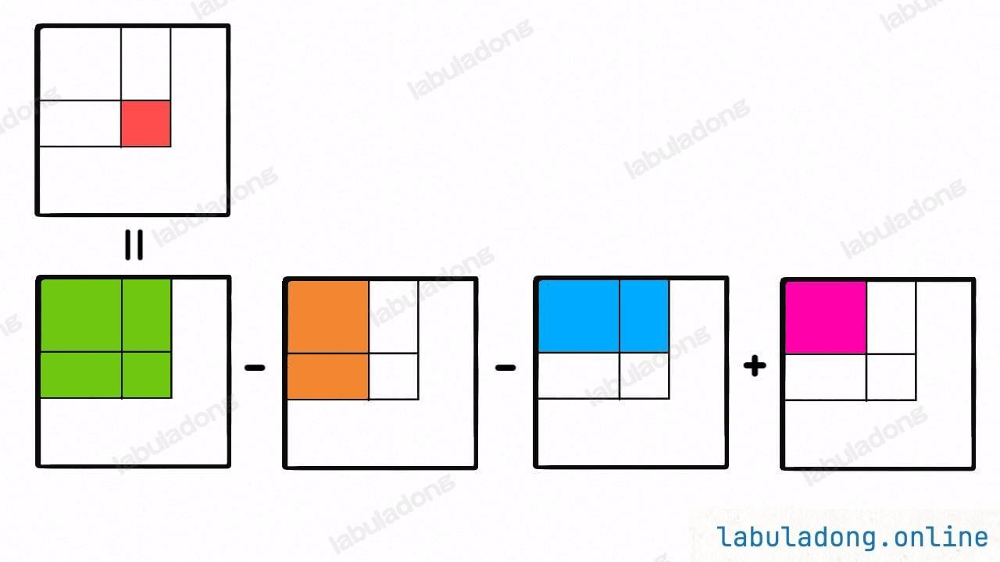

# 数组的前缀和

这个笔记是关于一维数组和二维数组的前缀和的算法。比较巧妙的一种方式去处理。

## 一维数组的前缀和

[303. 一维数组的前缀和](https://leetcode.cn/problems/range-sum-query-immutable/description/)

这个题目的意思是我们是给我们一个闭合的区间 `[left, right]` ，计算这两个下标的所代表的一维数组值的和。
一种常规的解法当给出 `[left, right]` 之后，我们直接循环相加就可以了。

```java
public int sum(int[] nums, int left, int righ) {
    int result = 0;
    for (int i = left; i <= right; i++) {
        result += nums[i];
    }

    return result;
}
```

上面这种解法的问题在于：在测试的过程中这个 `sum` 方法可能会被调用很多次，虽然时间复杂度为 $O(N)$ 。总的调用次数过多也会影响最终的成绩。

比较好的方式是我们计算 `[0]` 、`[0-1]` 、`[0-2]` ..... 一直到 `[0-nums.length - 1]` 长度的值。那么如果我们想要拿到 `[left, right]` 的和的时候，只需要 `sums[right + 1] - sums[left]` 就可以了。

```java
class NumArray {
    private int[] preSums;

    public NumArray(int[] nums) {
        preSums = new int[nums.length + 1];
        // 计算[0 - i] 之间的值
        for (int i = 1; i < preSums.length; i++) {
            preSums[i] = preSums[i - 1] + nums[i - 1];
        }
    }

    public int sumRange(int left, int right) {
        return preSums[right + 1] - preSums[left];
    }
}
```

>[!note]
> 我们在类里定义 `int[] preSums` 数组，在构造函数中，将这个函数进行初化，按上面的要求计算各个区间的和的值。

## 二维数组指定范围的和

[304 letcode 二维数组指定范围的和](https://leetcode.cn/problems/range-sum-query-2d-immutable/)

之前我们可以把一维数组指定范围的和当作是线段上的 `+-` ，二维数组我们这里可以理解成为是一面积之间的 `+-` 。



```java


class NumMatrix {
    int[][] preSums;
    public NumMatrix(int[][] matrix) {
        int m = matrix.length, n = matrix[0].length;
        if (m == 0 || n == 0) {
            return;
        }

        preSums = new int[m + 1][n + 1];
        for (int i = 1; i <= m; i++) {
            for (int j = 1; j <= n; j++) {
                // 初始化前缀和
                preSums[i][j] = preSums[i - 1][j] + preSums[i][j - 1] + matrix[i - 1][j - 1]
                        - preSums[i - 1][j - 1];
            }
        }
    }

    public int sumRegion(int x1, int y1, int x2, int y2) {
        return preSums[x2 + 1][y2 + 1] - preSums[x1][y2 + 1] - preSums[x2 + 1][y1] + preSums[x1][y1];
    }
}
```

实现如上面。通过先初始化和的二维数组然后进行 `+-` 操作，这种可以在查询的阶段将时间的复杂度达到 $O(1)$ 。是一种空间换时间的方法。从空间复杂度上面来讲这种方式牺牲了一些空间。并且初始化的时候也会浪费一些时间。

