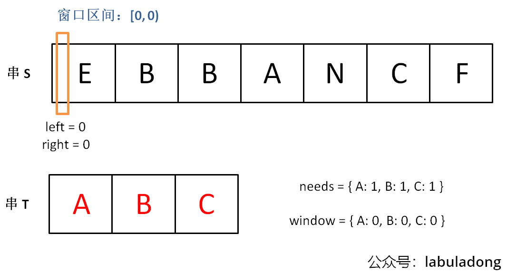
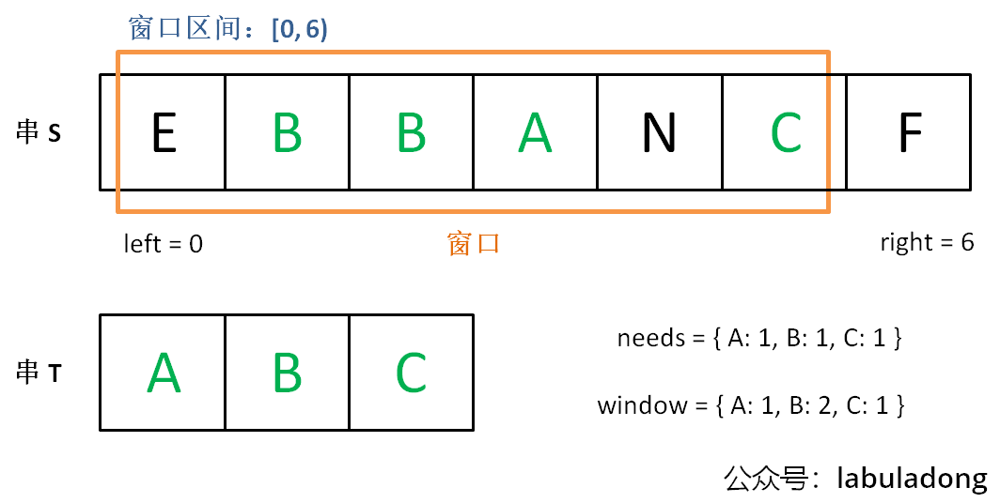
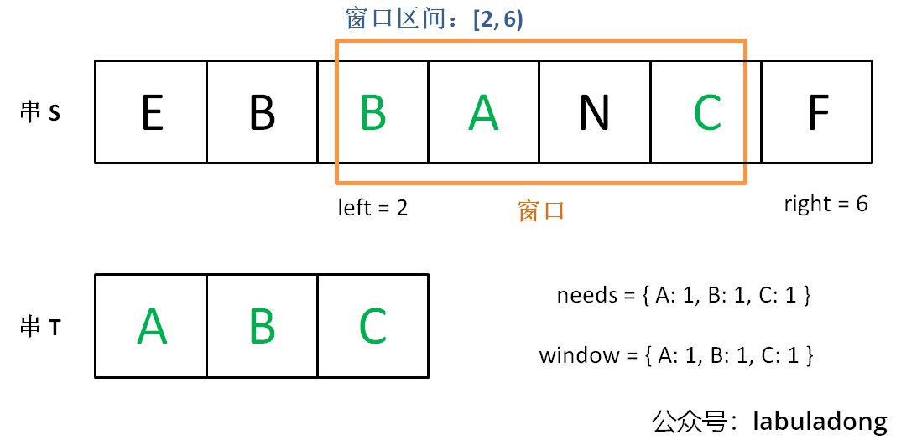
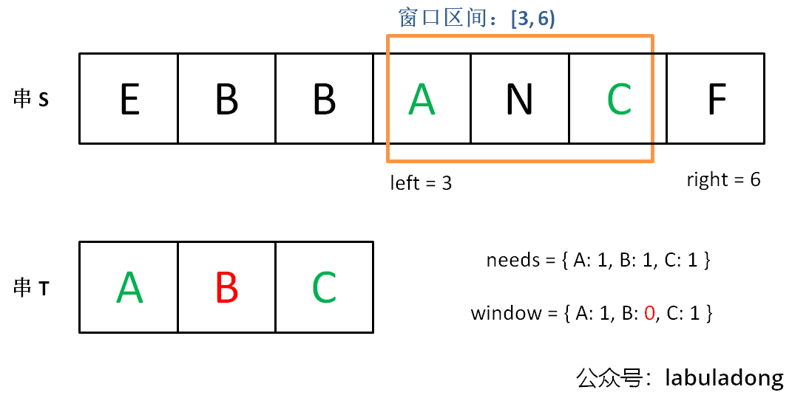

# 滑动窗口算法

滑动窗口可以归为快慢双指针，一快一慢两个指针前后相随，中间的部分就是窗口。滑动窗口算法技巧主要用来解决子数组问题，比如让你寻找符合某个条件的最长/最短子数组。

## 滑动窗口框架概览

如果用暴力解的话，你需要嵌套 for 循环这样穷举所有子数组，时间复杂度是: $O(N^2)$

```java
for (int i = 0; i < nums.length; i++) {
    for (int j = i; j < nums.length; j++) {
        // nums[i, j] 是一个子数组
    }
}
```

滑动窗口算法技巧的思路也不难，就是维护一个窗口，不断滑动，然后更新答案，该算法的大致逻辑如下：
```java
// 索引区间 [left, right) 是窗口
int left = 0, right = 0;

while (right < nums.size()) {
    // 增大窗口
    window.addLast(nums[right]);
    right++;
    
    while (window needs shrink) {
        // 缩小窗口
        window.removeFirst(nums[left]);
        left++;
    }
}
```

 滑动窗口的伪伪代码如下:
```java
// 滑动窗口算法伪码框架
void slidingWindow(String s) {
    // 用合适的数据结构记录窗口中的数据，根据具体场景变通
    // 比如说，我想记录窗口中元素出现的次数，就用 map
    // 如果我想记录窗口中的元素和，就可以只用一个 int
    Object window = ...
    
    int left = 0, right = 0;
    while (right < s.length()) {
        // c 是将移入窗口的字符
        char c = s[right];
        window.add(c)
        // 增大窗口
        right++;
        // 进行窗口内数据的一系列更新
        ...

        // *** debug 输出的位置 ***
        // 注意在最终的解法代码中不要 print
        // 因为 IO 操作很耗时，可能导致超时
        printf("window: [%d, %d)\n", left, right);
        // ***********************

        // 判断左侧窗口是否要收缩
        while (left < right && window needs shrink) {
            // d 是将移出窗口的字符
            char d = s[left];
            window.remove(d)
            // 缩小窗口
            left++;
            // 进行窗口内数据的一系列更新
            ...
        }
    }
}
```

框架中两处 ... 表示的更新窗口数据的地方，在具体的题目中，你需要做的就是往这里面填代码逻辑。而且，这两个 ... 处的操作分别是扩大和缩小窗口的更新操作，等会你会发现它们操作是完全对称的。

基于这个框架，遇到子串/子数组相关的题目，你只需要回答以下三个问题：
1. 什么时候应该移动 right 扩大窗口？窗口加入字符时，应该更新哪些数据？
2. 什么时候窗口应该暂停扩大，开始移动 left 缩小窗口？从窗口移出字符时，应该更新哪些数据？
3. 什么时候应该更新结果？

只要能回答这三个问题，就说明可以使用滑动窗口技巧解题。

## 最小覆盖子串





上面的几幅图表示的是如何使用滑动窗口的方法去处理最小子串的问题。

```java
public String minWindow(String s, String t) {
    Map<Character, Integer> need = new HashMap<>();
    Map<Character, Integer> window = new HashMap<>();

    // 初始化我们寻找的最小子串值的各项值
    for (Character c : t.toCharArray()) {
        /**
         * 下面这种写法已经过时了，并不是最优解
         */
        /*
         * if (charactersMap.containsKey(c)) {
         * charactersMap.put(c, charactersMap.get(c) + 1);
         * } else {
         * charactersMap.put(c, 1);
         * }
         */

        need.put(c, need.getOrDefault(c, 0) + 1);
    }

    int left = 0, right = 0;
    // 截取的字符串
    int valid = 0, start = 0, len = Integer.MAX_VALUE;
    // 右指针一直需要增加到字符串的最右侧
    while (right < s.length()) {
        char c = s.charAt(right);

        // 这里需要直接将right+1，因为后面的substring以及区间的开闭全需要搞清楚边界
        right++;
        if (need.containsKey(c)) {
            window.put(c, window.getOrDefault(c, 0) + 1);
            // 表明当前这个字符已经达到了所需要的数量
            if (window.get(c).equals(need.get(c))) {
                valid++;
            }
        }

        // 左侧的指针向右进行缩进
        while (valid == need.size()) {
            // 这时候进行更新操作
            if (right - left < len) {
                len = right - left;
                start = left;
            }

            // 开始进行移除左侧字符开始
            char leftCurrent = s.charAt(left);
            left++;
            if (need.containsKey(leftCurrent)) {
                if (window.get(leftCurrent).equals(need.get(leftCurrent))) {
                    valid--;
                }
                window.put(leftCurrent, window.get(leftCurrent) - 1);
            }

        }

    }
    return len == Integer.MAX_VALUE ? "" : s.substring(start, start + len);
}
```

上面的代码是完整的解决方案中，当我们发现某个字符在 `window` 的数量满足了 `need` 的需要，就要更新 `valid`，表示有一个字符已经满足要求。而且，你能发现，两次对窗口内数据的更新操作是完全对称的。

当 `valid == need.size()` 时，说明 `T` 中所有字符已经被覆盖，已经得到一个可行的覆盖子串，现在应该开始收缩窗口了，以便得到「最小覆盖子串」。

移动 `left` 收缩窗口时，窗口内的字符都是可行解，所以应该在收缩窗口的阶段进行最小覆盖子串的更新，以便从可行解中找到长度最短的最终结果。

## 字符串的排列

[leetcode 567字符串的排列](https://leetcode.cn/problems/permutation-in-string/description/)

```java
public boolean checkInclusion(String s1, String s2) {
    Map<Character, Integer> need = new HashMap<>();
    Map<Character, Integer> window = new HashMap<>();
    for (Character c : s1.toCharArray()) {
        need.put(c, need.getOrDefault(c, 0) + 1);
    }

    int left = 0, right = 0, valid = 0, len = s1.length();
    while (right < s2.length()) {
        char c = s2.charAt(right);
        right++;

        if (need.containsKey(c)) {
            window.put(c, window.getOrDefault(c, 0) + 1);
            if (window.get(c).equals(need.get(c))) {
                valid++;
            }
        }

        // 向左缩进
        while (valid == need.size()) {
            // 表明现在的字符串长度已经是一个连续的并且是符合s1长度要求的字符串则可以返回true
            if (right - left == len) {
                return true;
            }

            char d = s2.charAt(left);
            left++;

            if (need.containsKey(d)) {
                if (window.get(d).equals(need.get(d))) {
                    valid--;
                }
                window.put(d, window.get(d) - 1);
            }
        }
    }
    return false;
}
```

这个题目的思路也是一样的，只不过需要注意的是 `right - left == len`。

## 找到字符串中所有字母异位词

[leetcode 438](https://leetcode.cn/problems/find-all-anagrams-in-a-string/description/)

这个题目我们还是可以使用窗口的那种方式去处理，只需要使用 `ArrayList` 去记录符合条件的 `left` 即起始位置的指针值就可以了。

```java
public List<Integer> findAnagrams(String s, String p) {
    Map<Character, Integer> need = new HashMap<>();
    Map<Character, Integer> window = new HashMap<>();
    // 初始化window
    for (Character c : p.toCharArray()) {
        need.put(c, need.getOrDefault(c, 0) + 1);
    }

    int left = 0, right = 0, valid = 0, len = p.length();
    List<Integer> result = new ArrayList<>();
    while (right < s.length()) {
        Character c = s.charAt(right);
        right++;

        if (need.containsKey(c)) {
            window.put(c, window.getOrDefault(c, 0) + 1);
            if (window.get(c).equals(need.get(c))) {
                valid++;
            }
        }

        while (valid == need.size()) {
            // 长度相等时表明现在这个长度是符合要求的
            if (right - left == len) {
                result.add(left);
            }

            Character d = s.charAt(left);
            left++;
            if (need.containsKey(d)) {
                if (window.get(d).equals(need.get(d))) {
                    valid--;
                }
                window.put(d, window.get(d) - 1);
            }
        }
    }
    return result;
}
```

关键跟上一小节一样的，`if (right - left == len)` 这个判断要准确。 

## 最长无重复子串

[leetcode 3 最长无重复子串](https://leetcode.cn/problems/longest-substring-without-repeating-characters/description/)

```java
class Solution {
    public int lengthOfLongestSubstring(String s) {
        Map<Character, Integer> window = new HashMap<>();

        int left = 0, right = 0;
        // 记录结果
        int res = 0;
        while (right < s.length()) {
            char c = s.charAt(right);
            right++;
            // 进行窗口内数据的一系列更新
            window.put(c, window.getOrDefault(c, 0) + 1);
            // 判断左侧窗口是否要收缩
            while (window.get(c) > 1) {
                char d = s.charAt(left);
                left++;
                // 进行窗口内数据的一系列更新
                window.put(d, window.get(d) - 1);
            }
            // 在这里更新答案
            res = Math.max(res, right - left);
        }
        return res;
    }
}
```

这个题目其实还是就是一个变种，我们不再需要一个 `need` 表来存储我们需要找的目标字符串了，可以直接使用 `window` 去记录现在已经找到的各个子字符的数量。
