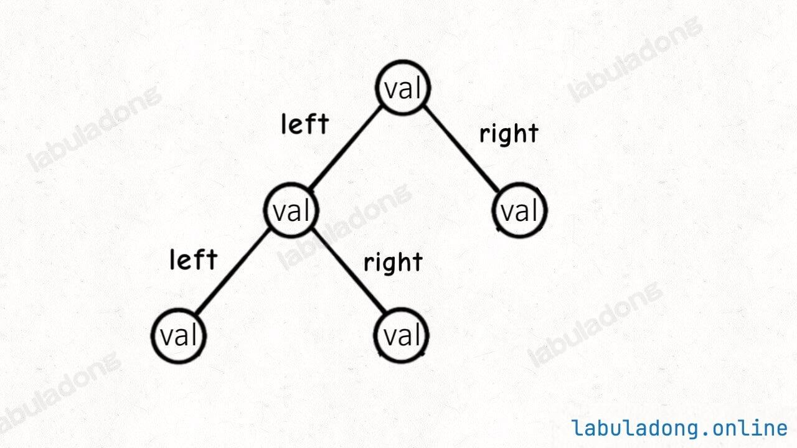
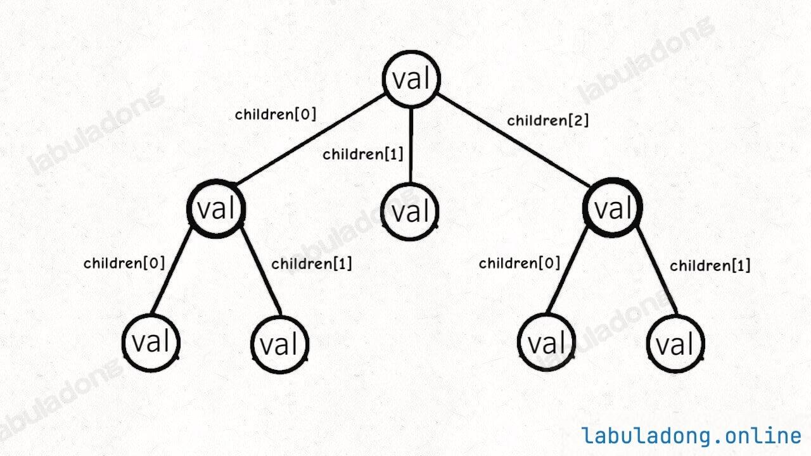
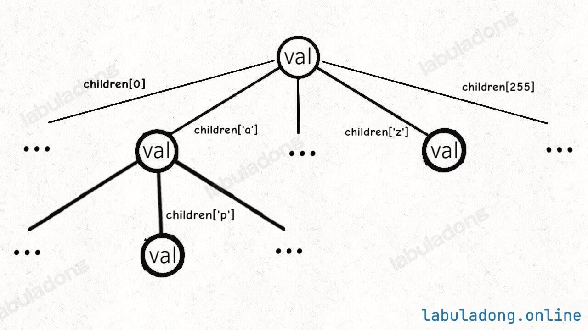
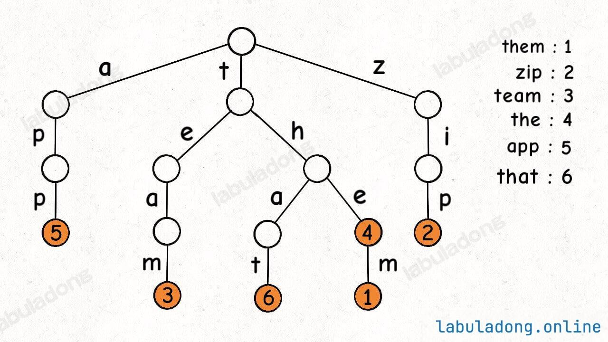
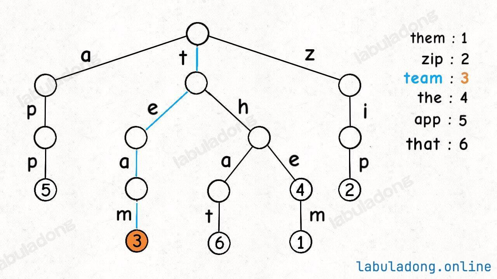

## Trie树

Trie树就是多叉树结构的延伸，是一种针对字符串进行特殊优化的数据结构。

Trie树在处理字符串相关操作时有诸多的优势，比如节省公共字符串前缀的内存空间、方便处理前缀操作、支持通配符匹配等。

### Trie树的主要应用场景

Trie树是一种针对字符串有特殊优化的数据结构，这也许它又被叫做字典的原因。Trie树针对字符串的处理有若干优势。


#### 节约存储空间
这里我们先使用`HashMap`来对比，比如下面的代码，我们来存储几个键值对:
```java
Map<String, Integer> map = new HashMap<>();
map.put("apple", 1);
map.put("app", 2);
map.put("appl", 3);
```

`HashMap` 的实现原理，键值对会被存到`table` 数组中，也就是说它真的创建了`apple` 、`app` 、`appl` 这三个字符串，占用12个字符的内存空间。

但是我们需要注意，这三个字符串共同的前缀，`app` 这个前缀被重复存储了三次，`I` 也被重复存储了两次。

如果换成TrieMap来存储：
```java
TrieMap<Integer> map = new TrieMap<>();
map.put("apple", 1);
map.put("app", 2);
map.put("appl", 3);
```

Trie树底层并不会重复存储公共前缀，所以只需要`apple` 这5个字符的内存空间来存储键。

这个例子的数据量并不是很大，所以还不是很明显，但是如果数据量很大的情况下，那么TrieMap可以节省大量的存储空间。

#### 方便处理前缀操作
```java
// Trie 树的键类型固定为 String 类型，值类型可以是泛型
TrieMap<Integer> map = new TrieMap<>();
map.put("that", 1);
map.put("the", 2);
map.put("them", 3);
map.put("apple", 4);

// "the" 是 "themxyz" 的最短前缀
System.out.println(map.shortestPrefixOf("themxyz")); // "the"

// "them" 是 "themxyz" 的最长前缀
System.out.println(map.longestPrefixOf("themxyz")); // "them"

// "tha" 是 "that" 的前缀
System.out.println(map.hasKeyWithPrefix("tha")); // true

// 没有以 "thz" 为前缀的键
System.out.println(map.hasKeyWithPrefix("thz")); // false

// "that", "the", "them" 都是 "th" 的前缀
System.out.println(map.keysWithPrefix("th")); // ["that", "the", "them"]
```

除了`keysWithPrefix` 方法的复杂度取决于返回结果长度，其他前缀操作的复杂度都是$O(L)$，其中$L$是前缀字符串长度。

上面的这几个操作，使用HashMap或TreeMap能做到吗？一般来说只能通过强行遍历的方式，然后一个个比较字符串得到前缀等，时间复杂度会非常的高。

#### 可以使用通配符
```java
// Trie 树的键类型固定为 String 类型，值类型可以是泛型
// 支持通配符匹配，"." 可以匹配任意一个字符
TrieMap<Integer> map = new TrieMap<>();

map.put("that", 1);
map.put("the", 2);
map.put("team", 3);
map.put("zip", 4);

// 匹配 "t.a." 的键有 "team", "that"
System.out.println(map.keysWithPattern("t.a.")); // ["team", "that"]

// 匹配 ".ip" 的键有 "zip"
System.out.println(map.hasKeyWithPattern(".ip")); // true

// 没有匹配 "z.o" 的键
System.out.println(map.hasKeyWithPattern("z.o")); // false
```

上面的例子是我们可以使用通配符。这个功能用HashMap或者TreeMap肯定做不到的。

#### 可以按照字典序遍历键
```java
// Trie 树的键类型固定为 String 类型，值类型可以是泛型
TrieMap<Integer> map = new TrieMap<>();

map.put("that", 1);
map.put("the", 2);
map.put("them", 3);
map.put("zip", 4);
map.put("apple", 5);

// 按照字典序遍历键
System.out.println(map.keys()); // ["apple", "that", "the", "them", "zip"]
```

这个功能`TreeMap` 也能做到，但是HashMap就做不到了。

### Trie树的基本结构
Trie树本质上就是一棵从二叉树衍生出来的多叉树。

二叉树的节点代码实现是下面的这样的:
```java
class TreeNode {
    int val;
    TreeNode left, right;
}
```

其中`left, right` 存储左右子节点的指针，所以二叉树的结构是这样:



多叉树节点的代码实现是下面这样的：
```java
class TreeNode {
    int val;
    TreeNode[] children;
}
```

其中`children` 数组中存储指向孩子节点的指针



而`TrieMap` 中的树节点`TrieNode` 代码实现是这样：
```java
class TrieNode<V> {
    V val = null;
    TrieNode<V>[] children = new TrieNode[256];
}
```

这个`val` 字段存储键对应的值，`children` 数组存储指向子节点的指针。

但是和之前的普通多叉树节点不同。`TrieMap` 中`children` 数组的索引是有意义的，代表键中的一个字符。

**比如说`children[97]` 如果非空，说明这里存储了一个字符`a` ，因为`a` 的ASCII码为97。**

这里的设计很巧妙也有很有意思。

这里的代码模板只考虑了如何处理ASCII字符，所有`children` 数组的大小设置为256。不过可以根据实际的问题进行修改。

比如在实际做题时，题目说了只包含`a-z` ，那么你可以把大小改为26；或者不想用索引来映射，直接用哈希表`HashMap<Character, TrieNode>` 也可以，都是一样的效果。



一个节点有256个子节点指针，但大多数时候都是空，可以省略掉不画，所以一般最后可以看到这个Trie树变成了下面的样子。



这是城`TrieMap<Integer>` 中插入一些键值对后的样子，白色的节点代码`val` 字段为空，橙色节点代码`val` 字段为非空。

这里我们需要注意一点的是在TrieMap 中我们的`val` 中存储在节点中的，但是对应的字符`key` 并没有实际存储，字符是通过父节点的`children` 数组中的索引确定的。

 

### TrieMap API
下面的这个是一般TrieMap的方法列表:

```java
// 底层用 Trie 树实现的键值映射
// 键为 String 类型，值为类型 V
class TrieMap<V> {

    // 在 Map 中添加/修改键值对
    public void put(String key, V val);

    // 删除键 key 以及对应的值
    public void remove(String key);

    // 搜索 key 对应的值，不存在则返回 null
    // get("the") -> 4
    // get("tha") -> null
    public V get(String key);

    // 判断 key 是否存在在 Map 中
    // containsKey("tea") -> false
    // containsKey("team") -> true
    public boolean containsKey(String key);

    // 在 Map 的所有键中搜索 query 的最短前缀
    // shortestPrefixOf("themxyz") -> "the"
    public String shortestPrefixOf(String query);

    // 在 Map 的所有键中搜索 query 的最长前缀
    // longestPrefixOf("themxyz") -> "them"
    public String longestPrefixOf(String query);

    // 搜索所有前缀为 prefix 的键
    // keysWithPrefix("th") -> ["that", "the", "them"]
    public List<String> keysWithPrefix(String prefix);

    // 判断是和否存在前缀为 prefix 的键
    // hasKeyWithPrefix("tha") -> true
    // hasKeyWithPrefix("apple") -> false
    public boolean hasKeyWithPrefix(String prefix);

    // 通配符 . 匹配任意字符，搜索所有匹配的键
    // keysWithPattern("t.a.") -> ["team", "that"]
    public List<String> keysWithPattern(String pattern);

    // 通配符 . 匹配任意字符，判断是否存在匹配的键
    // hasKeyWithPattern(".ip") -> true
    // hasKeyWithPattern(".i") -> false
    public boolean hasKeyWithPattern(String pattern);

    // 返回 Map 中键值对的数量
    public int size();
}
```

