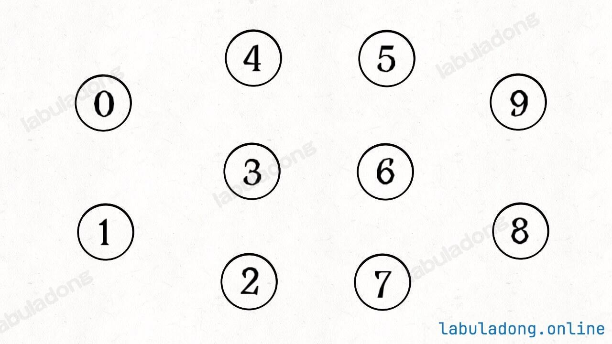
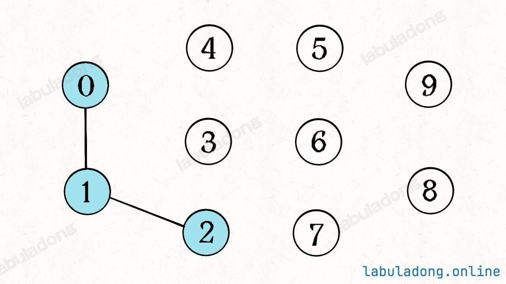

# Union Find 并查集原理

>[!note]
> 一句话总结
> 
> 并查集(Union Find)结构是二叉树结构的衍生，用于高效解决无向图的连通性问题，可以在$O(1)$时间内合并两个连通分量，在$O(1)$时间内查询两个节点是否连通，在$O(1)$时间内查询连通分量的数量。


## 动态连通性及术语
图论算法中专业术语比较多，有几个例子。

如下图的这个例子，其中有10个节点，分别用0~9标记，虽然其中没有边，但它依然是一个图结构：



我们可以说这个图结构中，有10个<u>连通分量</u>，每个节点自身都是一个连通分量，因为它们自成一派，没有和其他节点相连。

现在将其中的一些节点进行<u>连接操作</u> ，比如连接节点`0,1` 和`1,2`：



此时，图结构中的节点`0,1,2` 之间就连通了，它们三个节点共同构成了一个连通分量，我们可以说这个三个节点<u>连通的</u>的。


同时，这个图结构中的连通分量的数量从10减少到了8，因为连接操作将`0,1,2` 三个连通分量合并成了一个。

>[!important]
> 
> 连通关系的性质
> 
> 1. **<u>自反性</u> ** :节点`p` 和`p` 自身是连通的。
> 2. **<u>对称性</u> ** :如果节点`p` 和`q` 连通，那么`q` 和`p` 也连通。
> 3. **<u>传递性</u> ** :如果节点`p` 和`q` 连通，`q` 和`r` 连通，那么`p` 和`r` 也连通。
> 
> 判断这种<u>等价关系</u> 非常实用，比如说编译器判断同一个内存对象的不同变量引用，比如社交网络中的朋友圈计算等等。

那么动态连通性问题就是说，给你输入一个图结构。然后进行若干次<u>连通操作</u> 时可能会查询任意两个节点是否<u>连通</u> ，或者查询当前图中有多少个<u>连通分量</u> 。

我们的目标是设计一种数据结构，在尽可能小的时间复杂度下完成连接操作和查询操作。

## 为什么需要并查集算法

并查集(union find)结构提供如下API:
```java
class UF {
    // 初始化并查集，包含 n 个节点，时间复杂度 O(n)
    public UF(int n);

    // 连接节点 p 和节点 q，时间复杂度 O(1)
    public void union(int p, int q);

    // 查询节点 p 和节点 q 是否连通（是否在同一个连通分量内），时间复杂度 O(1)
    public boolean connected(int p, int q);

    // 查询当前的连通分量数量，时间复杂度 O(1)
    public int count();
}
```

其中`union` 方法用于连接两个节点，`connected` 方法用于查询两个节点是否连通，`count` 方法用于查询当前图中的连通分量数量。它们都可以在$O(1)$时间内完成。

$O(1)$的时间复杂是最牛逼的，我们应该如果去实现上面的几个API呢？

比如我们可以使用图中邻接表/邻接矩阵的代码实现，这个`union` 方法其实就是图中添加一条无向边，时间复杂度可以做到$O(1)$。

>[!note]
相当于就是做连通。


