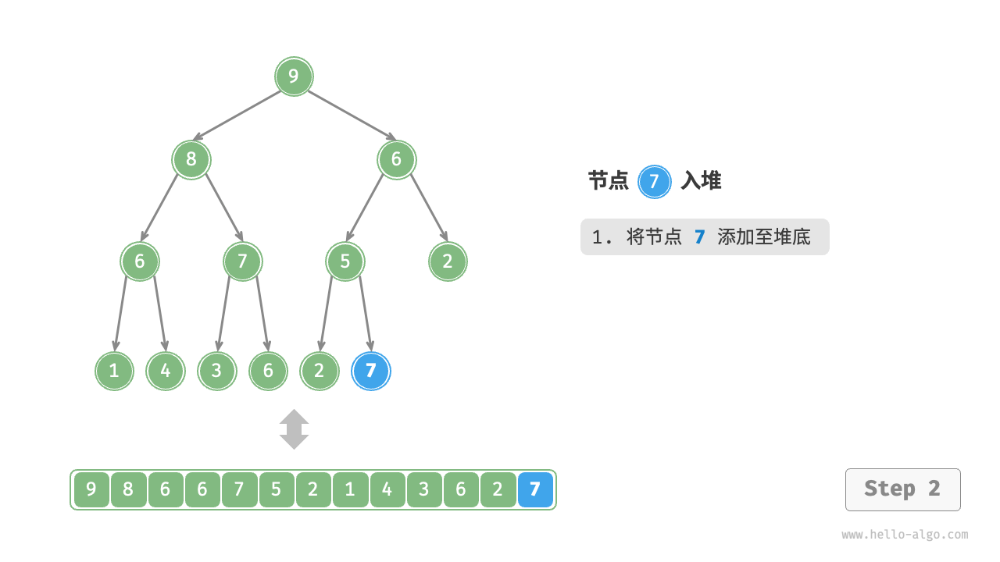
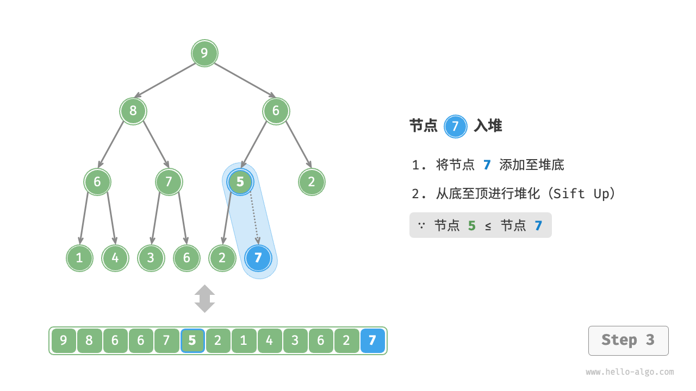

## 二叉堆

二叉堆是一种能够动态排序的数据结构，是二叉树结构的延伸。

二叉堆的主要操作就两个,`sink` (下沉)和`swim` (上浮)，用以维护二叉堆的性质。

二叉堆的主要应用有两个，首先是一种很有用的数据结构优先队列(Priority Queue)，第二是一种排序方法堆排序(Heap Sort)。

### 二叉堆的性质

二叉堆就是一种能够动态排序的数据结构。所谓动态排序，就是说我们可以不断往数据结构里面添加或删除元素，数据结构会自动调整元素的位置，使得我们可以有序地从数据结构中读取元素，这是一般排序算法做不到的。

能动态排序的常用数据结构其实只有两个，一个是优先级队列（底层用二叉堆实现），另一个是二叉搜索树。二叉搜索树的用途更广泛，优先级队列能做的事情，二叉搜索树其实都能做。但优先级队列的API和代码实现相较于二叉搜索结更简单，所以一般能用优先级队列解决的问题，我们没必要用二叉搜索树。


**性质** 
我们可以认为二叉堆是一种特殊的二叉树，这棵二叉树上的任意节点的值，都必须大于（或小于等于）其左右子树所有节点的值。如果是大于等于，我们称之为`大顶堆` ，如果是小于等于，我们称之为`小顶堆` 。

对于小顶堆，每个节点下方的所有节点的值都比它大，那么不难想象根节点就是整棵树上的最小值。同理，大顶堆的根节点就是整棵树上的最大值。所以二叉堆可以辅助我们快速找到最大值或最小值。

二叉堆还有一个性质：一个二叉堆的左右子堆（子树）也是一个二叉堆。这个性质要在堆排序算法的优化中有用到。


### 最常见的应用：优先级队列

```java
class MyPriorityQueue {
    // 在二叉堆堆顶插入一个元素，时间复杂度 O(logN)
    // N 为当前二叉堆中的元素个数
    void push(int x);

    // 返回堆顶元素，时间复杂度 O(1)
    // 该堆顶元素就是二叉堆中的最大值或最小值，取决于是最大堆还是最小堆
    int peek();

    // 删除堆顶元素，时间复杂度 O(logN)
    int pop();

    // 返回堆中元素的个数，时间复杂度 O(1)
    int size();
}
```

不同编程语言提供的API名字可能不同，但其效果和底层实现是大同小异的。

当然，自动排序是有代价的，注意优先级队列API的时间复杂度，增删元素的复杂度自然是$O(log{}{N})$，其中$N$是当前二叉堆中的元素个数，回头在算法题里面用到这种结构的话，你得会计算总的时间复杂度。

> 为什么我们会叫二叉堆为优先级队列呢？
> 主是要因为这个数据结构的API和标准队列API很像，标准队列是FIFO的顺序，而二叉堆可以理解为一种会自动排序的队列，所以叫优先级队列感觉也更贴切。

> 当然，我们也要明白，虽然它的API像队列，但它的底层原理和二叉树有关和队列没有关系。

### 另一种应用：堆排序

这种算法其实并不太难。它的原理特别简单，就相当于把一个乱序的数组都`push` 到一个二叉堆（优先级队列）里面，然后再一个个`pop` 出来，就得到了一个有序的数组：
```java
// 堆排序伪码，对 arr 原地排序
// 时间复杂度 O(NlogN)，空间复杂度 O(N)
int[] heapSort(int[] arr) {
    int[] res = new int[arr.length];
    MyPriorityQueue pq = new MyPriorityQueue();
    for (int x : arr)
        pq.push(x);
    // 元素出堆的顺序是有序的
    for (int i = 0; i < arr.length; i++)
        res[i] = pq.pop();
    return res;
}
```

当然，正常的堆排序算法代码并不依赖优先级队列，且空间复杂度是$O(1)$。那是因为它把`push` 和`pop` 的代码逻辑展开了，再加上直接在数组原地建堆，这样就不需要额外的空间了。

## 二叉堆/优先级代码实现

我们先实现一个简化版的优先级队列，用来理解二叉堆的核心操作`sink` 和`swim` 。最后再写一个比较完整的代码实现。

### 使用数组来实现堆

之前已经使用数组来表示过二叉树。这里笔记再进行一下回顾，当使用二叉树时，元素代码节点值，索引代表节点在二叉树中的位置。**节点指针通过索引映射公式来实现**。


如上图所示，给定索引$i$，其左节点的索引为$2i + 1$，右子节点的索引为$2i + 2$，父节点的索引为$(i - 1) / 2$（向上整除）。当索引越界时，表示空节点或节点不存在。


### 访问堆顶元素
堆顶元素即为二叉树的根节点，也就是列表的首个元素

### 元素入堆
给定元素`val` ，我们首先将其添加到堆底。添加之后，由于`val` 可能大于堆中其他元素，堆的成立条件可能已被破坏，**因此需要修复从插入节点到根节点的路径上的各个节点，** 这个操作被称为<u>堆化(heapfiy)</u>

考虑从入堆节点开始，**从底至顶执行堆化。** ，我们比较插入节点与其父节点的值，如果插入节点更大，则将它们交换。然后继续此操作，从底至顶修复堆中的各个节点，直至越过根节点或遇到无须交换的节点时结束。

这个过程我们也称为<u>上浮</u>。

<section>
    
    
    
    
    
    
    
    
    
</section>

