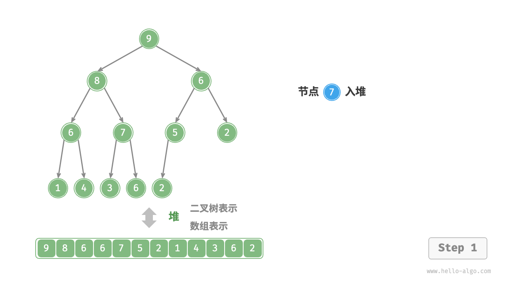
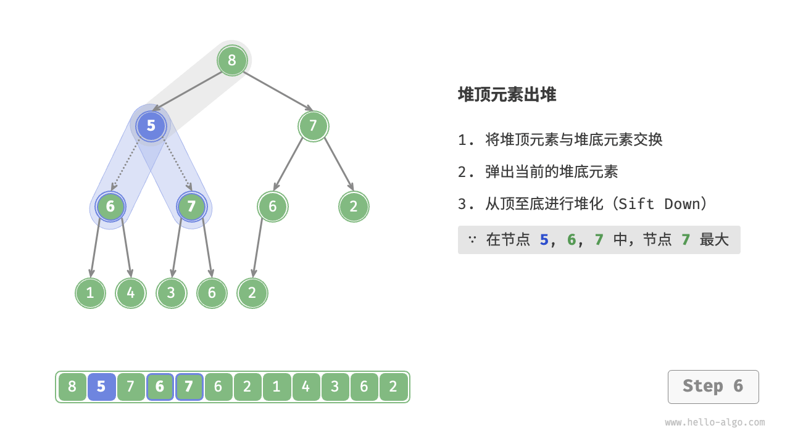

## 二叉堆

二叉堆是一种能够动态排序的数据结构，是二叉树结构的延伸。

二叉堆的主要操作就两个,`sink` (下沉)和`swim` (上浮)，用以维护二叉堆的性质。

二叉堆的主要应用有两个，首先是一种很有用的数据结构优先队列(Priority Queue)，第二是一种排序方法堆排序(Heap Sort)。

### 二叉堆的性质

二叉堆就是一种能够动态排序的数据结构。所谓动态排序，就是说我们可以不断往数据结构里面添加或删除元素，数据结构会自动调整元素的位置，使得我们可以有序地从数据结构中读取元素，这是一般排序算法做不到的。

能动态排序的常用数据结构其实只有两个，一个是优先级队列（底层用二叉堆实现），另一个是二叉搜索树。二叉搜索树的用途更广泛，优先级队列能做的事情，二叉搜索树其实都能做。但优先级队列的API和代码实现相较于二叉搜索结更简单，所以一般能用优先级队列解决的问题，我们没必要用二叉搜索树。


**性质** 
我们可以认为二叉堆是一种特殊的二叉树，这棵二叉树上的任意节点的值，都必须大于（或小于等于）其左右子树所有节点的值。如果是大于等于，我们称之为`大顶堆` ，如果是小于等于，我们称之为`小顶堆` 。

对于小顶堆，每个节点下方的所有节点的值都比它大，那么不难想象根节点就是整棵树上的最小值。同理，大顶堆的根节点就是整棵树上的最大值。所以二叉堆可以辅助我们快速找到最大值或最小值。

二叉堆还有一个性质：一个二叉堆的左右子堆（子树）也是一个二叉堆。这个性质要在堆排序算法的优化中有用到。


### 最常见的应用：优先级队列

```java
class MyPriorityQueue {
    // 在二叉堆堆顶插入一个元素，时间复杂度 O(logN)
    // N 为当前二叉堆中的元素个数
    void push(int x);

    // 返回堆顶元素，时间复杂度 O(1)
    // 该堆顶元素就是二叉堆中的最大值或最小值，取决于是最大堆还是最小堆
    int peek();

    // 删除堆顶元素，时间复杂度 O(logN)
    int pop();

    // 返回堆中元素的个数，时间复杂度 O(1)
    int size();
}
```

不同编程语言提供的API名字可能不同，但其效果和底层实现是大同小异的。

当然，自动排序是有代价的，注意优先级队列API的时间复杂度，增删元素的复杂度自然是$O(log{}{N})$，其中$N$是当前二叉堆中的元素个数，回头在算法题里面用到这种结构的话，你得会计算总的时间复杂度。

>[!note]
> 为什么我们会叫二叉堆为优先级队列呢？
> 主是要因为这个数据结构的API和标准队列API很像，标准队列是FIFO的顺序，而二叉堆可以理解为一种会自动排序的队列，所以叫优先级队列感觉也更贴切。
> 当然，我们也要明白，虽然它的API像队列，但它的底层原理和二叉树有关和队列没有关系。

### 另一种应用：堆排序

这种算法其实并不太难。它的原理特别简单，就相当于把一个乱序的数组都`push` 到一个二叉堆（优先级队列）里面，然后再一个个`pop` 出来，就得到了一个有序的数组：
```java
// 堆排序伪码，对 arr 原地排序
// 时间复杂度 O(NlogN)，空间复杂度 O(N)
int[] heapSort(int[] arr) {
    int[] res = new int[arr.length];
    MyPriorityQueue pq = new MyPriorityQueue();
    for (int x : arr)
        pq.push(x);
    // 元素出堆的顺序是有序的
    for (int i = 0; i < arr.length; i++)
        res[i] = pq.pop();
    return res;
}
```

当然，正常的堆排序算法代码并不依赖优先级队列，且空间复杂度是$O(1)$。那是因为它把`push` 和`pop` 的代码逻辑展开了，再加上直接在数组原地建堆，这样就不需要额外的空间了。

## 二叉堆/优先级代码实现

我们先实现一个简化版的优先级队列，用来理解二叉堆的核心操作`sink` 和`swim` 。最后再写一个比较完整的代码实现。

这个笔记里我们实现的是**大顶堆**，同样的原理，如果是想实现**小顶堆** 则更改其中的判断条件即可。

### 使用数组来实现堆

之前已经使用数组来表示过二叉树。这里笔记再进行一下回顾，当使用二叉树时，元素代码节点值，索引代表节点在二叉树中的位置。**节点指针通过索引映射公式来实现**。


如上图所示，给定索引$i$，其左节点的索引为$2i + 1$，右子节点的索引为$2i + 2$，父节点的索引为$(i - 1) / 2$（向上整除）。当索引越界时，表示空节点或节点不存在。


### 访问堆顶元素
堆顶元素即为二叉树的根节点，也就是列表的首个元素，直接返回`heap[0]` 即可。

>[!important]
> 需要我们去判断如果现在里面的元素已经是`None` 的时候，则抛出Exception即可。

```java
public Integer peek() {
    if (size == 0) {
        throw new IndexOutOfBoundsException();
    }
    return heap[0];
}
```

### 元素入堆
给定元素`val` ，我们首先将其添加到堆底。添加之后，由于`val` 可能大于堆中其他元素，堆的成立条件可能已被破坏，**因此需要修复从插入节点到根节点的路径上的各个节点，** 这个操作被称为<u>堆化(heapfiy)</u>

考虑从入堆节点开始，**从底至顶执行堆化。** ，我们比较插入节点与其父节点的值，如果插入节点更大，则将它们交换。然后继续此操作，从底至顶修复堆中的各个节点，直至越过根节点或遇到无须交换的节点时结束。

这个过程我们也称为<u>上浮(swim)</u>。

<section>
    
    
    
    
    
    
    
    
    
</section>

按照上面图中的步骤，我们将重要的几个过程写清楚
1. 将元素放至在堆底，也就是`heap[size] = val` ，当然这里需要对边界判断清楚，如果现在`size == heap.length` 我们就需要向外抛出Exception或做相应的异常处理。
2. 从堆底的值慢慢与父节点的位置进行比较，现在我们实现是大顶堆，那么如果`heap[i] > heap[p]` 则需要进行一次交换。
3. 交换直到父节点的元素值>当前节点的值的时候，就表示上浮已经完成。这里需要我们对于`0` 的时候做一个特殊的判断。

```java
private void swim(int i) {
    // 上浮的跳出条件是什么？
    int p = parent(i);
    while (heap[i] > heap[p]) {
        if (p == 0) {
            if (heap[i] > heap[0]) {
                swap(i, p);
            }
            break;
        }
        swap(i, p);
        i = p;
        p = parent(i);
    }
}
```

>[!important]
> 上面的代码中循环的条件是`heap[i] > heap[p]` 当不满足的时候上浮也就中止了，我们这里也可以使用`while(true)` 的方式，在里面判断完成后`break` ，为什么这里我们要对`p == 0` 这一情况进行一次判断呢？因为后面`i = p`，最小值就是`0` 不对这里进行判断的话，可能会陷入死循环达不到我们预期的效果。

### 元素弹出pop
元素的`pop` 方法需按照我们是**大顶堆** 还是**小顶堆** 来处理，因为我们实现的是大顶堆，所以最终弹的数据，应按照*从大到小* 顺序。所以我们只需要将`heap[0]` 位置的数据弹出即可。

但是直接将顶部的数据弹出后，整个树都需要重新去构建，会比较浪费时间也相对来说较复杂，一个好的处理方式是将这个元素与`heap` 尾元素进行对调，然后返回队尾的元素，`heap[0]` 元素再<u>下沉(sink)</u>。

<section>
    
    
    
    
    
    
    
    
    
    
</section>

按照上面的步骤图，我们来把步骤写下来：
1. 将堆顶的元素与堆底的元素进行交换，`swap(0, size - 1)`。
2. 弹出当前的堆底元素。
3. 将堆顶的元素下沉也可说是从顶到尾重新进行一次堆化。
4. 堆化完成之后，大顶堆的性质也得到修复。

```java

private void sink(int i) {
    int left = left(i);
    int right = right(i);

    while (left < size || right < size) {
        // 如果小于左节点的话，下沉至左节点位置
        if (left < size && heap[i] < heap[left]) {
            swap(i, left);
            i = left;
            // 如果小于右节点，下沉至右节点位置
        } else if (right < size && heap[i] < heap[right]) {
            swap(i, right);
            i = right;
        } else {
            // 都不符合则跳出当前循环
            break;
        }

        left = left(i);
        right = right(i);
    }
}

```

>[!important]
> 一定要注意这里的循环条件，我实现这块代码的时候就出现了比较多的问题，因为有可能下沉的时候某个节点的子树只有一个节点的情况，所以`left < size && right < size` 这种写法就可能出现少遍历元素的情况。

### 时间复杂度
从入堆来看，虽然我们将堆直接放至在堆底的位置，后面的比较也只是与自己的父节点进行比较操作最坏情况是`push` 的这个元素已经是整个堆中最大的数据。那么也只需要*半个树* 的高度就能达到`root` 节点上了。**所以`push`的时间复杂度为$O(log{}{n})$**。

而`pop` 方法也是同样的，我们将堆底的元素拿到堆顶来了，下沉过程中最坏情况也是到达底部，这个比较也是*半个树* ，**所以`pop`的时间复杂度为$O(log{}{n}$**。

如果我们想获得这个堆的最大值(大顶堆)或最小值(小顶堆)，时间复杂度是$O(1)$。

>[!note]
> 我们为什么要使用数组去代表树型结构呢，而不是使用链表呢？
> 
> 1. 链表节点需要一个额外的指针存储相邻节点的地址，所以相对数组，链表的内存消耗会大一些。
> 2. 这是主要原因，是时间复杂度的问题，前面的代码以及说明，当我们使用`push` 或`pop` 方法时，第一步就是找到堆尾（二叉树的最右侧元素）。
> 当我们使用链表的时候想拿到链表的最右侧元素，就需要遍历或递归遍历二叉树，时间复杂度是$O(N)$，进而导致`push` 和`pop` 方法时间复杂度退化到$O(N)$，这显然是不可接受的。
>
> 所以我们选择数组来模拟二叉树，可以使用$O(1)$时间内找到二叉树的底层最右侧节点。


