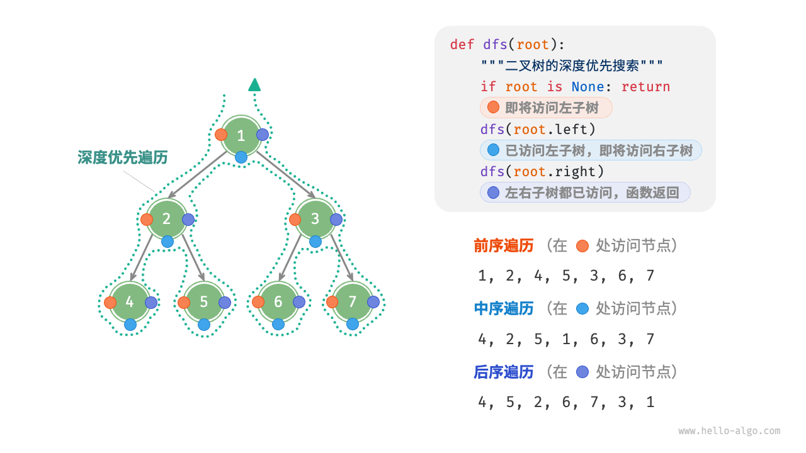

# 二叉树深度优先遍历

前序、中序和后序遍历都属于**深度优先遍历（depth-first traversal）** ，也称**深度优先搜索（depth-first search, DFS）** ，它体现了一种“先走到尽头，再回溯继续”的遍历方式。

下面的图展示了对二叉树进行深度优先遍历的工作原理。**深度优先遍历就像是绕着整棵二叉树的外围“走”一圈** ，在每个节点都会遇到三个位置，分别对应前序遍历、中序遍历和后序遍历。



```java
    /**
     * 前序遍历，按照的顺序是中左右
     *
     * @param root  节点
     * @param lists 返回的列表
     */
    public void preOrder(BinaryTree root, List<BinaryTree> lists) {
        if (root == null) {
            return;
        }

        lists.add(root);
        preOrder(root.left, lists);
        preOrder(root.right, lists);
    }

    /**
     * 中序遍历
     *
     * 按照 左中右
     *
     * @param root  节点
     * @param lists 节点列表
     */
    public void inOrder(BinaryTree root, List<BinaryTree> lists) {
        if (root == null) {
            return;
        }

        inOrder(root.left, lists);
        lists.add(root);
        inOrder(root.right, lists);
    }

    /**
     * 后序遍历
     * 按照 左右中的顺序进行遍历
     *
     * @param root  节点
     * @param lists 列表
     */
    public void postOrder(BinaryTree root, List<BinaryTree> lists) {
        if (root == null) {
            return;
        }

        postOrder(root.left, lists);
        postOrder(root.right, lists);
        lists.add(root);
    }

```


