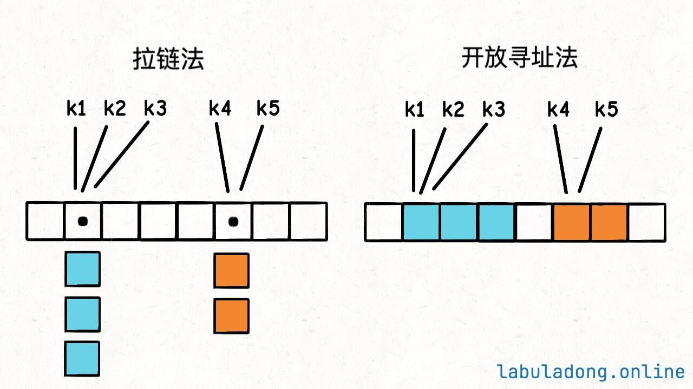

# 哈希表

**哈希表(hash table)** ，又称**散列表** ，它通过建立键`key` 与值`value` 之间的映射，实现高效的元素查询，具体而言，我们向哈希表中输入一个键`key` ，则可以在$O(1)$时间内获取对应的值`value`。

 

除哈希表外，数组和链表也可以实现查询功能，它们的效率对比如下面所示。
* **添加元素** ：仅需将元素添加至数组（链表）的尾部即可，使用$O(1)$时间。
* **查询元素** ：由于数组（链表）是乱序的，因此需要遍历其中的所有元素，使用$O(n)$时间。
* **删除元素** ：需要先查询到元素，再从数组（链表）中删除，使用$O(n)$时间。

|          | 数组   | 链表   | 哈希表 |
|----------|--------|--------|--------|
| 查找元素 | $O(n)$ | $O(n)$ | $O(1)$ |
| 添加元素 | $O(1)$ | $O(1)$ | $O(1)$ |
| 删除元素 | $O(n)$ | $O(n)$ | $O(1)$ |

## `Key` 的实现
我们如何去实现`Key` 呢，在Java语言中可以使用`hashCode` 去实现，实现定义类的时候，如果不重写这个方法，那么它的默认返回值可以认为是该对象的内存地址，一个对象的内存地址显然是全唯一的一个整数。

所以我们只需要调用`key` 的`hashCode` 方法相当于把`key` 转化成一个整数，且这个整数是全局唯一的。

### 如何保证索引合法
`hashCode` 方法返回的int类型，首先一个问题就是，这个int值可能是负数，而数组的索引是非负数（因为我们底层的实现是使用数组来实现的，如果出现负数则是有问题的）。

```java
int h = key.hashCode();
if (h < 0) h = -h;
```

当然也可以使用上面的方式去处理。

但这样有问题，int类型可以表示的最小值是`-2^31` ，而最大值是`2^31 - 1` 。所以如果`h = -2^32` ，那么`-h = 2^31` 就会超出int类型的最大值，这叫做整型溢出，编译器会报错，甚至产生不可预知的结果。

因为补码的原理，int就是32位二进制位，其中最高位（最左边位）是符号位，符号位是0时表示正数，是1表示负数。

那么为了杜绝这种影响，我们则可以使用补码的运算。

```java
// 位去处，把最高位的符号去掉
int h = key.hashCode();
h = h & 0x7fffffff;

// 0x7fffffff的二进制表示 0111 1111 ... 1111
// 即除了最高位（符号位）是0，其他位都是1
// 把0x7fffffff和其他int进行&运算之后，最高位（符号位）就会被清零，即保证了h是非负数。
```

通过上面的一系列处理，我们已经将`hashCode` 初步处理了，但是这个方法得到的`int` 会相当大，那么如何将得到的值变小呢，所以就需要使用`%` 运算来保证索引的合法性，实现如下：
```java
int hash(K key) {
    int h = key.hashCode();

    h = h & 0x7fffffff;
    return h % table.length;
}
```

当然，直接使用`%` 也有问题，因为`%` 这个求余数的运算比较消耗性能，一般在追求运行效率的标准库源码中会尽量避免使用`%` 运算，而是使用位运算提升性能。

这是Java中的`HashMap` 去实现hash的值的。

```java
return key == null ? 0 : (h = key.hashCode()) ^ h >>> 16;
```

## 实现


```java
public class ArrayHashMap {
    class Pair {
        public int key;
        public String val;

        public Pair(int key, String val) {
            this.key = key;
            this.val = val;
        }
    }

    private List<Pair> buckets;

    public ArrayHashMap() {
        buckets = new ArrayList<>(100);
        // 初始化将内部的列表中添加null对象
        for (int i = 0; i < 100; i++) {
            buckets.add(null);
        }
    }

    private int hashFunc(int key) {
        int index = key % 100;
        return index;
    }

    public void put(int key, String val) {
        int index = hashFunc(key);
        Pair pair = new Pair(key, val);

        buckets.set(index, pair);
    }

    public String get(int key) {
        int index = hashFunc(key);
        Pair pair = buckets.get(index);
        return pair == null ? null : pair.val;
    }
}

```

## 哈希表冲突
[哈希表冲突解决办法](https://labuladong.online/algo/data-structure-basic/hashmap-basic/#%E5%93%88%E5%B8%8C%E5%86%B2%E7%AA%81)


 

**拉链法：** 从上图观察到，当一个`key` 已经被占用之后，其对应的`value` 值可能有很多。那么我们把这些`value` 放到一个链表之中，那么有相同的`key` 就对应多个数据值，从这个`key` 会取得一串数据。

**寻址法(线性探查法)：** 一个`key` 对应的`value`，如果这个`key`已经被占用，则对这个`key` 所在`index` 向上加一`index + 1` ，查看是否已经被占用，如果被占用再`index + 1` 直到找到没有占用的位置，再将`value` 放入到这个空间位置。 
线性探查法，使用了`index = hash(key)` ，那么拿到这个位置之后去表中查看是否存在，发现已经存在了(因为可能之前有冲突，`index + 1` 在这个位置)，出现这种情况之后就需要再往表后去找，因为不确定`index` 是否已经存在了，那么按顺序去遍历时间复杂度就为$O(K)$。

那么当哈希表的冲突比较频繁时，`K` 值会越来越大，这个哈希表的性能会有显著的下降。这是我们应该避免的。

为何会出现冲突呢，无非是两个原因:
1. 在设计`key` 时算法并不好，导致`key` 的冲突频率会比较大。
2. 哈希表中已经装的太多了，使得`hash` 函数并不完美了，这是我们需要避免的。

### 负载因子
负载因子是一个哈希表装满的程度的度量。一般来说，负载因子越大，说明哈希表里面存储的`key-value` 对越多，哈希表冲突的概率就越大，哈希表的操作性能就越差。

负载因子的计算公司也很简单，就是`size / table.length`。其中`size` 是哈希表里面的`key-value` 对的数量，`table.length` 是哈希表底层数组的容量。

不难发现，用拉链法实现的哈希表，负载因子可以无限大，因为链表可以无限延伸；用线性探查法实现的哈希表，负载因子不会超过1。

像Java的HashMap，允许我们创建哈希表时自定义负载因子，不设置的话默认是`0.75` ，这个值是经验值，一般保持默认就行了。

**当哈希表内元素达到负载因子时，哈希表会扩容。就是把哈希表底层`table` 数组的容量扩大，把数据搬移到新的大数据中。** 


以上现我们写的代码为例，现在我们的key是使用`key % 100` 来取模的，那么如图下面所示，可能会出现冲突。


那么我们如何去解决这个冲突呢，可以将整个表扩容之后则可以减少冲突的情况。

 


## 为什么不能依赖哈希表的遍历顺序
哈希表的遍历本质就是遍历那个底层`table` 数组：
```java
KVNode[] table = new KVNode[1000];

List<KeyType> keys = new ArrayList<>();

for (int i = 0; i < table.length; i++) {
    KVNode node = table[i];
    if (node != null) {
        keys.add(node.key);
    }
}
```

首先，我们使用的了`hash(key)` 的形式将`key` 进行一次“哈希”计算，然后`key` 对应了一个`value` ，那么`key` 在`table` 底层数组中的分布是随机的，不像数组或链表结构有个明确的元素顺序。

其次，在上面的笔记中也讲了，如果当一个哈希表已经超过了负载因子时就会对表进行扩容，也就是`table.length` 会变化，且会搬移元素。

**搬迁新的元素时，我们再对所有的key进行`hash` 进行计算而这个值是依赖`table.length` 来的，所以自动扩容后，同一个`key` 的哈希值可能会发生变化。** 那么在底层的`table` 中虽然就是同一个`key` 位置也变了，那么再遍历时候就是无序的。

## 为什么不建议在for循环中增/删哈希表的`key`
简单来讲，当我们在遍历的过程中，增加元素可能会导致扩容，上一章节讲到了当扩容发生时可能会导致同一个`key` 所对应的哈希值变化了，那么底层的`table` 顺序就已经发生了改变，那么去读取数据的顺序时无法保证每一个元素能正确的读取到。

行为变得不可预期。

## `Key` 必须是不可变的

**只有那些不可变的类型，才能作为哈希表的`key`。**
比如在Java中，我们可以使用`Integer`、`Long` 等这些类型来作为`Key`。

因为如果我们使用`ArrayList`、`LinkedList` 等数据结构来作为`Key` 时，在对应`Key-Value` 时，`Key` 的哈希值是可能发生改变的，我们可以向这些数据结构中插入或更改元素。

那么我们是否可以使用`String` 来作为我们的`key` 呢，答案是肯定的。可以使用`String` 来作为我们的`Key`，因为字符串是由`char` 来组成的一个数组，那么字符是确定的，可以对`string` 的中每一个元素分别进行一次`hash`计算最终得到我们的哈希值。


## 拉链法的说明&实现

```java
private LinkedList<KVNode<K, V>> table[];
```

我们使用的一个数组来表示这个表，刚开始的时候，我是使用了`ArrayList` 来实现了，那么就有以下几个问题。

* 当使用了`ArrayList` ，如果想获得这个表的大小时候`.size()` 得到了只是当前这个线性结构的实际大小，而不是内存中开辟出来的数据大小。
* 他是按照顺序来进行添加的，如果直接指定某个位置进行插入的话，超出了这个表的最大边界则会抛出`IndexOutOfBondException`。

所以这里我们还是需要使用*数组* 来实现。


```java
public ListHashMap(int capacity) {
    table = (LinkedList<KVNode<K, V>>[]) new LinkedList[capacity];
    this.size = 0;

    for (int i = 0; i < table.length; i++) {
        table[i] = new LinkedList<KVNode<K, V>>();
    }
}
```

上面的代码表示，在构造函数中将*表* 初始化。

```java
public void put(K key, V value) {
    // .....


    if (((double) size / table.length) >= BOND_FACTOR) {
        // 如果现在的负载因子已经足够大了，那么这时候就需要对表进行扩容，我这里是将表扩容至2倍以上
        resize(table.length * EXPAND_RATE);
    }
}

```

上面的这段代码是向表中添加一组键值对，关键是如果现在这个表的大小已经超过了设定的最大的负载因子，那么这时候就需要去扩容。


同样的在`remove` 这个函数中，如果现在表的大小已经足够小的话，也需要再去缩减表的大小。
```java
public void remove(K key) {

    // .....

    // 如果现在的这个表数据已经足够小的话，还是需要再对这个数组进行缩减
    if (size < table.length / 8) {
        resize((int) Math.floor(table.length / 4));
    }
}
```

扩容或缩减的方法:
```java
public void resize(int length) {
    // ....
    // 新的大小
    ListHashMap<K, V> newHashMap = new ListHashMap<K, V>(length);
    for (List<KVNode<K, V>> nodes : table) {
        for (KVNode<K, V> node : nodes) {
            newHashMap.put(node.key, node.value);
        }
    }

    // ....
}
```
这里需要掌握如果扩容一个数组，因为在`Java` 语言中，数组是无法动态去扩容的，解决办法就是**重新声明创建一个新的数组，然后把原来的数组值按顺序复杂到现有的数组中。** 

## 线性探查法

线性探查法，可查看一下上文的图，不同于拉链法，其需要向后去查找元素，如果一直找到表的最后一位还没有，那么就需要再到头部去找，这种实现方式等同于去实现一个环形数组。会产生两个难点:

下面的例子假如我们的数组长度都是`10` ，并且哈希值`index` 是利用`hash(key) = key % 10` 的方式。

### 难点一：需要环形数组技巧

我们底层的`table` 数组是一个一维数组，当发生哈希冲突时，我们需要往后找一个空位。如果一直找到数组的末尾还没找到空位，怎么办？这时候就需要转到数组的头部继续找空位，直到找到为止。

举个简单的例子，比如调用一次`put(8, a)` ，底层`table` 数组的情况是这样:

```
table = [_, _, ..., _, a, _]
index    0  1  ...  7  8  9
```

再调用一次`put(18, b)` ，发现`hash(18) = 8` 这个索引已经被占用了，那么就往后找一个空位：

```
table = [_, _, ..., _, a, b]
index    0  1  ...  7  8  9
```

如果再调用一次`put(28, c)` ，发现`hash(28) = 8` 这个索引还是被占用了，那么就继续往后找空位，找到最后一个位置还没找到，就要转到数组的头部继续找：

```
table = [c, _, ..., _, a, b]
index    0  1  ...  7  8  9
```

这是`put` 方法添加元素的情况，在查找和删除元素的时候，也会遇到类似的问题。

### 难点二：删除操作比较复杂
线性探查法的删除操作比较复杂，因为要维护元素的连续性。

为什么线性探查法也要维护元素的连续性呢，比方说我这样调用：

```java
put(0, a)
put(10, b)
put(20, c)

put(3, A)
put(13, B)

put(30, d)
put(40, e)
```

那么底层的`table` 数组的情况是这样:

```
table = [a, b, c, A, B, d, e, _, _, _]
index    0  1  2  3  4  5  6  7  8  9
hash     ^        ^
key      0 10 20  3 13  30 40
```

比如说，现在我想删除`key = 10` 这个键值对，怎么办？如果直接把`table[1] = null`，就会变成这样：
```
table = [a, _, c, A, B, d, e, _, _, _]
index    0  1  2  3  4  5  6  7  8  9
hash     ^        ^
key      0    20  3 13  30 40
```

这里需要我们记住上面的我们已经有了一个前提哈希的计算方法是简化过的`hash(key) = key % 10` ，那么这里的`key = (0, 10, 20)` 得到的哈希值是一样的都为`0`。

所以，这样一来元素就不连续了，回顾一下`get` 方法的逻辑，此时调用`get(20), get(30), get(40)` 的时候就会发现找不到对应的`key` ，这是错误的，哈希表被搞坏了。


#### 方法一：数据搬移避免空洞
在`table` 中删除元素时，可以进行类似数组的数据搬移操作，把后面的元素向前挪，保证元素的连续性。

但这里的搬移操作其实比数组的搬移操作更复杂，因为不能把`table[1]` 后面的元素往前挪，而应该仅挪动在索引0出现哈希冲突的元素。

举例来说，如果移动后面的所胡元素，`table` 就会变成这样:
```
table = [a, c, A, B, d, e, _, _, _, _]
index    0  1  2  3  4  5  6  7  8  9
hash     ^        ^
key      0 20  3 13  30 40
```

`key = 3, value = A` 的那个键值对已经不能找到了，`hash(3) = 3` ，顺着`table[3]` 往后一直都找不到，因为它被错误地往前移动了。

正确的做法是，只把`hash(key) = 0` 出现哈希冲突的元素往前挪，其他元素不要动，这样才能保证线性探查的正确性。

也就是说，删除`key = 10` 之后，`table` 应该变成这样：
```
table = [a, c, d, A, B, e, _, _, _, _]
index    0  1  2  3  4  5  6  7  8  9
hash     ^        ^
key      0 20 30  3 13  40
```

这样一来，获取每个`key` 对应的`value` 就不会出错了。

#### 方法二：占位符标记删除
还有一种办法，就是通过一个特殊值作为占位符来标记被删元素，这样就可以避免数据搬移，同时保证元素连续。

还是这个例子：

```
table = [a, b, c, A, B, d, e, _, _, _]
index    0  1  2  3  4  5  6  7  8  9
hash     ^        ^
key      0 10 20  3 13  30 40
```

如果想删除`key = 10` ，那么可以把`table[1]` 设置为一个特殊占位符标记为删除，用`x` 来表示，这样`table` 就变成了：

```
table = [a, x, c, A, B, d, e, _, _, _]
index    0  1  2  3  4  5  6  7  8  9
hash     ^        ^
key      0    20  3 13  30 40
```

在`get` 方法中会特殊处理这个特殊值，所以调用`get(10)` 的时候会返回`-1` ，表示没有找到。

同时，调用`get(20), get(30), get(40)` 的时候，还是可以正确地向后找到对应的`value` 。

这种方法的好处是，不需要进行数据搬移，删除操作处理起来比较简单。

但也有缺点，比如如果不断地插入和删除元素，`table` 数组中会出现很多这样的占位符，这样会增加连续元素的长度，进而降低`get` 方法线性探查的效率。

还有一种非常特殊的情况，比如不断的插入和删除元素，导致`table` 中全部都是占位符，如果不对这种特殊的情况做处理，那么此时调用一次`get` 方法，由于环形数组的特性，算法就会陷入死循环。

