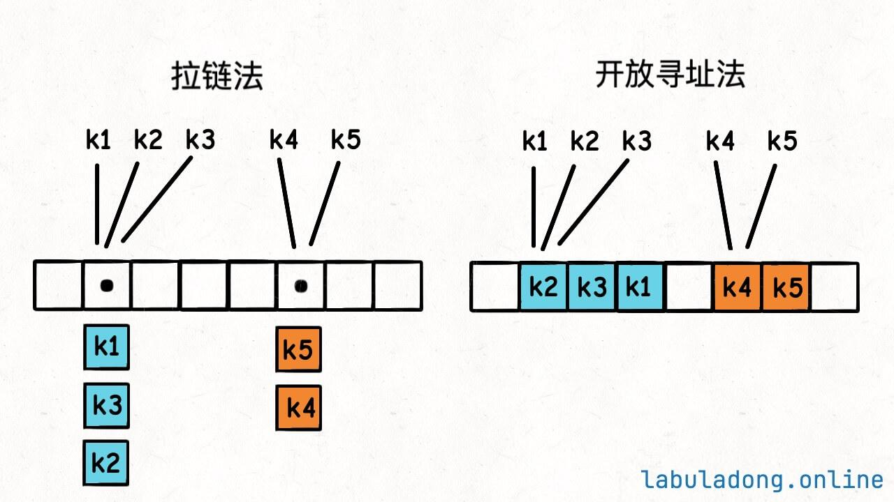

## 哈希表

**哈希表(hash table)** ，又称**散列表** ，它通过建立键`key` 与值`value` 之间的映射，实现高效的元素查询，具体而言，我们向哈希表中输入一个键`key` ，则可以在$O(1)$时间内获取对应的值`value`。

 

除哈希表外，数组和链表也可以实现查询功能，它们的效率对比如下面所示。
* **添加元素** ：仅需将元素添加至数组（链表）的尾部即可，使用$O(1)$时间。
* **查询元素** ：由于数组（链表）是乱序的，因此需要遍历其中的所有元素，使用$O(n)$时间。
* **删除元素** ：需要先查询到元素，再从数组（链表）中删除，使用$O(n)$时间。

|          | 数组   | 链表   | 哈希表 |
|----------|--------|--------|--------|
| 查找元素 | $O(n)$ | $O(n)$ | $O(1)$ |
| 添加元素 | $O(1)$ | $O(1)$ | $O(1)$ |
| 删除元素 | $O(n)$ | $O(n)$ | $O(1)$ |

### `Key` 的实现
我们如何去实现`Key` 呢，在Java语言中可以使用`hashCode` 去实现，实现定义类的时候，如果不重写这个方法，那么它的默认返回值可以认为是该对象的内存地址，一个对象的内存地址显然是全唯一的一个整数。

所以我们只需要调用`key` 的`hashCode` 方法相当于把`key` 转化成一个整数，且这个整数是全局唯一的。

#### 如何保证索引合法
`hashCode` 方法返回的int类型，首先一个问题就是，这个int值可能是负数，而数组的索引是非负数（因为我们底层的实现是使用数组来实现的，如果出现负数则是有问题的）。

```java
int h = key.hashCode();
if (h < 0) h = -h;
```

当然也可以使用上面的方式去处理。

但这样有问题，int类型可以表示的最小值是`-2^31` ，而最大值是`2^31 - 1` 。所以如果`h = -2^32` ，那么`-h = 2^31` 就会超出int类型的最大值，这叫做整型溢出，编译器会报错，甚至产生不可预知的结果。

因为补码的原理，int就是32位二进制位，其中最高位（最左边位）是符号位，符号位是0时表示正数，是1表示负数。

那么为了杜绝这种影响，我们则可以使用补码的运算。

```java
// 位去处，把最高位的符号去掉
int h = key.hashCode();
h = h & 0x7fffffff;

// 0x7fffffff的二进制表示 0111 1111 ... 1111
// 即除了最高位（符号位）是0，其他位都是1
// 把0x7fffffff和其他int进行&运算之后，最高位（符号位）就会被清零，即保证了h是非负数。
```

通过上面的一系列处理，我们已经将`hashCode` 初步处理了，但是这个方法得到的`int` 会相当大，那么如何将得到的值变小呢，所以就需要使用`%` 运算来保证索引的合法性，实现如下：
```java
int hash(K key) {
    int h = key.hashCode();

    h = h & 0x7fffffff;
    return h % table.length;
}
```

当然，直接使用`%` 也有问题，因为`%` 这个求余数的运算比较消耗性能，一般在追求运行效率的标准库源码中会尽量避免使用`%` 运算，而是使用位运算提升性能。

这是Java中的`HashMap` 去实现hash的值的。

```java
return key == null ? 0 : (h = key.hashCode()) ^ h >>> 16;
```

### 实现


```java
public class ArrayHashMap {
    class Pair {
        public int key;
        public String val;

        public Pair(int key, String val) {
            this.key = key;
            this.val = val;
        }
    }

    private List<Pair> buckets;

    public ArrayHashMap() {
        buckets = new ArrayList<>(100);
        // 初始化将内部的列表中添加null对象
        for (int i = 0; i < 100; i++) {
            buckets.add(null);
        }
    }

    private int hashFunc(int key) {
        int index = key % 100;
        return index;
    }

    public void put(int key, String val) {
        int index = hashFunc(key);
        Pair pair = new Pair(key, val);

        buckets.set(index, pair);
    }

    public String get(int key) {
        int index = hashFunc(key);
        Pair pair = buckets.get(index);
        return pair == null ? null : pair.val;
    }
}

```

### 哈希表冲突
[哈希表冲突解决办法](https://labuladong.online/algo/data-structure-basic/hashmap-basic/#%E5%93%88%E5%B8%8C%E5%86%B2%E7%AA%81)


 

**拉链法：** 从上图观察到，当一个`key` 已经被占用之后，其对应的`value` 值可能有很多。那么我们把这些`value` 放到一个链表之中，那么有相同的`key` 就对应多个数据值，从这个`key` 会取得一串数据。

**寻址法(线性探查法)：** 一个`key` 对应的`value`，如果这个`key`已经被占用，则对这个`key` 所在`index` 向上加一`index + 1` ，查看是否已经被占用，如果被占用再`index + 1` 直到找到没有占用的位置，再将`value` 放入到这个空间位置。 
线性探查法，使用了`index = hash(key)` ，那么拿到这个位置之后去表中查看是否存在，发现已经存在了(因为可能之前有冲突，`index + 1` 在这个位置)，出现这种情况之后就需要再往表后去找，因为不确定`index` 是否已经存在了，那么按顺序去遍历时间复杂度就为$O(K)$。

那么当哈希表的冲突比较频繁时，`K` 值会越来越大，这个哈希表的性能会有显著的下降。这是我们应该避免的。

为何会出现冲突呢，无非是两个原因:
1. 在设计`key` 时算法并不好，导致`key` 的冲突频率会比较大。
2. 哈希表中已经装的太多了，使得`hash` 函数并不完美了，这是我们需要避免的。

#### 负载因子
负载因子是一个哈希表装满的程度的度量。一般来说，负载因子越大，说明哈希表里面存储的`key-value` 对越多，哈希表冲突的概率就越大，哈希表的操作性能就越差。

负载因子的计算公司也很简单，就是`size / table.length`。其中`size` 是哈希表里面的`key-value` 对的数量，`table.length` 是哈希表底层数组的容量。

不难发现，用拉链法实现的哈希表，负载因子可以无限大，因为链表可以无限延伸；用线性探查法实现的哈希表，负载因子不会超过1。

像Java的HashMap，允许我们创建哈希表时自定义负载因子，不设置的话默认是`0.75` ，这个值是经验值，一般保持默认就行了。

**当哈希表内元素达到负载因子时，哈希表会扩容。就是把哈希表底层`table` 数组的容量扩大，把数据搬移到新的大数据中。** 




以上现我们写的代码为例，现在我们的key是使用`key % 100` 来取模的，那么如图下面所示，可能会出现冲突。


那么我们如何去解决这个冲突呢，可以将整个表扩容之后则可以减少冲突的情况。

 


### 为什么不能依赖哈希表的遍历顺序
哈希表的遍历本质就是遍历那个底层`table` 数组：
```java
KVNode[] table = new KVNode[1000];

List<KeyType> keys = new ArrayList<>();

for (int i = 0; i < table.length; i++) {
    KVNode node = table[i];
    if (node != null) {
        keys.add(node.key);
    }
}
```

首先，我们使用的了`hash(key)` 的形式将`key` 进行一次“哈希”计算，然后`key` 对应了一个`value` ，那么`key` 在`table` 底层数组中的分布是随机的，不像数组或链表结构有个明确的元素顺序。

其次，在上面的笔记中也讲了，如果当一个哈希表已经超过了负载因子时就会对表进行扩容，也就是`table.length` 会变化，且会搬移元素。

**搬迁新的元素时，我们再对所有的key进行`hash` 进行计算而这个值是依赖`table.length` 来的，所以自动扩容后，同一个`key` 的哈希值可能会发生变化。** 那么在底层的`table` 中虽然就是同一个`key` 位置也变了，那么再遍历时候就是无序的。

### 为什么不建议在for循环中增/删哈希表的`key`
简单来讲，当我们在遍历的过程中，增加元素可能会导致扩容，上一章节讲到了当扩容发生时可能会导致同一个`key` 所对应的哈希值变化了，那么底层的`table` 顺序就已经发生了改变，那么去读取数据的顺序时无法保证每一个元素能正确的读取到。

行为变得不可预期。

### `Key` 必须是不可变的

**只有那些不可变的类型，才能作为哈希表的`key`。**
比如在Java中，我们可以使用`Integer`、`Long` 等这些类型来作为`Key`。

因为如果我们使用`ArrayList`、`LinkedList` 等数据结构来作为`Key` 时，在对应`Key-Value` 时，`Key` 的哈希值是可能发生改变的，我们可以向这些数据结构中插入或更改元素。

那么我们是否可以使用`String` 来作为我们的`key` 呢，答案是肯定的。可以使用`String` 来作为我们的`Key`，因为字符串是由`char` 来组成的一个数组，那么字符是确定的，可以对`string` 的中每一个元素分别进行一次`hash`计算最终得到我们的哈希值。


### 拉链法的说明&实现

```java
private LinkedList<KVNode<K, V>> table[];
```

我们使用的一个数组来表示这个表，刚开始的时候，我是使用了`ArrayList` 来实现了，那么就有以下几个问题。

* 当使用了`ArrayList` ，如果想获得这个表的大小时候`.size()` 得到了只是当前这个线性结构的实际大小，而不是内存中开辟出来的数据大小。
* 他是按照顺序来进行添加的，如果直接指定某个位置进行插入的话，超出了这个表的最大边界则会抛出`IndexOutOfBondException`。


