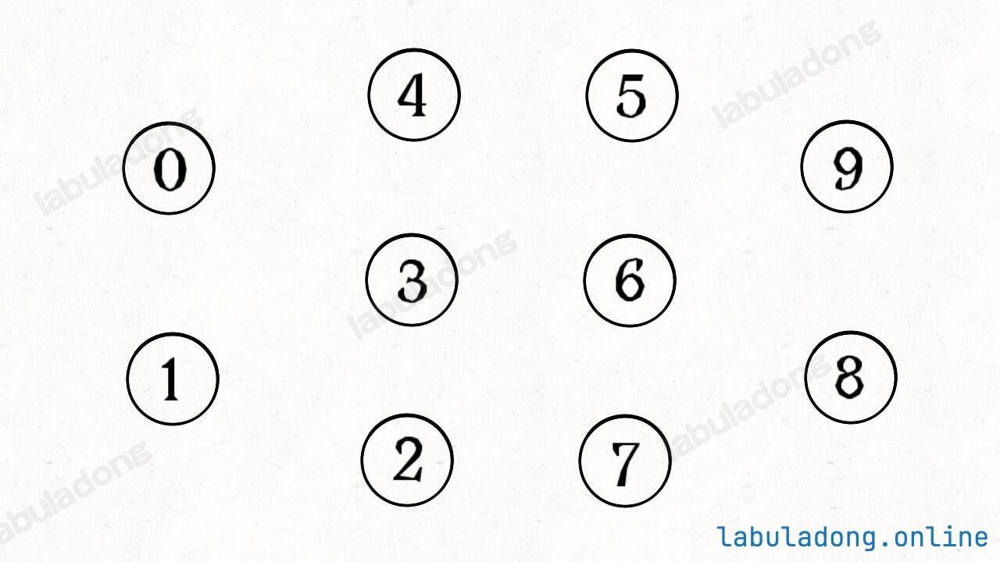

# Union Find 并查集原理

>[!note]
> 一句话总结
> 
> 并查集(Union Find)结构是二叉树结构的衍生，用于高效解决无向图的连通性问题，可以在$O(1)$时间内合并两个连通分量，在$O(1)$时间内查询两个节点是否连通，在$O(1)$时间内查询连通分量的数量。


## 动态连通性及术语
图论算法中专业术语比较多，有几个例子。

如下图的这个例子，其中有10个节点，分别用0~9标记，虽然其中没有边，但它依然是一个图结构：



我们可以说这个图结构中，有10个<u>连通分量</u>，每个节点自身都是一个连通分量，因为它们自成一派，没有和其他节点相连。

现在将其中的一些节点进行<u>连接操作</u> ，比如连接节点`0,1` 和`1,2`：


此时，图结构中的节点`0,1,2` 之间就连通了，它们三个节点共同构成了一个连通分量，我们可以说这个三个节点<u>连通的</u>的。


同时，这个图结构中的连通分量的数量从10减少到了8，因为连接操作将`0,1,2` 三个连通分量合并成了一个。

>[!important]
> 
> 连通关系的性质
> 
> 1. **<u>自反性</u> ** :节点`p` 和`p` 自身是连通的。
> 2. **<u>对称性</u> ** :如果节点`p` 和`q` 连通，那么`q` 和`p` 也连通。
> 3. **<u>传递性</u> ** :如果节点`p` 和`q` 连通，`q` 和`r` 连通，那么`p` 和`r` 也连通。
> 
> 判断这种<u>等价关系</u> 非常实用，比如说编译器判断同一个内存对象的不同变量引用，比如社交网络中的朋友圈计算等等。

那么动态连通性问题就是说，给你输入一个图结构。然后进行若干次<u>连通操作</u> 时可能会查询任意两个节点是否<u>连通</u> ，或者查询当前图中有多少个<u>连通分量</u> 。

我们的目标是设计一种数据结构，在尽可能小的时间复杂度下完成连接操作和查询操作。

## 为什么需要并查集算法

并查集(union find)结构提供如下API:
```java
class UF {
    // 初始化并查集，包含 n 个节点，时间复杂度 O(n)
    public UF(int n);

    // 连接节点 p 和节点 q，时间复杂度 O(1)
    public void union(int p, int q);

    // 查询节点 p 和节点 q 是否连通（是否在同一个连通分量内），时间复杂度 O(1)
    public boolean connected(int p, int q);

    // 查询当前的连通分量数量，时间复杂度 O(1)
    public int count();
}
```

其中`union` 方法用于连接两个节点，`connected` 方法用于查询两个节点是否连通，`count` 方法用于查询当前图中的连通分量数量。它们都可以在$O(1)$时间内完成。

$O(1)$的时间复杂是最牛逼的，我们应该如果去实现上面的几个API呢？

比如我们可以使用图中邻接表/邻接矩阵的代码实现，这个`union` 方法其实就是图中添加一条无向边，时间复杂度可以做到$O(1)$。

>[!note]
相当于就是更新一条边。

--------

那么`connected` 方法怎么实现呢？如果我们直接使用邻接表/邻接矩阵，看看这两个节点是否相连就行了？

那我们边忘记了上面讲的<u>连通</u> 的性质，其中有一条是<u>传递性</u> ：如果节点`p` 和`q` 连通，`q` 和`r` 连通，那么`p` 和`r` 也连通。

**如果只是单纯的查询只能判断两个节点是否直接相连**，而无法处理这种传递的连通关系。

所以，要实现`connected(a, b)` ，我们只能使用<u>图结构中的DFS/BFS</u> 算法，从`a` 节点开始遍历所有可达的节点，看看`b` 节点是否在其中，才能判断`a,b` 两个节点是否连通。

这样的话，`connected` 方法最坏时间复杂度就是图遍历的复杂度$O(V + E)$，其中$V$是节点的数量，$E$是边的数量。

--------

那么接下来，`count` 方法如何实现呢？

还得依赖<u>图结构的DFS/BFS遍历算法</u> ，但是更麻烦。

我们需要使用BFS/DFS遍历整幅图，将所有节点分类到不同的连通分量中，最后统计连通分量的数量。这个过程的时间复杂度为$O(V + E)$。

所以说并查集算法非常巧妙，它不仅可以在$O(1)$时间内完成上述操作，而且它根本不需要真的用邻接表/邻接矩阵构造图结构，只需要一个数组就可以了。

## 并查集的核心原理

并查集本质上还是树结构的延伸。

对于一棵树，其中所有节点，都是有一个共同的根节点。

如果我们想办法把同一个连通分量的节点都放到同一棵树中，把这棵树的根节点作为这个连通分量的代表，那么我们就可以高效实现上面的操作了。

并查集底层其实是一片森林（若干棵多叉树），每棵树代表一个连通分量：

* `connected(p, q)` ：只需要判断`p` 和`q` 所在多叉树的根节点，若相同，`p` 和`q` 在同一棵中，即连通，否则不连通。
* `count` :只需要统计一下总共有多少棵树，即可得到连通分量的数量。
* `union(p, q)` :只需要将`p` 节点所在的这棵树的根节点，接入到`q` 节点所在的这棵树的根节点下面，即可完成连接操作。注意这里并不是`p,q` 两个节点合并，而是两棵树根节点的合并。因为`p,q` 一旦连通，那么他们所属的连通分量就合并成了同一个更大的连通分量。

综上，并查集中每个节点其实并不在乎自己的子节点是谁，只在乎自己的根节点是谁，所以一个并查集节点类似于下面这样：

```java
class UFNode {
    // 节点的id编号
    int id;

    // 指向父节点的指针
    // 根节点的parent 指针为空
    UFNode parent;
}

```

这样，对于任意一个节点，我们都可以顺着`parent` 指针一路找到它的根节点。`union, connected, count`方法的实现思路如下：

```java
// 连接根节点p和节点q
void union(UFNode p, UFNode q) {
    find(p).parent = find(q);
}

// 查询节点p和节点q是否连通(是否在同一个连通分量内)
boolean connected(UFNode p, UFNode q) {
    return find(p).id == find(q).id;
}

// 查询节点node的根节点，时间复杂度取决于树的高度。
UFNode find(UFNode node) {
    while (node.parent != null) {
        node = node.parent;
    }

    return node;
}

```

`union` 和`connected` 方法的时间复杂度都依赖于`find` 方法，而`find` 方法的时间复杂度取决树的高度。

所以并查集算法的最终目标，就是要尽可能降低树的高度，如果能保持树高为常数，那么上述方法的复杂度就是$O(1)$了。


