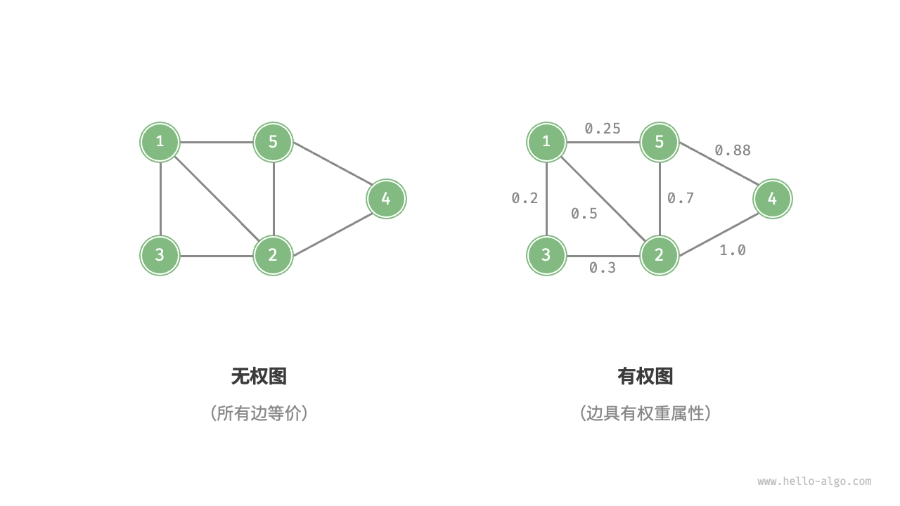

# 图

<u>图(graph)</u>是一种非线性数据结构，由<u>顶点(vertex)</u>和<u>边(edge)</u>组成。我们可以将图$G$抽象地表示为一组顶点$V$和一组边$E$的集合。

$$
V = {1, 2, 3, 4, 5} \newline
E = {(1, 2), (1, 3), (1, 5), (2, 3), (2, 4), (2, 5), (4, 5)} \newline
G = {V, E}
$$

如果将顶点看作节点，将边看作连接各个节点引用(指针)，我们就可以将图看作一种从链表拓展而来的数据结构。**相较于线性关系（链表）和分治关系（树），网络关系（图）的自由度更高，** 因而理为复杂。

## 图的常见类型与术语

根据边的是否具有方向，可分为<u>无向图(undirected graph)</u>和<u>有向图(directed graph)</u>。

* 在无向图中，边表示两顶点之间“双向”连接关系，例如微信或QQ中“好友关系”。
* 在有向图中，边具有方向性，即$A→B$和$A←B$两个方向的边是相互独立的，例如微博或抖音上的“关注”和“被关系”关系。

根据所有顶点是否连通，可分为<u>连通图(connected graph)</u>和<u>非连通图(disconnected graph)</u>。

* 对于连通图，从某个顶点出发，可以到达其余任意顶点。
* 对于非连通图，从某个顶点出发，至少有一个顶点无法到达。

我们还可以以边添加“权重”变量，从而得到下面所示的<u>有权图(weighted graph)</u>。例如在游戏中，系统会根据共同游戏时间计算玩家之间的“亲密度”，这种亲密网络就可以用有权图来表示。

图数据结构包含以下常用术语：
* <u>邻接(adjacency)</u>: 当两顶点之间存在相连时，称这两顶点“邻接”。在上图中，顶点1的邻接顶点为顶点2、3、5。
* <u>路径(path)</u>: 从顶点A到顶点B经过的边构成的序列被称为从A到B的“路径”。在上图中，边序列1-5-2-4是顶点1到顶点4的一条路径。
* <u>度(degree)</u>: 一个顶点拥有的边数。对于有向图，<u>入度(in-degreee)</u>表示有多少条连指向该顶点，<u>出度(out-degree)</u>表示有多少条边从该顶点指出。

## 图的表示
图的常用表示方式包括“邻接矩阵”和“邻接表”。以下使用无向图进行举例。

### 邻接矩阵
设图的顶点数量为$n$，<u>邻接矩阵(adjacency matrix)</u>使用一个$n x n$大小的矩阵来表示图，每一行（列）代表一个顶点，矩阵元素代表连，用$1$或$0$表示两个顶点之间是否存在边。

如下图所示，设邻接矩阵为$M$、顶点列表为$V$，那么矩阵元素$M[i,j] = 1$表示顶点$V[i]$到顶点$V[j]$之间存在边，反之$M[i,j] = 0$表示两顶点之间无边。

邻接矩阵具有以下特性：
* 在简单图中，顶点不能与自身相连，此时邻接矩阵主对角线元素没有意义。
* 对于无向图，两个方向的边等价，此时邻接矩阵关于主对角线对称。
* 将邻接矩阵的元素从$1$和$0$替换为权重，则可表示有权图。

使用邻接矩阵表示图时，我们可以直接访问矩阵元素以获取边，因此增删改查操作的效率很高，时间复杂度均为$O(1)$。然而，矩阵的空间复杂度为$O(n^2)$，内存占用较多。

### 邻接表
<u>邻接表(adjacency list)</u>使用$n$个链表表示图，链表节点表示顶点。第$i$个链表对应顶点$i$，其中存储了该顶点的所有邻接顶点（与该顶点相连的顶点）。下图展示了一个使用邻接表存储的图。

邻接表仅存储实际存在的边，而边的总数通常远小于$n^2$，因此它更加节省空间。然而，在邻接表中需要通过遍历链表来查找边，因此其时间效率不如邻接矩阵。

观察上图，**邻接表结构与哈希表中的“链式地址”非常相似，因此我们也可以采用类似的方法来优化效率。**。比如当链表较长时，可以将链表转化为AVL树或红黑树，从而将时间效率$O(N)$优化至$O(log{}{N})$；还可以把链表转换为哈希表，从而将时间复杂度降至$O(1)$。

