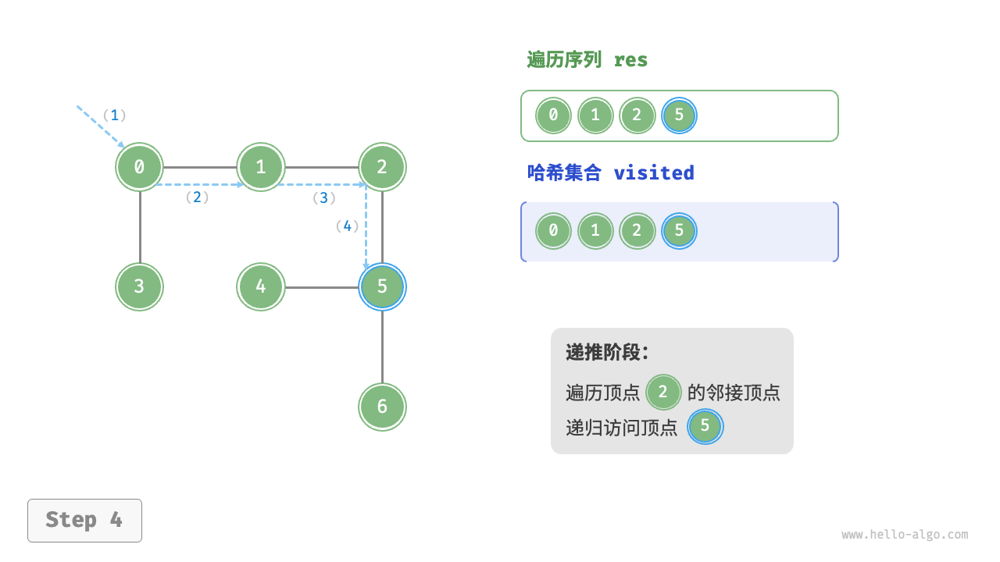
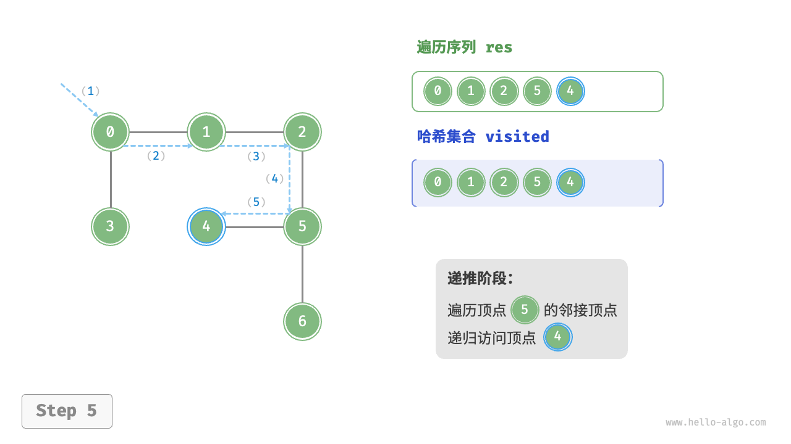
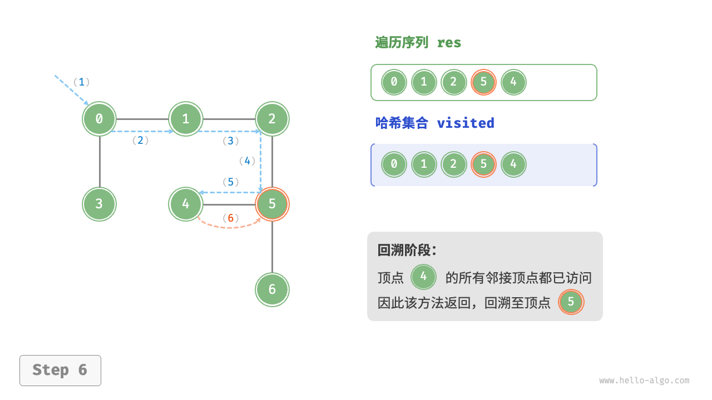
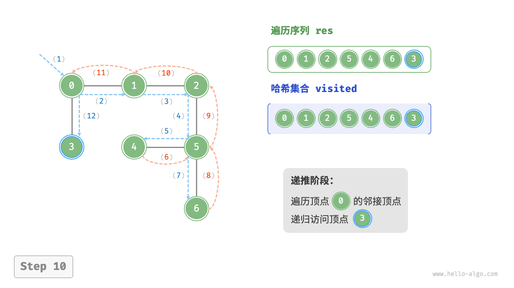

# 图的遍历

>[!important]
> 一句话总结
> 
> 图的遍历就是多叉树遍历的延伸，主要遍历方式还是尝试优先搜索(DFS)和广度优先搜索(BFS)。
> 
> 唯一的区别是，树结构中不存在环，而图中的结构可能存在环，所以我们需要标记遍历过的节点，避免遍历函数在环中死循环。
> 
> 遍历图*节点* 和*路径* 略有不同，遍历*节点* 时，需要`visited` 数组在前序位置标记节点；遍历图的所有*路径* 时，需要`onPath` 数组在前序位置标记节点，在后序位置摊销标记。


## 深度优先搜索(DFS)


前面我们已经使用了`Vertex` 这个类来存储图一般情况下是不需要用这个类来表示图的。

上面的章节也讲了，本质上就是对一个多叉树进行遍历，但是因为可能会造成死循环的情况，我们这里需要使用`visited` 数组来标记我们已经访问过的节点。

遍历的步骤如下：

<section>
    
    
</section>
<section>
    
    
</section>
<section>
    
    
</section>
<section>
    
    
</section>
<section>
    
    
</section>

### 遍历所有节点(`visited` 数组)

```java
/**
 * 深度优先遍历图
 *
 * @param graph   图
 * @param start   开始遍历的节点
 * @param visited 记录节点是否已经被遍历过
 */
public void dfs(Graph graph, int start, boolean visited[]) {
    if (graph == null || start < 0 || start >= graph.size() || visited[start]) {
        return;
    }

    System.out.println("visited[" + start + "] -> true");
    visited[start] = true;

    for (Graph.Edge edge : graph.neighbors(start)) {
        dfs(graph, edge.to, visited);
    }
}
```

我们可以看到，图的遍历比多叉树的遍历多了一个`visited` 数组，用来记录被遍历过的节点，避免遇到环时陷入死循环。

>[!note]
> 为什么会形成死循环呢？
> 
> 举个简单的成环场景，有一条1->2的边，同时有一条*2->1* 的边，节点`1,2` 就形成了一个环。
> 
> ```
> 1 <=> 2
> ```
> 
> 如果我们不标记遍历过的节点，那么从`1` 开始遍历，会走到`2` ，再走到`1` ，再走到`2` ，再走到`1` ，如此`1->2->1->2->...`无限递归循环下去。 
> 
> 如果有了`visited` 数组，第一次遍历到`1` 时，会标记`1` 为已访问，出现`1->2->1` 这种情况时，发现`1` 已经被访问过，就会直接返回，从而终止递归，避免了死循环。

由于`visited` 数组的剪枝作用，这个遍历函数会遍历一次图中所有的节点，并尝试遍历一次所有边，所以算法的时间复杂度是$O(E + V)$，其中$E$是边的总数，$V$是节点的总数。

### 遍历所有路径(`onPath` 数组)
对于树结构，遍历所有*路径* 和遍历所有节点*节点* 是没有什么区别的。而对于图结构，遍历所有*路径* 和遍历所有*节点* 稍有不同。

因为对于树结构来说，只能由父节点指向子节点，所有从根节点`root` 出发，到任意一个节点`targetNode` 的路径都是唯一的。换句话说，我遍历一遍树结构的所有节点之后，必然可以找到`root` 到`targetNode` 的唯一路径：

```java
public void findPath(Node root, Node targetNode) {
    if (root == null) return;

    path.addLast(root);
    if (root.val == targetNode.val) {
        System.out.println("find path: " + path);
    }

    for (Node child : root.children) {
        findPath(child, targetNode);
    }

    path.removeLast();
}

```

而对于图结构来说，由起点`src` 到目标节点`dest` 的路径可能不止一条。我们需要一个`onPath` 数组，在进入节点时(前序位置)标记为正在访问，退出节点时(后序位置)撤销标记，这样才能遍历图中的所有路径，从而找到`src` 到`dest` 的所有路径:

```java
    List<Integer> path;
    boolean[] onPathCheck;

    /**
     * 得到一个节点到另一个节点的所有路径
     *
     * @param graph       图
     * @param src         源节点
     * @param onPathCheck 标记已经访问过的节点
     */
    public void onPath(Graph graph, int src, int dest) {
        // 递归的边界判断
        if (graph == null || src < 0 || src >= graph.size()) {
            return;

        }

        // 防止死循环已经标记过访问过的节点返回return
        if (onPathCheck[src]) {
            return;
        }
        // 前序位置
        onPathCheck[src] = true;
        path.add(src);
        if (src == dest) {
            System.out.println("path found: " + path);
        }

        for (Graph.Edge edge : graph.neighbors(src)) {
            onPath(graph, edge.to, dest);
        }

        // 后序位置
        // 注意这里的这个方法，remove只是这里指定的index下的元素
        // 所以我们需要将这个列表的最后一个元素给删除
        path.remove(path.size() - 1);
        // 撤销标记
        onPathCheck[src] = false;
    }
```

>[!important]
> 观察一下上一章我们讲到的内容，为什么对于点的遍历来讲我们不需要撤销`visited` 数组标记，而这里要在后序位置撤销`onPath` 数组中的标记呢？
> 
> 因为前文遍历节点的代码中，`visited` 数组的职责是保证每个节点只会被访问一次。**而对于图结构来说，要想遍历所有路径，可能会多次访问一个节点，这是关键的区别。**
> 
> 比方说下面这张图，我们想求从节点`1` 到节点`4` 的全部路径：
> 
> 
> 如果使用前文遍历节点的算法，只要前序位置标记`visited` 为true，那么遍历完`1->2->4` 和`1->2->3->4` 之后，所有节点都已经被标记为已访问了，算法就会停止，`visited` 数组完成了自己职责。
> 
> 但是显然我们还没有遍历完所有路径，`1->3->2->4` 和`1->3->4` 被漏掉了。
> 
> 如果用`onPath` 数组在离开节点时(后序位置)撤销标记，就可以找到`1` 到`4` 的所有路径。

由于这里使用的`onPath` 数组会在后序位置撤销标记，所以这个函数可能重复遍历图中的节点和边，复杂度一般比较高（阶乘或指数级），具体的时间复杂度应该是所有路径的长度之和，取决于图的结构特点。

### 同时使用`visited` 和`onPath` 数组
按照上面的分析，`visited` 数组和`onPath` 分别用于遍历所有节点和所有路径，那是否是可能的呢？答案是可能的。

遍历所有路径的算法复杂度较高，大部分情况下我们可能并不需要穷举完所有的路径，而是仅需要找到某一条符合条件路径。这种场景下，我们可能会借助`visited` 数组进行剪枝，提前排除一些不符合条件，从而降低复杂度。

比如拓扑排序中会讲到如何判定图是否成环，就会同时利用`visited` 和`onPath` 数组来进行剪枝。

比如说判定成环的场景，在遍历所有路径的过程中，如果发现一个节点，`s` 被标记为`visited` ，那么说明`s` 这个起点出发的所有路径在之前都已经遍历过了。如果之前遍历的时候都没有找到环，我现在再去遍历一次，肯定也不会找到环，所以这里可以直接剪枝，不再继续遍历节点`s` 。

### 完全不用`visited` 和`onPath` 数组

是否有既不用`visited` 数组，也不用`onPath` 数组的场景呢？

一般的来说在题目中如果已经明确告知了，现在这个图并不会有环的情况，那么不需要考虑成环的情况。


## 广度优先搜索(BFS)
图的结构的广度优先搜索其实就是多叉树的层序遍历，无非就是加了一个`visited` 数组来避免重复遍历节点。

理论上BFS遍历也需要区分遍历所有*节点* 和遍历所有*路径* ，但是实际上BFS算法一般只用来寻找那样最短路径，不会用来求所有路径。

当然BFS算法肯定也可以求所有路径，但是我们一般会选择用DFS算法求所有路径 。

那么如果只求最短路径 的话，只需要遍历*节点* 就可以了，因为按照BFS算法一层一层向四周扩散的逻辑，第一次遇到目标节点，必然就是最短路径。

与多叉树层序遍历一样，图结构的BFS算法框架也有三种不同的写法。

### 方法一

```java
public void method1(Graph graph, int s) {
    // 获得当前的图的大小用于后面初始化访问的数组
    int size = graph.size();

    boolean visited[] = new boolean[size];
    Queue<Integer> queue = new LinkedList<>();
    queue.offer(s);

    visited[s] = true;
    while (!queue.isEmpty()) {
        int nodeValue = queue.poll();
        // 访问节点
        System.out.print(nodeValue + " ");

        // 与多叉树进行对比可知，这里的区别就在于我们需要记录下这个边(节点)是否已经被访问过了。
        for (Graph.Edge edge : graph.neighbors(nodeValue)) {
            if (visited[edge.to]) {
                continue;
            }

            queue.offer(edge.to);
            visited[edge.to] = true;
        }
    }
}
```

这是方法一的广度优先遍历方式，与多叉树的遍历方式可以进行一定的对比，唯一的区别就是这里使用了`visited` 布尔数组来记录边(节点)是否已经被访问过了。如果已经被访问过了则不需要再做处理。

### 方法2
```java
public void method2(Graph graph, int s) {
    boolean visited[] = new boolean[graph.size()];
    Queue<Integer> queue = new LinkedList<>();

    visited[s] = true;
    queue.offer(s);

    // 注意这里与多叉树之间的区别，多叉树中设置的为depth = 1，这里为0
    int step = 0;

    while (!queue.isEmpty()) {
        int size = queue.size();
        for (int i = 0; i < size; i++) {
            int vertex = queue.poll();

            System.out.print("vertex: " + vertex + ", step-> " + step);

            for (Graph.Edge e : graph.neighbors(vertex)) {
                if (visited[e.to]) {
                    continue;
                }

                queue.offer(e.to);
                visited[e.to] = true;
            }

        }

        step++;
    }
}
```

上面的处理可以一并处理路径的问题。


