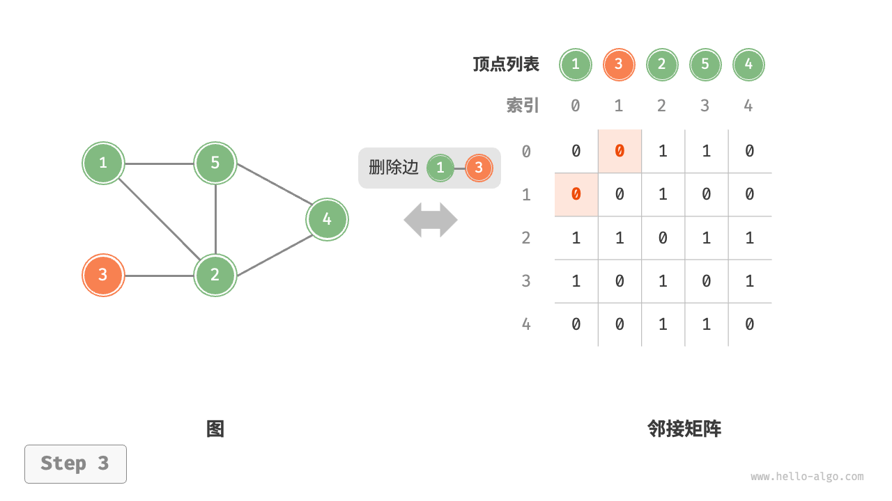
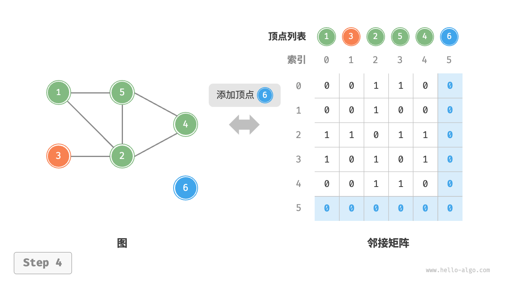

## 图的基础操作

图的基础操作可分为对“边”的操作和“顶点”的操作。在“邻接矩阵”和“邻接表”两种表示方法下，实现方式有所不用。

### 基于邻接矩阵的实现
给定一个顶点数量$n$的无向图，则各种操作的实现方式如下图:

* <u>**添加或删除边:**</u> 直接在邻接矩阵中修改指定的边即可，使用$O(1)$时间。而由于无向图，因此需要同时更新两个方向的边。
* <u>**添加顶点:**</u> 在邻接矩阵的尾部添加一行一列，并全部填$0$即可，使用$O(N)$时间。
* <u>**删除顶点:**</u> 在邻接矩阵中删除一行一列。当删除首行首列时达到最差情况，需要将$(n-1)^2$个元素“向右上移动”，从而使用$O(N^2)$时间。 
* <u>**初始化:**</u> 传入$n$个顶点，实始化长度为$n$的顶点列表`vertices` ，使用$O(N)$时间；初始化$nxn$大小的邻接矩阵`adjMat` ，使用$O(N^2)$时间。

<section>
    
    
    
    
    
</section>

