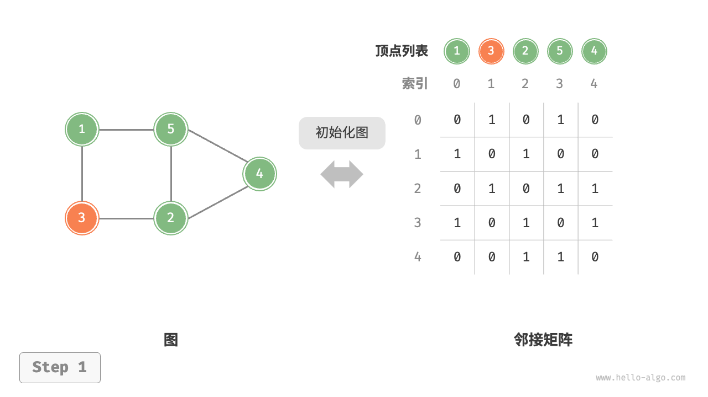
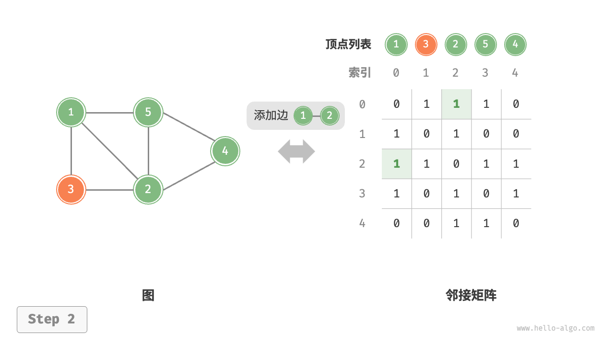
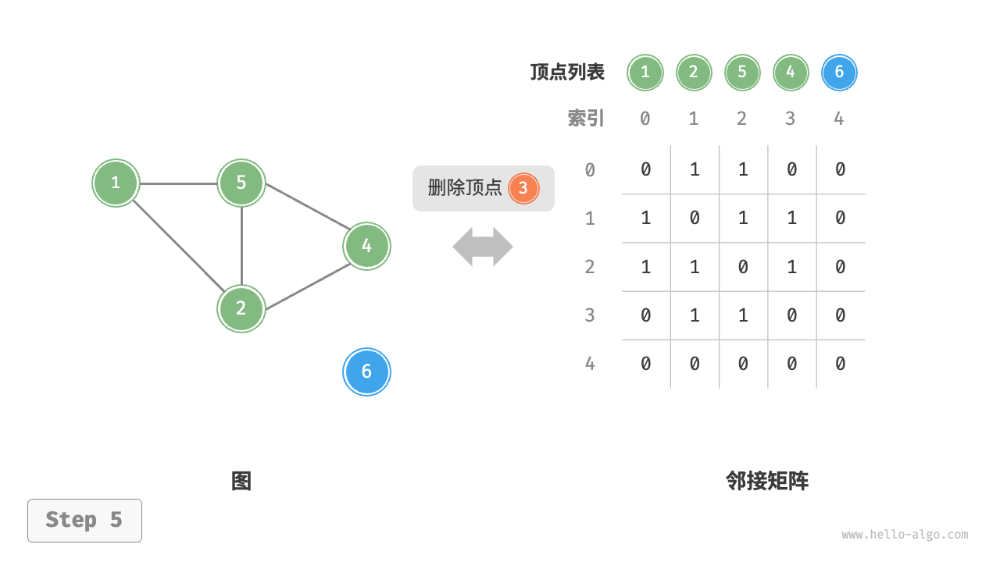

# 图的基础操作

图的基础操作可分为对“边”的操作和“顶点”的操作。在“邻接矩阵”和“邻接表”两种表示方法下，实现方式有所不用。

>[!important]
> 一句话总结
>
> 图结构就是多叉树结构的延伸。图结构逻辑上由若干节点(Vertex)和边(Edge)构成，我们一般用邻接表、邻接矩阵等方式来储图。
> 
> 在树结构中，只允许父节点指向子节点，不存在子节点指向父节点的情况，子节点之间也不会互相链接；而图中没有那么多限制，节点之间可以相互指向，形成复杂的网络结构。

## 基于邻接矩阵的实现
给定一个顶点数量$n$的无向图，则各种操作的实现方式如下图:

* <u>**添加或删除边:**</u> 直接在邻接矩阵中修改指定的边即可，使用$O(1)$时间。而由于无向图，因此需要同时更新两个方向的边。
* <u>**添加顶点:**</u> 在邻接矩阵的尾部添加一行一列，并全部填$0$即可，使用$O(N)$时间。
* <u>**删除顶点:**</u> 在邻接矩阵中删除一行一列。当删除首行首列时达到最差情况，需要将$(n-1)^2$个元素“向右上移动”，从而使用$O(N^2)$时间。 
* <u>**初始化:**</u> 传入$n$个顶点，实始化长度为$n$的顶点列表`vertices` ，使用$O(N)$时间；初始化$nxn$大小的邻接矩阵`adjMat` ，使用$O(N^2)$时间。

<section>
    
    
</section>
<section>
    
    
</section>


### 类对象

```java
public class GraphAdjMatrix {
    // 顶点列表
    private List<Integer> vertexs;
    // 图矩阵
    private List<List<Integer>> adjMatrix;
}
```

我们需要一个列表来存储顶点的值，这里的是顶点的值是`Integer` 类型，还需要一个二维列表存储边（邻接）信息。

### 构造方法

```java
/**
 * 默认的构造函数，传入的两个值一个顶点的列表，一个为连接的关系
 *
 * @param vertices 顶点列表
 * @param edges    边之间的关系
 */
public GraphAdjMatrix(int[] vertexs, int[][] edges) {
    this.vertexs = new ArrayList<>();
    this.adjMatrix = new ArrayList<>();

    // 添加顶点至列表
    for (int v : vertex) {
        addVertex(v);
    }

    // 添加边连接的数据到列表中
    for (int e[] : edges) {
        addEdge(e[0], e[1]);
    }

}
```

* 添加顶点

```java
/**
 * 添加顶点
 *
 * @param value 顶点值
 */
public void addVertex(int value) {
    int n = size();

    vertices.add(value);

    List<Integer> newRow = new ArrayList<>();
    for (int i = 0; i < n; i++) {
        newRow.add(0);
    }

    adjMatrix.add(newRow);
    for (List<Integer> row : adjMatrix) {
        row.add(0);
    }
}
```

注意这里的方法，每次新加的顶点都会放入到列表中去，大小只是根据现有的顶点长度来生成。

```java
    // 新的一行，这新的一行这时候数据是少一位的
    List<Integer> newRow = new ArrayList<>();
    for (int i = 0; i < n; i++) {
        newRow.add(0);
    }
```

然后我们再每一行后面再追加新的一个元素，也就是说这个表是一个动态的过程。
```java
    adjMatrix.add(newRow);
    for (List<Integer> row : adjMatrix) {
        row.add(0);
    }
```

### 增加边的信息
```java
/**
 * 添加处理数组边的信息
 *
 * @param i 横边
 * @param j 竖边
 */
public void addEdge(int i, int j) {
    // 边界判断处理
    // 注意中间的判断i == j即对角线位置都应该是0，不应该做任何处理
    if (i < 0 || j < 0 || i == j || i >= size() || j >= size()) {
        throw new IndexOutOfBoundsException();
    }

    adjMatrix.get(i).set(j, 1);
    adjMatrix.get(j).set(i, 1);
}
```

这里还是比较简单的，我们只需要把相应的边界判断清楚即可。`i < 0 || j < 0 || i == j || i >= size() || j >= size()`。

重点在于`i == j` 也就是对角线的这块数据，这里数据我们是不需要进行处理的。默认的情况下就是为了0

### 删除顶点
```java
/**
 * 删除顶点
 *
 * @param index 删除顶点的坐标
 */
public void removeVertex(int index) {
    if (index >= size()) {
        throw new IndexOutOfBoundsException();
    }

    vertexs.remove(index);
    adjMatrix.remove(index);

    // 有关的所有边对应的index都需要remove掉
    for (List<Integer> row : adjMatrix) {
        row.remove(index);
    }
}
```

>[!note]
> 一定要注意我们在删除顶点的时候也需要对顶点连接的相应边做出处理。
> ```java
> for (List<Integer> row : adjMatrix) {
>     row.remove(index);
> }
> ```

### 删除边
```java
/**
 * 删除边，因为我们是使用1 或 0来表示两个顶点是否有边连通，所以这里只需要更新边为0就可以了
 *
 * @param i 横边坐标
 * @param j 竖边坐标
 */
public void removeEdge(int i, int j) {
    if (i < 0 || j < 0 || i == j || i >= size() || j >= size()) {
        throw new IndexOutOfBoundsException();
    }

    // 将边数据更新为0就是表示删除了这个边
    adjMatrix.get(i).set(j, 0);
    adjMatrix.get(j).set(i, 0);
}
```

删除边的操作还是比较简单的，我们只需要对邻接的这个矩阵对应的值设置为`0` 即可。

>[!note]
> 在一开始的时候我犯下了以下几个错误，首先对于`edges[][]` 这个理解不透彻，这个数据的格式为`edges = {{0, 1}, {2, 3}}` 类似这样的状态，只表示顶点之间的连接状态，即：顶点索引之间如果有连接的话在这个二维数组中则有值，否则则没有值。

## 基于邻接表实现
设无向图的顶点总数为$n$、边总数为$m$，则可根据下面的图做出相应的api操作。

* **<u>添加边:</u>** 在顶点对应链表的末尾添加连即可，使用$O(1)$时间。因为是无向图，所以需要同时添加两个方向的边。
* **<u>删除边:</u>** 在顶点对应链表中查找并删除指定边，使用$O(m)$时间，向无向图中，需要同时删除两个方向的边。
* **<u>添加顶点:</u>** 在邻接表中添加一个链表，并将新增顶点作为链表头节点，使用$O(1)$时间。
* **<u>删除顶点:</u>** 需遍历整个邻接表，删除包含指定顶点的所有边，使用$O(n + m)$时间。
* **<u>初始化:</u>** 在邻接表中创建$n$个顶点和$2m$条边，使用$O(n + m)$时间。

<section>
    
    
</section>
<section>
    
    
</section>


>[!note]
我们在邻接表中使用`Vertex` 类来表顶点，这样做的原因是：如果与邻接矩阵一样，用列表索引来区分不同顶点，那么假设要删除索引$i$的顶点，则需要遍历整个邻接表，将所有大于$i$的索引全部减$1$，效率很低。而如果每一个顶点都是唯一的`Vertex` 实例，删除某一个顶点之后就无须改动索引了。


### 初始化数据
```java
// 邻接表
private Map<Vertex, List<Vertex>> adjList;

/**
 * 默认的构造函数
 *
 * @param edges 边的关系
 */
public GraphAdjList(Vertex[][] edges) {
    if (edges == null) {
        return;
    }

    this.adjList = new HashMap<>();

    for (Vertex[] edge : edges) {
        // 添加顶点
        addVertex(edge[0]);
        addVertex(edge[1]);

        // 添加两个顶点的边
        addEdge(edge[0], edge[1]);
    }
}
```

注意我们这里使用的邻接表格式是使用`HashMap` 来实现的，`Key` 为`Vertex` 类，而`Value` 对应的值是`List<Vertice>` 表示与这个顶点所对应的其他顶点列表。

### 添加顶点
```java
/**
 * 添加顶点
 *
 * @param vertice 顶点数据对象
 */
public void addVertex(Vertice vertice) {
    if (adjList.containsKey(vertice)) {
        return;
    }

    List<Vertex> vertices = new ArrayList<>();
    adjList.put(vertice, vertices);
}
```

这里的功能较为简单，我们不需要过多的去处理。只需要向`map` 中添加`key-value` 即可。

### 删除顶点

```java
/**
 * 删除一个顶点
 *
 * @param vertice
 */
public void removeVertex(Vertice vertice) {
    if (!adjList.containsKey(vertice)) {
        return;
    }

    List<Vertex> edges = adjList.get(vertice);
    // 删除其他的顶点
    for (Vertex v : edges) {
        adjList.get(v).remove(vertice);
    }

    // 删除这个顶点
    adjList.remove(vertice);
}
```

删除顶点我们只需要将现在这个顶点所对应的边（其他顶点）列表中的数据拿到，然后再将对应的列表中的顶点依次删除即可。当然还有一种简单的处理方式。

```java
public void removeVertex(Vertice vertice) {
    // .... 

    adjList.remove(vertice);
    for (List<Vertex edges : adjList.values()) {
        edges.remove(vertice);
    }

    // ...
}

```

但是我个人感觉这种方式的处理并没有上面的这种效率和方式更高。

### 两种实现方式效率对比
|              | **邻接矩阵** | **邻接表(链表)** | **邻接表(哈希表)** |
|--------------|--------------|------------------|--------------------|
| 判断是否邻接 | $O(1)$       | $O(n)$           | $O(1)$             |
| 添加边       | $O(1)$       | $O(1)$           | $O(1)$             |
| 删除边       | $O(1)$       | $O(n)$           | $O(1)$             |
| 添加顶点     | $O(n)$       | $O(1)$           | $O(1)$             |
| 删除顶点     | $O(n^2)$     | $O(n + m)$       | $O(n)$             |
| 内存空间占用 | $O(n^2)$     | $O(n + m)$       | $O(n + m)$         |

>[!note]
似乎邻接表(哈希表)的时间效率与空间效率最优。但实际上，在邻接矩阵中操作边的效率更高，只需要一次数组访问或赋值操作即可。综合来看，邻接矩阵体现了“以空间换时间”的原则，而邻接表体现了”以时间换空间”的原则。

## 使用场景
注意分析两种存储方式的空间复杂度，对于一幅有`V` 个节点，`E` 条边的图，邻接表的空间复杂度是$O(V + E)$，而邻接矩阵的空间复杂度是$O(V^2)$。

所以如果一幅图的`E` 远小于`V^2` （稀疏图），那么邻接表会比邻接矩阵节省空间，反之，如果`E` 接近`V^2` （稠密图），二者就差不多了。

邻接矩阵的最大优势在于，矩阵是一个强有力的数学工具，图的一些隐晦性质可以借助精妙的矩阵去处展出出来。

## 有向邻接表实现

**关键点** :

```java
static class Edge {
    // 边指向的节点
    int to;
    // 权重
    int weight;

    public Edge(int to, int weight) {
        this.to = to;
        this.weight = weight;
    }

    public Edge() {
    }

}
```

>[!important]
> 跟上面的章节需要对比一下。之前我们是使用`Vertex` 来实现的，这种方式有有一点不好的就是我们无法对*权重* 进行实现，只有点到某个点之间的关系。现在我们使用的`Edge` 这个类来表示边，那么就可以存储相应的信息了，并且有了属性`weight` 来表示权重。

## 有向邻接矩阵实现

```java
int matrix[][];

public WeightedDigraphMatrix(int n) {
    this.matrix = new int[n][n];
}
```

定义一个合适大小的二维数组，`matrix[from][to]` 里存储的是`weight` 即权重。

>[!note]
> 需要注意的是`matrix[from][to] = 0` 表示这两个点是没有连接关系的。
> 
> 如果是双向的则是`matrix[to][from]` 这样的形式。


## 有向无权图
无权只需要给一个默认的值就可以了，无论是邻接表实现还是邻接矩阵实现，在`addEdge` 时，去掉`weight` 参数，默认给`1` 即可。

以邻接表实现为例:
```java
public void addEdge(int from, int to, int weight) {
    List<Edge> edges = null;
    if (!adjList.containsKey(from)) {
        edges = new ArrayList<>();
    } else {
        edges = adjList.get(from);
    }

    for (Edge e : edges) {
        if (e.to == to) {
            e.weight = 1;
            return;
        }
    }

    Edge edge = new Edge(to, 1);
    edges.add(edge);
    adjList.put(from, edges);
}
```

## 无向有权图邻接表/邻接矩阵实现
```java
public class WeightedUndigraph {
    private WeightedDigraph graph;

    public WeightedUndigraph() {
        this.graph = new WeightedDigraph();
    }

    public void addEdge(int from, int to, int weight) {
        graph.addEdge(from, to, weight);
        graph.addEdge(to, from, weight);
    }

    public void removeEdge(int from, int to) {
        graph.removeEdge(from, to);
        graph.removeEdge(to, from);
    }

    public int weight(int from, int to) {
        return graph.weight(from, to);
    }

    public boolean hasEdge(int from, int to) {
        return graph.hasEdge(from, to);
    }

    public int size() {
        return graph.size();
    }

    public List<WeightedDigraph.Edge> neighbors(int from) {
        return graph.neighbors(from);
    }

    public static void main(String[] args) {
        WeightedUndigraph graph = new WeightedUndigraph();
        graph.addEdge(0, 1, 1);
        graph.addEdge(1, 2, 2);
        graph.addEdge(2, 0, 3);
        graph.addEdge(2, 1, 4);

        System.out.println(graph.hasEdge(0, 1)); // true
        System.out.println(graph.hasEdge(1, 0)); // true

        graph.neighbors(2).forEach(edge -> {
            System.out.println(2 + " <-> " + edge.to + ", wight: " + edge.weight);
        });
        // 2 <-> 0, wight: 3
        // 2 <-> 1, wight: 4

        graph.removeEdge(0, 1);
        System.out.println(graph.hasEdge(0, 1)); // false
        System.out.println(graph.hasEdge(1, 0)); // false
    }

}
```

我们可以直接使用有向的实现方式即可，因为**无向的图可以看作是双向的有向图**。

上面的代码是使用有向的邻接表来实现的，那么对于邻接矩阵的实现方式参考上面的代码即可，我也没有做相应的实现。

## 无向无权邻接表/邻接矩阵实现

无非还是跟上面的小节是一样的， 利用已经实现的有向图再将权重设置为`1` 就可以了。

