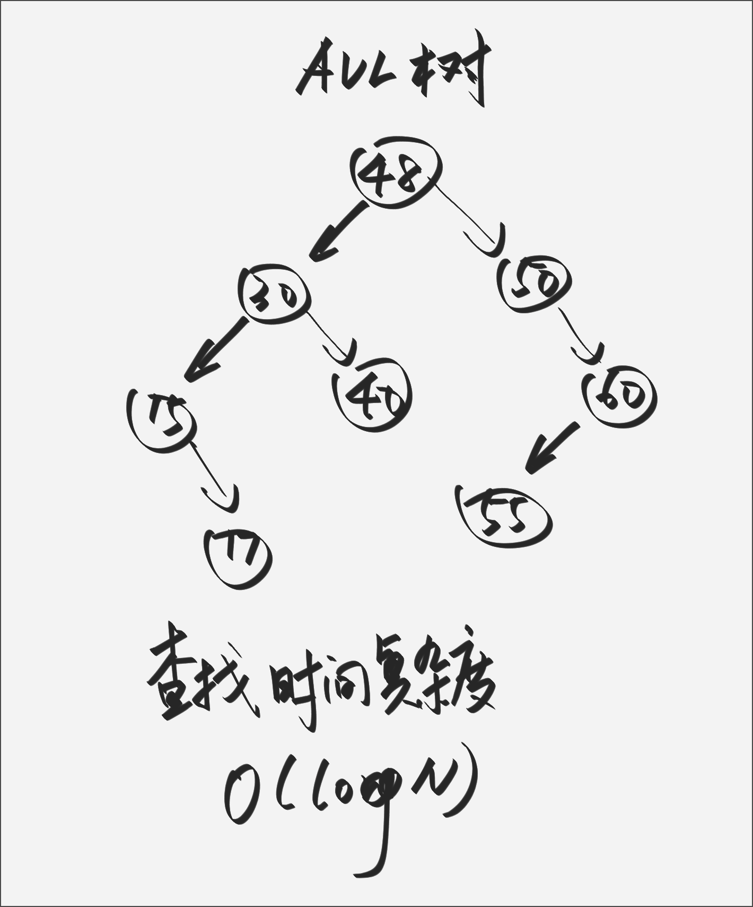
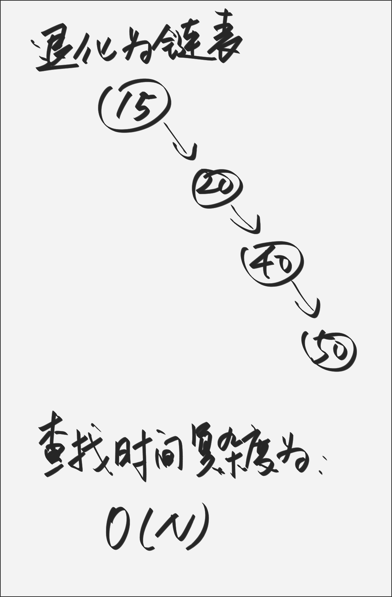
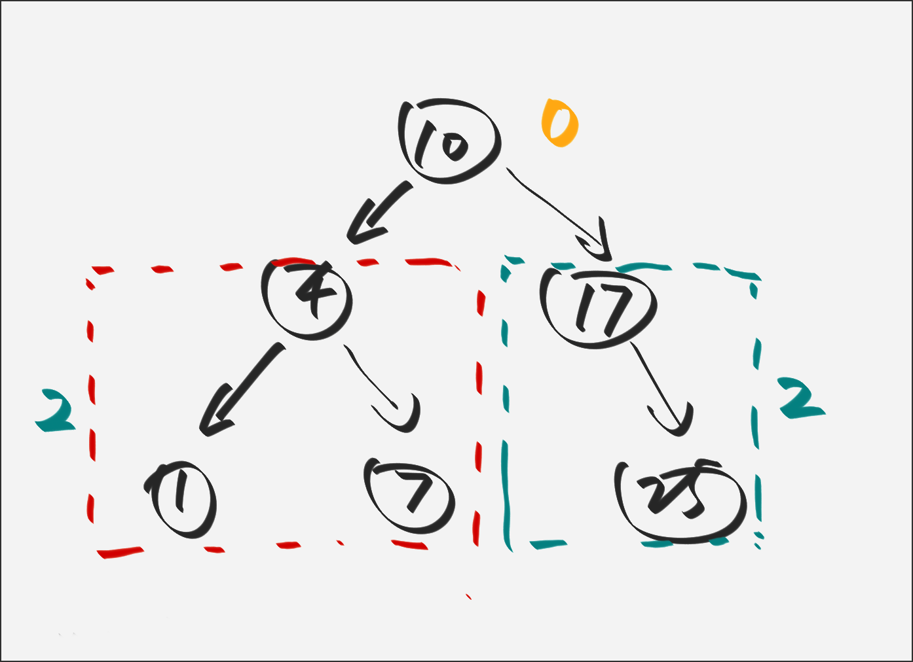
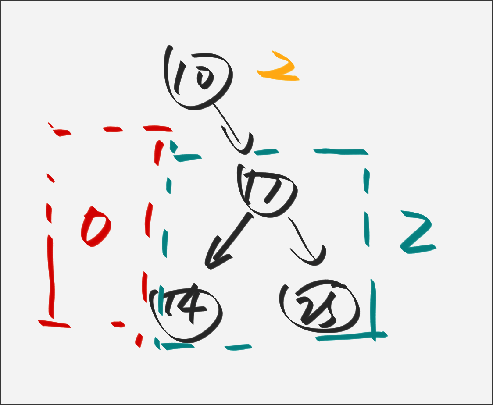
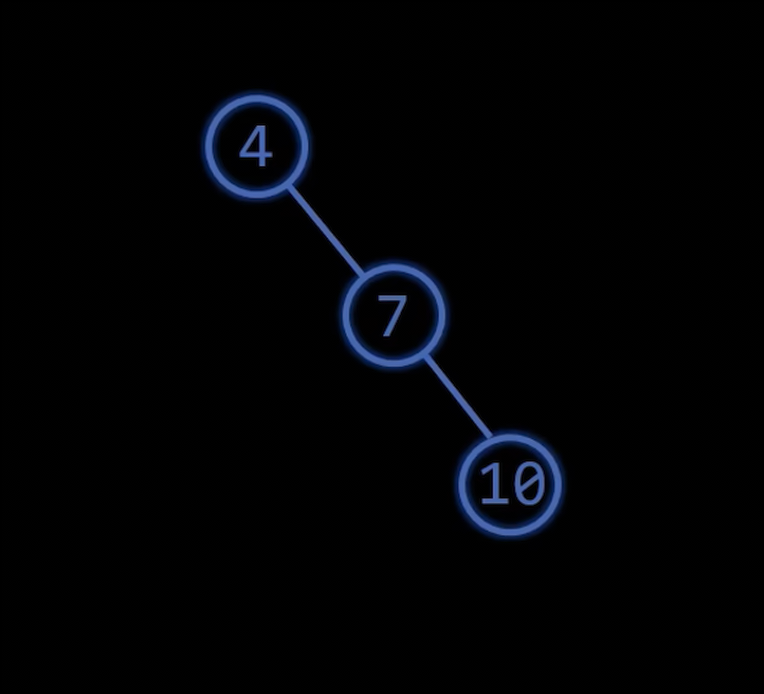
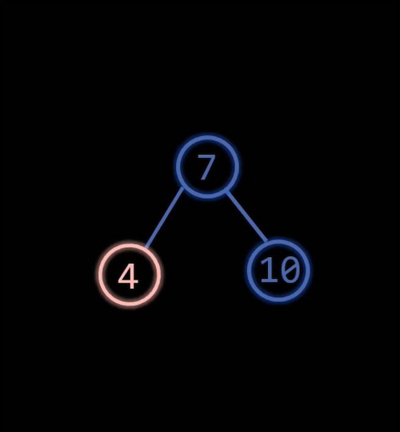
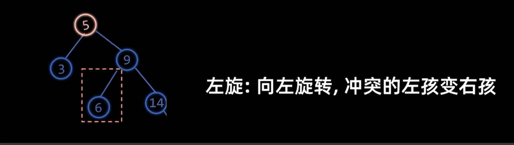
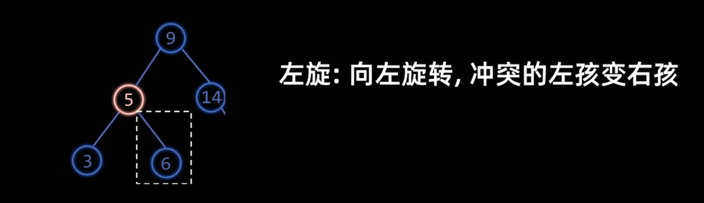
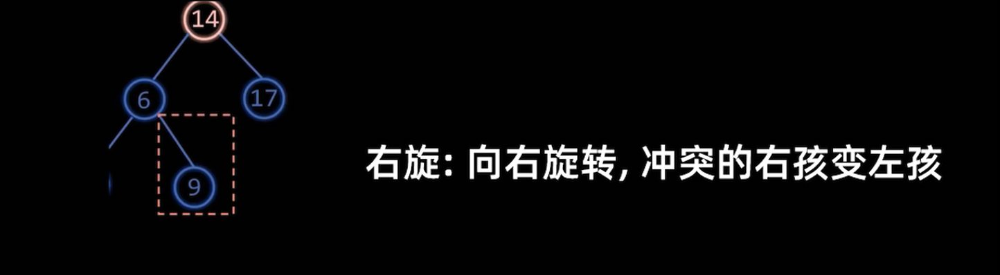

## AVL树

首先来看一下什么是二叉搜索树，这个二叉树的左侧节点是比根节点小的，右侧的子节点比根节点要大。

可以参考下面的图:

 

但是有时候会出现一种情况就是插入的树值是排序好的，那么这个二叉搜索树则会退化成一个链表。这时候插入或者去查找某一个元素时间复杂度会退化成为$O(N)$。

那么如何去解决这个问题呢，这就是本篇内容所要探索的。

### 什么是AVL树
首先我们现在操作的这个树前提必须是一个二叉搜索树。

那么在二叉搜索树的前提下，满足条件:**所有的结点的(左子树高度-右子树高度)的绝对值 <= 1** 即AVL树。

其中`(左子树高度-右子树高度)` 我们也称作**平衡因子** 。

现在我们看两个例子:

上面的图，我们以`10` 这个节点为例，其左子树的高度为`2` ，右子树高度为`2` 所以，这个结点的平衡因子为`0` ，包括其他的结点也是符合这个要求的。

### 如何去平衡二叉树

总共有两种方式一种是`左旋` 另一种则是右旋`右旋` 。

左旋之后这两个树是等价的，中序遍历都是有序的

### 左旋规则
左旋即：**向左旋转，冲突的左孩变右孩**。

### 右旋规则

右旋即：**向右旋转，冲突的右孩变左孩**

