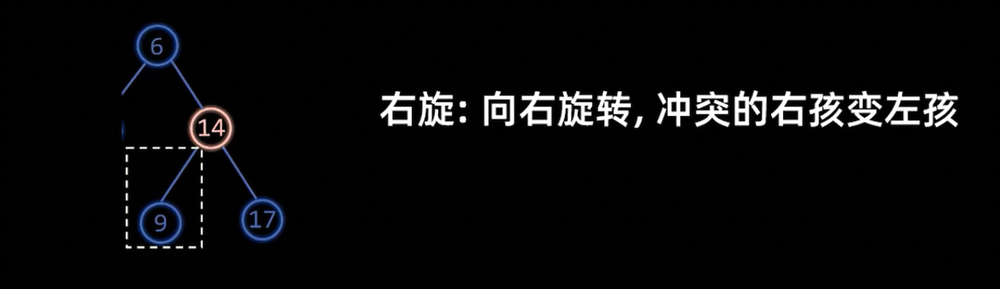

# AVL树

首先来看一下什么是二叉搜索树，这个二叉树的左侧节点是比根节点小的，右侧的子节点比根节点要大。

可以参考下面的图:


 

但是有时候会出现一种情况就是插入的树值是排序好的，那么这个二叉搜索树则会退化成一个链表。这时候插入或者去查找某一个元素时间复杂度会退化成为$O(N)$。


那么如何去解决这个问题呢，这就是本篇内容所要探索的。

## 什么是AVL树
首先我们现在操作的这个树前提必须是一个二叉搜索树。

那么在二叉搜索树的前提下，满足条件:**所有的结点的(左子树高度-右子树高度)的绝对值 <= 1** 即AVL树。

其中`(左子树高度-右子树高度)` 我们也称作**平衡因子** 。

现在我们看两个例子:


上面的图，我们以`10` 这个节点为例，其左子树的高度为`2` ，右子树高度为`2` 所以，这个结点的平衡因子为`0` ，包括其他的结点也是符合这个要求的。


### 树的高度
树的高度是指一个节点到子树的最大路径。`Math.max(node.left.height, node.right.height) + 1` <++>

```java
// 获得树的高度
private int height(Node node) {
    return node == null ? -1 : node.height;
}
```

更新树的高度（设置树的高度）:
```java
private void updateHeight(Node node) {
    node.height = Math.max(height(node.left), height(node.right)) + 1;
}
```

如果一个节点就是叶子节点，那么这个树的高度是`0` ，如果节点是`None` 则这个节点的高度为`-1` 。

### 平衡因子
在上面的说明中，我们已经讲解了什么是*平衡因子* ，下面的代码展示了如何获得一个节点的平衡因子。

```java
private int balanceFactor(Node node) {
    return height(node.left) - height(node.right);
}
```

## 如何去平衡二叉树

总共有两种方式一种是`左旋` 另一种则是右旋`右旋` 。


左旋之后这两个树是等价的，中序遍历都是有序的

## 左旋规则
左旋即：**向左旋转，冲突的左孩变右孩**。


**关键点** :
1. **获得旋转节点的子节点**: `Node child = node.right` 也即这个节点的右孩。
2. **获得右子节点的左节点**: `Node grandChild = child.left` 我们这里并不需要考虑到这个节点是否为空。因为就算是为空在旋转的时候也不会影响什么。
3. **更新指针**: `child.left = node` 子节点的左孩子指向旋转的节点（表示旋转），新的子节点右孩子更新为原子节点的左孩子。

实现在代码如下：

```java
private Node leftRotate(Node node) {
    if (node == null) {
        return null;
    }

    // 先找到需要旋转的节点的子节点
    // 然后再找到这个节点的左节点
    // 冲突的“左孩变右孩”
    Node child = node.right;
    Node grandChild = child.left;

    child.left = node;
    node.right = grandChild;

    // 更新高度
    updateHeight(node);
    updateHeight(child);

    return child;
}
```

## 右旋规则

右旋即：**向右旋转，冲突的右孩变左孩**




这里的处理跟上面的左旋是类似的，需要注意更新是哪些节点指针。

```java
private Node rightRotate(Node node) {
    if (node == null) {
        return null;
    }

    Node child = node.left;
    Node grandChild = child.right;

    child.right = node;
    node.left = grandChild;

    updateHeight(node);
    updateHeight(child);

    return child;
}
```

## 总共有几种情况

### LL型


如上图所示，假如现在我们插入`3` 这个节点，那么`14` 这个节点*平衡因子* 就为`2` 了，那么就是失衡的状态。而插入的这个节点呢又在这个失衡因子的左子树的左节点上，所以我们称这种情况也叫**LL** 型。

平衡因子的角度：
* 失衡结点: **平衡因子 = 2** 
* 失衡结点左孩子: **平衡因子 = 1** 

那么如何去处理这种*LL* 型呢，使得这棵树重新达到平衡的状态？


从上面的图可知，我们只需要对**失衡的结点做出右旋的操作** 即可。
```java
// 旋转，需要考虑的是4种情况LL RR LR RL
private Node rotate(Node node) {
    // 获取节点 node 的平衡因子
    int balanceFactor = balanceFactor(node);
    // 左偏树 L型
    if (balanceFactor > 1) {
        if (balanceFactor(node.left) >= 0) {
            // LL型
            // 右旋
            return rightRotate(node);
        } else {
            // some code ....
        }
    }
}
```

上面的代码展现了对于`LL` 型的处理。只需要对失衡的节点右旋即可。

### RR型


如上图所示，假如现在我们插入`17` 这个节点，那么`5` 这个节点*平衡因子* 就为`-2` 了，那么就是失衡状态。而插入的这个节点在失衡因子的右子树的右节点上，我们称这种情况为**RR** 型。

平衡因子角度:
* 失衡节点: **平衡因子= -2** 
* 失衡节点的右孩子: **平衡因子= -1** 


如上图所示，我们只需要对**失衡的节点进行右旋操作** 即可。

```java
// 旋转，需要考虑的是4种情况LL RR LR RL
private Node rotate(Node node) {
    // 获取节点 node 的平衡因子
    int balanceFactor = balanceFactor(node);
        if (balanceFactor < -1) {
            if (balanceFactor(node.right) <= 0) {
                // RR型
                // 左旋
                return leftRotate(node);
            } else {
                //some code
            }
        }
    }
}
```

上面的代码表示了，如何去处理RR型，我们只需要对失衡的节点左旋即可。

### LR型


如上图所示，当我们插入的节点`6` 时，`9` 这个节点失衡了，这个节点的平衡因子是`2` 而，其左节点的平衡因子为`-1` ，这个新插入的节点是在右子树里。我们称这种情况为**LR** 型。

平衡因子角度:
* 失衡节点: **平衡因子 = 2**
* 失衡节点的左孩子: **平衡因子 = -1**


如上面两图所示:我们需要先对**失衡节点为的左孩子进行左旋操作，然后再对失衡节点进行右旋操作。**

```java
// 旋转，需要考虑的是4种情况LL RR LR RL
private Node rotate(Node node) {
    // 获取节点 node 的平衡因子
    int balanceFactor = balanceFactor(node);
    // 左偏树 L型
    if (balanceFactor > 1) {
        if (balanceFactor(node.left) >= 0) {
            // LL型
            // 右旋
            return rightRotate(node);
        } else {
            // 重点关注
            // LR型
            // 先左旋后右旋
            node.left = leftRotate(node.left);
            return rightRotate(node);
        }
    }
}
```

对于LR型，我们只需要对失衡的左节点先左旋，然后当失衡节点右旋即可。

### RL型


如上图所示，当我们插入的节点`8` 时，`5` 这个节点就失衡了，这个节点的平衡因子为`-2` ，而其右节点的平衡因子为`1` 时，这个新插入的节点在右子左子树里，我们称这种情况为**RL** 型。

平衡因子角度:
* 失衡节点: **平衡因子 = -2**
* 失衡节点的右孩子: **平衡因子 = -1**


```java
// 旋转，需要考虑的是4种情况LL RR LR RL
private Node rotate(Node node) {
    // 获取节点 node 的平衡因子
    int balanceFactor = balanceFactor(node);
        if (balanceFactor < -1) {
            if (balanceFactor(node.right) <= 0) {
                // RR型
                // 左旋
                return leftRotate(node);
            } else {
                // RL型
                // 先右旋后左旋
                node.right = rightRotate(node.right);
                return leftRotate(node);
            }
        }
    }
}
```

对于RL型，我们只需要对失衡节点的右子节点右旋，然后再对失衡节点左旋。

### 四种情况 LL、RR、LR、RL

> [!important]
> 表

| 型 | 平衡因子情况                                                       | 操作                 |
|----|--------------------------------------------------------------------|----------------------|
| LL | 失衡节点: **平衡因子 = 2**<br/>失衡节点的左孩子: **平衡因子= 1**   | 右旋                 |
| RR | 失衡节点: **平衡因子 = -2**<br/>失衡节点的右孩子: **平衡因子= -1** | 左旋                 |
| LR | 失衡节点: **平衡因子 = 2**<br/>失衡节点的左孩子: **平衡因子= -1**  | 左旋左孩子, 然后右旋 |
| RL | 失衡节点: **平衡因子 = -2**<br/>失衡节点的右孩子: **平衡因子= 1**  | 右旋右孩子, 然后左旋 |


## 插入
我们在正常插入的时候如果遇到有多个节点平衡因子都不平衡的情况时。


如上图所示，这个棵树中插入了一个新的节点`9` ，这时候AVL树有多个节点都同出现了不平衡的情况,`3` 和`6` ，我们这时只需要调整距离9最近的失衡结点就可以了。

```java

public void insert(int val) {
    this.root = insertHelper(root, val);
}

private Node insertHelper(Node node, int val) {
    if (node == null) {
        return new Node(val);
    }

    // 这里处理跟普通的BST是一样的，左节点<根节点，右节点>根节点
    if (val > node.value) {
        node.right = insertHelper(node.right, val);
    } else if (val < node.value) {
        node.left = insertHelper(node.left, val);
    } else {
        // 如果不需要更新则直接返回
        return node;
    }

    // 实时更新节点高度
    updateHeight(node);
    // 旋转节点，旋转的方法里面对于各种情况已经做了判断，如果不需要处理的则不会有任何处理。
    node = rotate(node);

    return node;
}
```

这里的重点是:递归里会返回新的旋转节点，这时候就会更新新的节点。`node.right = insertHelper(node.right, val)` 和`node.left = insertHelper(node.left, val)` 。

## 删除
当我们去删除AVL树中的节点时，他的操作与普通BST树是一样的，只不过当我们删除完了之后，还需要对父节点进行检查，查看是否有失衡的情况，有的话就进行调整。

```java
public void remove(int val) {
    this.root = removeHelper(root, val);
}

private Node removeHelper(Node node, int val) {
    if (node == null) {
        return null;
    }

    if (node.value > val) {
        node.left = removeHelper(node.left, val);
    } else if (node.value < val) {
        node.right = removeHelper(node.right, val);
    } else {
        // 叶子节点的数量 < 2
        if (node.left == null || node.right == null) {
            Node child = node.left != null ? node.left : node.right;

            if (child == null) {
                // 没有任何子树
                return null;
            } else {
                // 更新节点为child
                // 子节点 == 1 的时候，把原来的节点更新为最新的节点
                node = child;
            }
        } else {
            // 节点==2
            // 现在这个右节点相当于新的root节点了
            // 在右节点中使用中序去查找到最小值
            Node temp = node.right;

            while (temp.left != null) {
                temp = temp.left;
            }

            // 需要删除右侧的节点最小值
            node.right = removeHelper(node.right, temp.value);
            // 更新这个节点的值为找到值相当于替换
            node.value = temp.value;
        }
    }

    updateHeight(node);
    node = rotate(node);
    return node;
}

```

> [!important]
>上面的代码中，重点的代码在于，如果我们现在需要删除的这个节点有两个子节点，那么就需要去找到这个节点的右子树中最小的值，然后把最小值的节点也删除，也使用递归的形式去处理。因为因为这个节点删除之后，还可能造成此节点也失衡了，需要再进行旋转的操作。

其他部分跟插件是类似的，也要遵守BST的规则。
