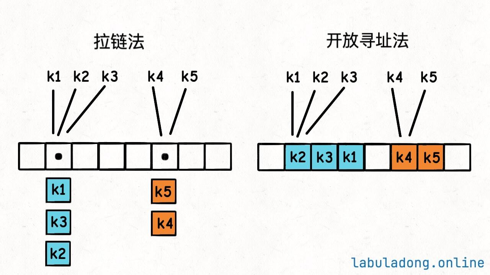

# 数组加强哈希表

对于链表可以加强哈希表，在午到`keys` 这一类的时候可以按插入顺序来做，那数组作为链表的好兄弟也能加强哈希表。

现在我们先来看这样的一个场景，在基于标准哈希表的API之上，添加一个新的`randomKey` API，可以在$O(1)$的时间复杂度上随机键：

```java
interface Map<K, V> {
    // 获取 key 对应的 value，时间复杂度 O(1)
    V get(K key);

    // 添加/修改 key-value 对，时间复杂度 O(1)
    void put(K key, V value);

    // 删除 key-value 对，时间复杂度 O(1)
    void remove(K key);

    // 是否包含 key，时间复杂度 O(1)
    boolean containsKey(K key);

    // 返回所有 key，时间复杂度 O(N)
    List<K> keys();

    // 新增 API：随机返回一个 key，要求时间复杂度 O(1)
    K randomKey();
}
```

注意，我们一般说的随机，都是指均匀随机，即每个元素被选中的概率相等。比如你`n` 个元素，你的随机算法要保证每个元素被选中的概率都是$\frac{1}{n}$，才叫均匀随机。

哈希表本质就是一个`table` 数组，现在让你随机返回一个哈希表的键，很容易就会联想到在数组中随机获取一个元素。

在标准数组，随机获取一个元素很简单，只要用随机数生成器生成一个`[0, size]` 的随机索引，就相当于找到了一个元素。

```java
int randomElement(int[] arr) {
    Random r = new Random();

    // 生成[0, size]的随机索引
    return arr[r.nextInt(arr.length)];
}
```

这个算法是正确的，它的复杂度是$O(1)$，且每个元素被选中的概率都是$\frac{1}{n}$，`n` 为`arr` 数组的总元素个数。

但是这个算法能达到我们想要的平均概率下，数组中的元素必须是紧凑的，没有空洞。比如`arr = [1, 2, 3, 4]` ，这样才可以保持拿到任何一个元素都是平均概率的。

当这个数组有空洞的时候，情况是什么样呢？`arr = [1, 2, null, 4, null]` ，其中`arr[2]` 为`null` ，那么如果随机数产生就为2的时候怎么办呢？

是否可以向右做线性查找，找到一个非空元素返回，类似这样：
```java
// 返回一个非空的随机元素（伪码）
int randomeElement(int[] arr) {
    Random r = new Random();
    // 生成 [0, arr.length) 的随机索引
    int i = r.nextInt(arr.length);
    while (arr[i] == null) {
        // 随机生成的索引 i 恰巧是空洞
        // 借助环形数组技巧向右进行探查
        // 直到找到一个非空元素
        i = (i + 1) % arr.length;
    }
    return arr[i];
}
```

这样是不行的，这个算法有两个问题：
1. 有个循环，最坏时间复杂度上升到$O(N)$，不符合$O(1)$的要求。
2. 这个算法不是均匀随机的，因为你的查找方向是固定的，空洞右侧的元素被选中的概率更大，比如`arr = [1, 2, null, 4]` ，元素`1, 2, 4` 被选中的概率分别是`1/4, 1/4, 2/4` 。


那么还有一个办法就是不断的产生随机数，直到查找到不是空洞的随机数。

```java
// 返回一个非空的随机元素（伪码）
int randomeElement(int[] arr) {
    Random r = new Random();
    // 生成 [0, arr.length) 的随机索引
    int i = r.nextInt(arr.length);
    while (arr[i] == null) {
        // 随机生成的索引 i 恰巧是空洞
        // 重新生成一个随机索引
        i = r.nextInt(arr.length);
    }
    return arr[i];
}
```

现在这个算法产生的随机数是均匀随机的了，但问题也很明显，它的时间复杂度依赖了随机数，肯定达不到$O(1)$的，不符合要求。

别忘了，我们现在的目标是从哈希表中随机返回一个键，哈希表底层的`table` 数组不仅包含空洞，情况还会更加复杂一些：



比如我们常用的拉链法，我们可以通过随机拿到某个hash值下的数据，但这个数据是链表的形式，我们还需要再对链表的索引进行随机。链表上的节点想到拿到，不审需要$O(N)$的时间复杂度。

不光如此，这种方式拿到的数组也不是均匀随机的。

## 实现思路

紧凑的数组可以随机返回一个元素，现在我们想随机返回哈希表的一个键，那么最简单的方法是这样：

```java
// 伪码思路
class MyArrayHashMap {
    // arr 数组存储哈希表中所有的 key
    ArrayList<Integer> arr = new ArrayList<>();
    Map<Integer, Integer> map = new HashMap<>();

    // 添加/修改 key-value 对，时间复杂度 O(1)
    public void put(int key, int value) {
        if (!map.containsKey(key)) {
            // 新增的 key 加入到 arr 数组中
            arr.add(key);
        }
        map.put(key, value);
    }

    // 获取 key 对应的 value，时间复杂度 O(1)
    public int get(int key) {
        return map.get(key);
    }

    // 新增 API：随机返回一个 key，要求时间复杂度 O(1)
    public int randomKey() {
        Random r = new Random();
        // 生成 [0, arr.size()) 的随机索引
        return arr.get(r.nextInt(arr.size()));
    }

    // 删除 key-value 对，时间复杂度 O(1)
    public void remove(int key) {
        ...
    }
}
```

这个思路非常简单，就是用一个数组`arr` 维护哈希表中所有的键，然后通过随机索引返回一个键，这样就能保证随机，且时间复杂度为$O(1)$。

但需要注，我没有实现哈希表的`remove` 方法，因为这个方法不仅要删除哈希表`map` 中的`key` ，还有删除`arr` 数组中的元素`key` ，而删除数组中的元素时间复杂度$O(N)$，因为我们需要搬移数据以保持元素的连续性。


其实是可以做的：可以把待删除的元素，先交换到数组尾部，然后再删除，数组尾部删除元素的时间复杂度是$O(1)$。

当然，这样的代价就是数组中的元素顺序会被打乱，但是对于我们当前的场景来说，数组中的元素顺序并不重要，所以打乱了也无所谓。

比如`arr = [1, 2, 3, 4, 5]` ，如果要删除`2` ，我先把`2` 交换到数组尾部，变成`arr = [1, 5, 3, 4, 2]` ，然后只需花$O(1)$ 的时间即可删除尾部元素`2` ，且数组的连续性不会被破坏。

```java
// 表中维护的只是key对应的数组下标值
private HashMap<K, Integer> map;
// 存储Node节点
private ArrayList<Node<K, V>> arr;
```

实现的方式也比较简单，就是我们只需要一个`map` 去维护key跟数组之间的关系就可以了，然后当需要用到均匀概率随机一个`key` 这种场景的时候从数组中随机一个索引并拿这个索引去数组中取得数组即可。
