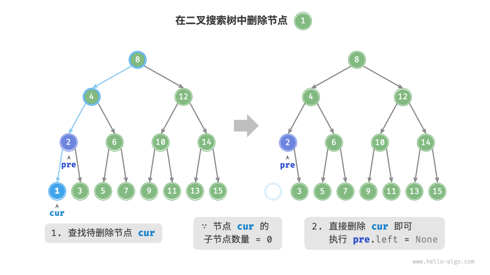
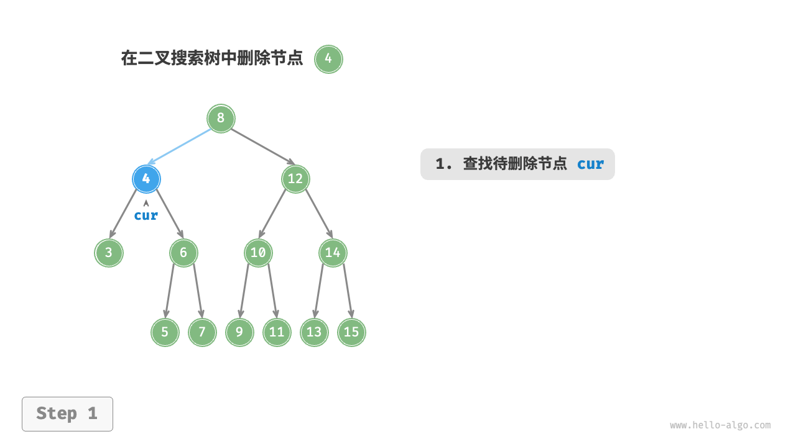
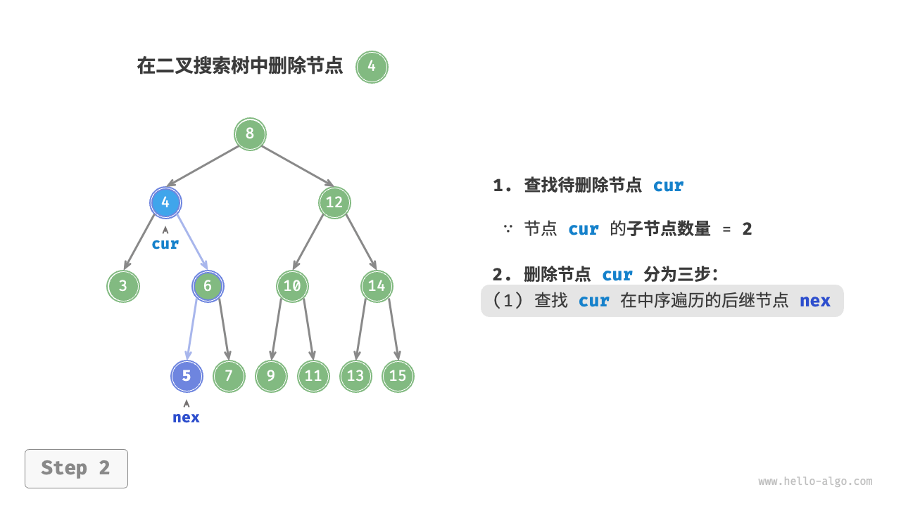

# 二叉搜索树相关内容

从下图所知，二叉搜索树，需要满足以下几个条件。
1. 二叉搜索树本身就是一个二叉树。
2. 左节点的值 < 根节点值 < 右节点值。
3. 根节点下的左右子树也都是二叉搜索树，也满足条件2。


当有了这个条件之后，为什么需要使用这种方式去构建一棵树呢？当我们有一个二叉树之后，如果我们想去查找某个一值，所需要的时间是$O(N)$。需要对每一个节点进行一次遍历才能找到相应的节点。

有了二叉搜索树之后，每到一个`根节点` 时，所搜索的范围就减少一半，所以二叉搜索树的时间复杂度就可以降至为$O(log{}{N})$级别。

## 查找一个节点
假设我们现在想要查到的节点值为`num` ，`cur` 表示我们现在所在节点的位置指针对象。

1. 当`cur.value == num` 时表示我们已经找到这个节点了，直接返回`cur` 即可。
2. 当`cur.value < num` 时表示目标节点在`cur` 的左子树中，`cur = cur.left` 再向左子树中查找数据。
3. 当`cur.value > num` 时表示目标节点在`cur` 的右子树中，`cur = cur.right` 再向右子树中查找数据。

<section>
    
    
</section>
<section>
    
    
</section>

```java
/**
 * 判断数据是否存在，本质上也是一种查找的过程
 */
public boolean exist(Integer value) {
    if (value == null) {
        return false;
    }

    Node cur = root;
    while (cur != null) {
        if (cur.value == value) {
            return true;
        }

        if (cur.value < value) {
            cur = cur.right;
        } else {
            cur = cur.left;
        }
    }

    return false;
```

通过图的查找数据的流程，我们可以看到，每一次查找的过程中，都会对数据进行一次折半过程。所以时间复杂度是不断的*折半* *折半* 的过程。

## 插入过程

与查找过程类似，如下图所示查看一下这一过程。


1. **查找插入位置**: 遵循搜索二叉的基本规则，我们从`root` 节点开始查找，比较`num` 与当前`node` 节点大小，如果`num < node.value` 则向左子树查找，`cur = cur.left` ，如果`num > node.value` 则向右子树进行查找，`cur = cur.right` 。

2. **插入新的节点**: 这里的关键是我们需要记录`pre` 即上一层的节点，然后`new Node(num)` 判断父节点与当前节点的大小`num < pre.value` 表示我们应该将这个新节点插入到**左叶子** ，如果`num > pre.value` 表示我们应该将这个新节点插入到**右叶子** 上。

```java
public void insert(int value) {
    Node cur = this.root, pre = null;

    // 这里对现在的这个树进行查找工作
    while (cur != null) {
        if (cur.value == value) {
            return;
        }

        pre = cur;
        if (cur.value < value) {
            cur = cur.left;
        } else if (cur.value > value) {
            cur = cur.right;
        }
    }

    // 能跳出相应的循环表明现在已经找到了节点高度为0的目标位置
    // 下面就是判断应该将新的节点插入到左节点上还是右节点上
    if (pre.value < value) {
        pre.right = new Node(value);
    } else {
        pre.left = new Node(value);
    }
}

```

## 删除节点

删除节点首先也是要按照搜索的过程去搜索节点，遵循的也是左节点 < 根节点 < 右节点。

但是我们需要分情况:

查找代码（各方法共同点）
```java
public void remove(int value) {
    // ...... some code

    Node cur = this.root, pre = null;

    while (cur != null) {
        if (cur.value == value) {
            break;
        }

        pre = cur;
        if (cur.value < value) {
            cur = cur.right;
        } else {
            cur = cur.left;
        }
    }

    // 说明没有找到需要删除的节点
    if (cur == null) {
        return;
    }

    // ...... some code
}

```

### 情况一: 需要删除节点是叶子节点



如上图所示，我们需要删除的节点是叶子节点，那么我们可以直接删除它。
1. **搜索节点**: `cur.value < num` 则向右进行查找`cur = cur.right` 。`cur.value > num` 则向左进行查找`cur = cur.left` 。

2. **删除** : 这种我们只需要让`cur = null` 就可以删除了。若是C++等语言还需要`free(cur)`，对这块内存区域进行释放，但Java中我们可以将这个工作交于*GC* 去处理。

### 情况二: 删除的节点有单个叶子节点(左或右)即高度为1


如上图所示，我们需要删除的`cur` 节点有子节点，那么不可以直接将`cur`设置为`None`，这样会造成数据的丢失。

所以我们需要将其中的一个子节点(左或右)，我们只需要记录`prev` 父节点，让父节点指向这个节点即可。

1. **搜索节点**: `cur.value < num` 则向右进行查找`cur = cur.right` 。`cur.value > num` 则向左进行查找`cur = cur.left` 。

2. **找到子树**：找到左节点或右节点。我们不需要关心这个子节点是否还有子节点（子树），指向之后不会影响整个树的特性（所有的子树都是BST）。
```java

public void remove(int value) {
    // ... some code
    if (cur.left == null || cur.right == null) {
        // 说明现在需要删除的这个节点有0个或1节点
        Node child = cur.left != null ? cur.left : cur.right;
        // .... some code
    }

    // ... some code
}
```

3. **父节点`prev`指向新节点**： 判断需要删除的这个节点是在父节点的左侧还是右侧，然后根据不同的情况让父节点指向子节点。**如果我们删除的这个节点正好是根节点`root`**，那么我们只需要将`root` 更新为`child` 即可。


```java
public void remove(int value) {

    // ... some code
    if (cur != root) {
        // 判断cur在上一层节点的左子树还是右子树上然后再进行一次更新
        if (pre.left == cur) {
            pre.left = child;
        } else {
            pre.right = child;
        }
    } else {
        // 如果现在删除的节点是根节则需要替换根节点为子节点
        root = child;
    }
    // ... some code
}

```

### 情况三：需要删除的这个节点有两个叶子节点
<section>
    
    
</section>
<section>
    
    
</section>

其删除的流程与上面的步骤是类似的。
1. **检索节点** : 与上面的流程类似，我们需要对现在这个树中的数据进行检索。
2. **查找待删除节点子树中最小值** ：这一步骤还是很重要的，**删除的节点需要用子树中最小值来替换，因为只有这样的操作才可以保持BST树的特性** 。那么如何去查找呢，`temp = cur.right`从右子树中查找最小值，其过程本质是*中序遍历* 不断去查找左节点，直到为`None` 时。

```java

public void remove(int value) {
    // .... some code 

    // 这里是找到当前节点的右子树中最小的值然后替换这个节点
    Node temp = cur.right;
    // 逻辑相当于找到右子树，然后使用中序遍历的方式找到第一个值（即最小值的结点）
    while (temp.left != null) {
        temp = temp.left;
    }

    // .... some code 

}
```

3. **删除找到的节点** :找到替换的节点值之后，还需要将这个节点删除，可以调用自身删除方法`remove(temp.value)` 。

```java
// 这里是找到当前节点的右子树中最小的值然后替换这个节点
Node temp = cur.right;
// 逻辑相当于找到右子树，然后使用中序遍历的方式找到第一个值（即最小值的结点）
while (temp.left != null) {
    temp = temp.left;
}

// 这里再递归找到需要替换cur值的这个节点，把它给删除掉
remove(temp.value);
```

4. **替换节点值** : 将找到的节点值替换到`cur` 这个节点中即可。
```java
cur.value = temp.value;
```

## 有序遍历
因为BST的特性，我们可知如果使用**中序遍历** 取得的数据就是一个有序的列表。


## 二叉树的效率
给定一组数据，我们考虑使用数组或二叉搜索树存储。观察下表，二叉搜索树的各项操作的时间复杂度都是对数阶，具有稳定且高效的性能。只有在高频添加、低频查找删除数据的场景下，数组比二叉搜索树的效率更高。

|      | 数组   | 二叉搜索树    |
|------|--------|---------------|
| 查找 | $O(n)$ | $O(log{}{N})$ |
| 插入 | $O(1)$ | $O(log{}{N})$ |
| 删除 | $O(N)$ | $O(log{}{N})$ |

理想情况下，二叉搜索树是一个平衡的状态，但是如果插入的元素本身是一个有序的，或者在删除的过程中变成*有序* 的，现在二叉搜索树会退化成链表。效率也会退化为$O(N)$级别。


