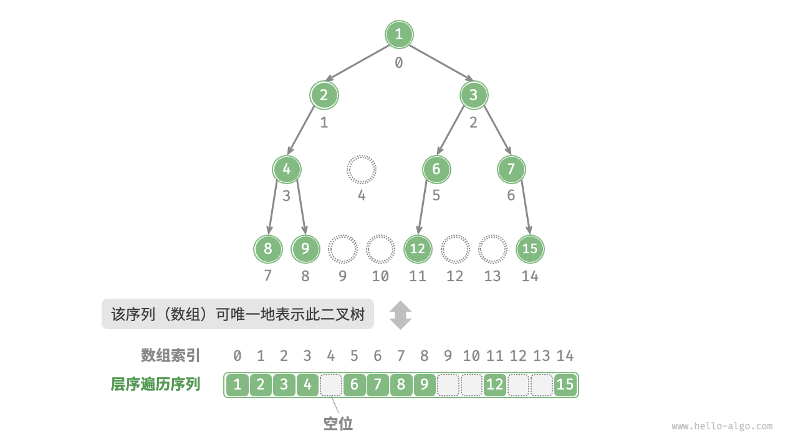

# 二叉树使用数组表示

一般情况下我们都是使用指针来构建二叉树。那么是否可以使用数组来表示二叉树吗？答案肯定是可以的。

## 表示完美二叉树
给定一棵完美二叉树，我们将所有节点按照层序遍历的顺序存储在一个数组中，则每个节点都对应唯一的数组索引。

根据层序遍历的特性，我们可以推导出父节点索引与子节点索引之间“映射公式”：**若某个节点的索引为$i$，则该节点的左子节点索引为$2i + 1$，右子节点索引为$2i + 2$** 。

 

**映射公式的角色相当于链表中的节点引用（指针）** 。给定数组中的任意一个节点，我们都可以通过映射公式来访问它的左（右）子节点。

## 表示任意二叉树
完美二叉树是一个特例，在二叉树的中间层通常存在许多`None` 。由于层序遍历序列并不包含这些`None` ，因此我们无法仅凭该序列来推测`None` 的数量和分布位置。**这意味着存在多种二叉树结构都符合该层序遍历序列** 。

上面的图如果按照之前处理，可以看到这种表示方法已经失效了。

为了解决此问题，**我们可以考虑在层序遍历序列中显式地写出所有`None` ** 。这样处理后层序遍历序列就可以唯一表示二叉树了。

值得说明的是，**完全二叉树非常适合使用数组来表示** 。`None` 只出现在最底层且靠右的位置，**因此所有`None` 一定出现在层序遍历序列的末尾** 。

这意味着使用数组表示完全二叉树时，可以省略存储所有`None` ，非常方便。

