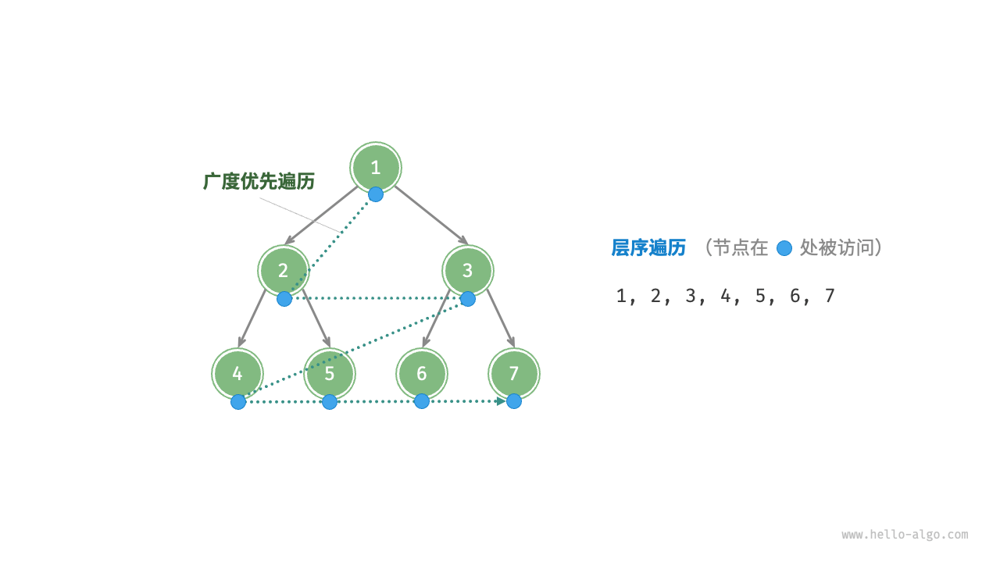

# 层序遍历（广度优先遍历||广度优先搜索）

**层序遍历（level-order traversal）** 从顶部到底部逐层遍历二叉树，并在每一层按照从左到右的顺序访问节点。

层序遍历本质上属于**广度优先遍历（breadth-first traversal）** ，也称**广度优先搜索（breadth-first search,BFS）** 它体现了一种“一圈一圈向外扩展”的逐层遍历方式。




## 方法一

```java
public List<BinaryTree> levelOrder() {
    Queue<BinaryTree> queue = new LinkedList<>();
    List<BinaryTree> nodesByLevelOrder = new ArrayList<>();

    queue.add(this.root);

    // 使用队列去进行层优先遍历
    while (!queue.isEmpty()) {
        BinaryTree bt = queue.poll();
        nodesByLevelOrder.add(bt);

        if (bt.left != null) {
            queue.add(bt.left);
        }
        if (bt.right != null) {
            queue.add(bt.right);
        }
    }

    return nodesByLevelOrder;
}

```

这种写法的最大优势就是简单。每次把队头元素拿出来，然后把它的左右子节点加入队列，就完事了。

但是这种写法的缺点是，无法知道当前节点在第几次。知道节点的层数是个常见的需求，比方说收集每一层的节点，或者计算二叉树的最小深度等等。

所以这种写法虽然简单，但用的不多。

## 方法二
```java
public List<BinaryTree> levelOrder2() {
    Queue<BinaryTree> queue = new LinkedList<>();

    List<BinaryTree> rtnList = new ArrayList<>();
    // 将根节点加入到队列中
    queue.offer(root);

    int depth = 1;
    // 对节点进行遍历操作
    while (!queue.isEmpty()) {
        int size = queue.size();

        // 使用for循环将一个层级的节点都取出来
        for (int i = 0; i < size; i++) {
            BinaryTree bt = queue.poll();
            bt.depth = depth;

            rtnList.add(bt);

            if (bt.left != null) {
                queue.add(bt.left);
            }

            if (bt.right != null) {
                queue.add(bt.right);
            }

        }

        depth++;

    }

    return rtnList;
}

```

对一个层级进行处理添加到列表中的操作如下：
```java
int size = queue.size();

for (int i = 0; i < size; i++) {
    ...
}
```

当然还有另一种写法
```java
int size = queue.size();
while (size-- > 0) {
    ...
}
```

这里的`size` 大小一定要在循环处理前定义并赋值，否则会出现问题，因为`queue` 的长度是动态变化的过程。


## 复杂度分析
* **时间复杂度$O(n)$** ：所有节点被访问一次，使用$O(n)$时间，其中$n$为节点数量。
* **空间复杂度$O(n)$** ：在最差情况，即满二叉树时，遍历到最底层之前，队列中最多同时存在$(n+1)/2$个节点，占用$O(n)$空间。
