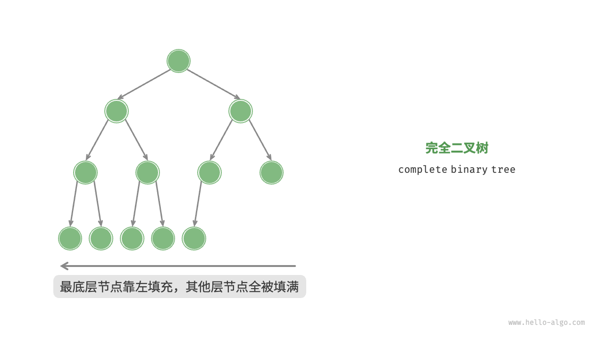

# 二叉树的相关概念

**二叉树(binary tree)** 是一种非线性数据结构，代表“祖先”与“后代”之间的派生关系，体现了“一分为二”的分治逻辑。与链表类似，二叉树的基本单元是节点，每个节点包含值、左子节点引用和右子节点引用。

```java
public class TreeNode {
    // 数据
    int val;
    // 左侧节点的指针
    BinaryTree left;
    // 右侧节点的指针
    BinaryTree right;
}
```

每个节点都有两个引用（指针），分别指向**左子节点（left-child node）** 和**右子节点（right-child node）** ，该节点称为这两个子节点的**父节点（parent node）** 。给当定一个二叉树的节点时，我们将该左子节点形成的树称为该节点的**左子树（left subtree）** ，同理可得**右子树（right substree）**。

**在二叉树中，除叶节点外，其他所有节点都包含子节点和非空子树** 。


## 二叉树的常见术语
* **根节点（root node）** ：位于二叉树顶层节点，没有父节点。
* **叶节点（leaf node）** ：没有子节点的节点，其两个指针均指向`None`。
* **连（edge）** ：连接两个节点的线段，即节点引用（指针）。
* **节点所在的层（level）** ：从顶至底递增，根节点所在层为1。
* **节点的度（degree）** ：节点的子节点的数量。在二叉树中，度的取值范围是0、1、2* **二叉树的高度（height）** ：从根节点到最远叶节点所经过连的数量。
* **节点的深度（depth）** ：从根节点到该节点所经过的边的数量。
* **节点的高度（height）** ：从距离该节点最远的叶节点到该节点所经过的连的数量。


## 二叉树的基本操作

### 初始化二叉树
```java
BinaryTree root = new BinaryTree(1);

root.left = new BinaryTree(2);
root.right = new BinaryTree(3);
```

使用引用（指针）来构建二叉树。

### 插入和删除节点


## 常见的二叉树类型

### 完美二叉树
**完美二叉树（perfect binary tree）** 所有层的节点都被完全填满。在完美二叉树中，叶节点的度为0，其余所有节点的度都为2；若树的高度为h，则节点总数为$2^{h+1} - 1$ 呈现标准的指数级关系，反映了自然界中常见的细胞分裂现象。


### 完全二叉树
**完全二叉树（complete binary tree）** 只有最底层的节点未被填满，且最底层节点尽量靠左填充。请注意，完美二叉树也是一棵完全二叉树。



#### 完满二叉树
**完满二叉树（full binary tree）** 除了叶节点之外，其余所有节点都两个子节点。


### 平衡二叉树
**平衡二叉树（balanced binary tree）** 中任意节点的左子树和右子树的高度之差的绝对值不超过1。


## 二叉树的退化
* 完美二叉树是理想情况，可以充分发挥二叉树“分治”的优势。
* 链表则是另一个极端，各项操作都变为线性操作，时间复杂度退化至$O(n)$。


