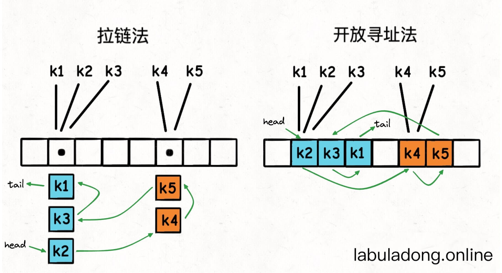

# 用链表加强哈希表(LinkedHashMap)

在之前我们学习过`哈希表` 原理，哈希表底层是使用数组来实现的，元素的位置是利用`hash(key)` 来计算的，那么插入的位置是*随机* 的，所以在使用如`keys()` 或`values()` 方法时，取得的列表就是无序的。 

但是在Python 3.7开始，标准库提供的哈希表`dict` 就明确说明了，`dict` 键的遍历顺序就是键的插入顺序。

```python
d = dict()

d['a'] = 1
d['b'] = 2
d['c'] = 3
print(list(d.keys()))  # ['a', 'b', 'c']

d['y'] = 4
print(list(d.keys()))  # ['a', 'b', 'c', 'y']

d['d'] = 5
print(list(d.keys()))  # ['a', 'b', 'c', 'y', 'd']
```

无论插入多少键，`keys` 方法返回的所有键都是按照插入顺序排列，感觉就好像向数组尾部追加元素一样。

## 哈希链表(LinkedHashMap)实现思路

先看下面的图，标准的哈希表键是无序存储在底层`table` 数组中的:

 

不管是哪一种实现方法，我们是无法得知这些键值对是什么时候插入到表中的。

而且当表扩容的时候这些键的位置还会再改变。那么现在我们在不改变哈希表增删改查复杂度的情况下，能够按照插入顺序来访问所有的键，且不受扩缩容影响。

那么一个直接的思路就是，我想办法把这些键值对都用类似链表节点的结构串起来，**持有一个头尾节点, head tail** 的引用，每次把新的键插入`table` 数组时，同时把这个键插入链表的尾部。


这样一来，只要我从头节点`head` 开始遍历链表，就能按照插入顺序访问所有键了：
 

假设键和值都是字符串类型，标准的哈希表是这样的：
```java
HashMap<String, String> map = new HashMap<>();

String key = "k1";
String value = "v1";

map.put(key, value);
```

而现在我们在给哈希表的值类型嵌套了一层双链表结构：
```java
class Node {
    String key;
    String value;
    Node prev;
    Node next;

    Node(String key, String value) {
        this.key = key;
        this.value = value;
    }
}

HashMap<String, Node> map = new HashMap<>();

String key = "k1";
String value = "v1";

map.put(key, new Node(key, value));
```

这样一来就实现了哈希链表结构：

* 我们还可以在$O(1)$的时间复杂度内通过键查找到对应的又链表节点，进而找到键对应的值。
* 我们可以在$O(1)$的时间复杂度内插入新的键值对。因为哈希表本身的插入操作时间复杂度是$O(1)$，且双链表头尾的插入操作时间复杂度也是$O(1)$。
* 我们可以在$O(1)$的时间复杂度内删除指定的键值对。因为哈希表本身的删除操作时间复杂度是$O(1)$，删除给定双链表节点的操作时间复杂度也是$O(1)$。
* 由于链表节点顺序是插入顺序，那只要从头节点开始遍历这个链表，就能按照插入顺序访问所有键。

## 代码实现
初步实现的时候是考虑将`head` 以及 `tail` 也是一个真实的节点，那么如果实现这个目标就需要，去判断`head` 和`tail` 是不为空也就是说当插入第一元素的时候会有这样的问题。代码如下：
```java
public class LinkedHashMap<K, V> {
    // 使用HashMap来实现有序的Map
    private HashMap<K, Node<K, V>> map;
    // 表的头节点
    private Node<K, V> head;
    // 表的尾节点
    private Node<K, V> tail;

    public LinkedHashMap() {
        map = new HashMap<>();
        head = null;
        tail = null;
    }

    /**
     * 向表中插入一对键值对
     *
     * @param key   键
     * @param value 值
     */
    public void put(K key, V value) {
        if (key == null) {
            throw new IllegalArgumentException();
        }

        Node<K, V> node = new Node<>(key, value);
        if (head == null) {
            head = node;
            map.put(key, node);
            return;
        }

        if (tail == null) {
            head.next = node;
            node.prev = head;
            tail = node;
            map.put(key, node);
            return;
        }

        node.prev = tail;
        tail.next = node;
        tail = node;
        map.put(key, node);
    }

    /**
     * 删除某个节点
     *
     * @param key 键
     */
    public void remove(K key) {
        if (key == null) {
            throw new IllegalArgumentException();
        }

        Node<K, V> node = getNode(key);
        if (node == null) {
            throw new IllegalArgumentException();
        }

        map.remove(key);
        // 如果删除的这个节点是记录的头节点
        if (node == head) {
            head = node.next;
            if (node.next != null) {
                node.next.prev = null;
                node.next = null;
            }

            return;
        }

        if (node == tail) {
            tail = node.prev;
            if (node.prev != null) {
                node.prev.next = null;
                node.prev = null;
            }

            return;
        }

        node.prev.next = node.next;
        node.next.prev = node.prev;
        node.next = null;
        node.prev = null;
    }

    /**
     * 获得表中的所有的数据但是按照顺序来的
     */
    public List<V> values() {
        if (map.isEmpty()) {
            return Collections.emptyList();
        }

        List<V> values = new ArrayList<>();

        Node<K, V> temp = head;
        // 对现在这个链表进行遍历按顺序拿到所有的节点
        while (temp == null) {
            values.add(temp.value);
            temp = temp.next;
        }

        return values;
    }

}
```

上面代码的实现可以方式可以看作是一个**无头节点** 的双向链表。

那么为了减少判断的情况发生我们可以使用有头有尾的双向链表设计形式。
```java

public LinkedHashMap() {
    map = new HashMap<>();
    head = new Node<K, V>(null, null);
    tail = new Node<K, V>(null, null);

    head.next = tail;
    tail.prev = head;
}

```

那么在加入的方法中，因为`head` 和`tail` 已经互相指向了，不需要再单独去判断现在表中是否为空。

```java
/**
 * 向表中插入一对键值对
 *
 * @param key   键
 * @param value 值
 */
public void put(K key, V value) {
    if (key == null) {
        throw new IllegalArgumentException();
    }

    // 现在表中已经有这个节点了，只需要去更新一下这个节点的value值
    if (map.containsKey(key)) {

        Node<K, V> node = map.get(key);
        node.value = value;

        return;
    }

    Node<K, V> node = new Node<>(key, value);
    // 把节点也要添加到linkedlist中去
    add2list(node);
    // 把节点放至到表中
    map.put(key, node);
}

/**
 * 删除某个节点
 *
 * @param key 键
 */
public void remove(K key) {
    if (key == null) {
        throw new IllegalArgumentException();
    }

    if (!map.containsKey(key)) {
        return;
    }

    Node<K, V> node = map.get(key);

    // 从表以及链中删除
    removeFromList(node);
    map.remove(key);

}
```

这两个函数展示了如何向节点添加/删除一个节点。

