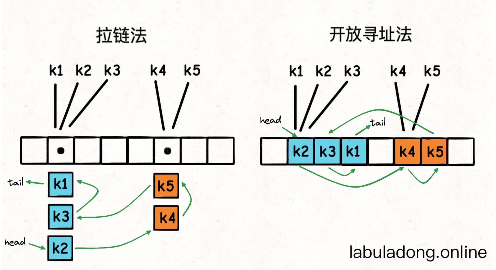

## 用链表加强哈希表(LinkedHashMap)

在之前我们学习过`哈希表` 原理，哈希表底层是使用数组来实现的，元素的位置是利用`hash(key)` 来计算的，那么插入的位置是*随机* 的，所以在使用如`keys()` 或`values()` 方法时，取得的列表就是无序的。 

但是在Python 3.7开始，标准库提供的哈希表`dict` 就明确说明了，`dict` 键的遍历顺序就是键的插入顺序。

```python
d = dict()

d['a'] = 1
d['b'] = 2
d['c'] = 3
print(list(d.keys()))  # ['a', 'b', 'c']

d['y'] = 4
print(list(d.keys()))  # ['a', 'b', 'c', 'y']

d['d'] = 5
print(list(d.keys()))  # ['a', 'b', 'c', 'y', 'd']
```

无论插入多少键，`keys` 方法返回的所有键都是按照插入顺序排列，感觉就好像向数组尾部追加元素一样。

### 哈希链表(LinkedHashMap)实现思路

先看下面的图，标准的哈希表键是无序存储在底层`table` 数组中的:

 

不管是哪一种实现方法，我们是无法得知这些键值对是什么时候插入到表中的。

而且当表扩容的时候这些键的位置还会再改变。那么现在我们在不改变哈希表增删改查复杂度的情况下，能够按照插入顺序来访问所有的键，且不受扩缩容影响。

那么一个直接的思路就是，我想办法把这些键值对都用类似链表节点的结构串起来，**持有一个头尾节点, head tail** 的引用，每次把新的键插入`table` 数组时，同时把这个键插入链表的尾部。


这样一来，只要我从头节点`head` 开始遍历链表，就能按照插入顺序访问所有键了：
 

假设键和值都是字符串类型，标准的哈希表是这样的：
```java
HashMap<String, String> map = new HashMap<>();

String key = "k1";
String value = "v1";

map.put(key, value);
```

而现在我们在给哈希表的值类型嵌套了一层双链表结构：
```java
class Node {
    String key;
    String value;
    Node prev;
    Node next;

    Node(String key, String value) {
        this.key = key;
        this.value = value;
    }
}

HashMap<String, Node> map = new HashMap<>();

String key = "k1";
String value = "v1";

map.put(key, new Node(key, value));
```

这样一来就实现了哈希链表结构：

* 我们还可以在$O(1)$的时间复杂度内通过键查找到对应的又链表节点，进而找到键对应的值。
* 我们可以在$O(1)$的时间复杂度内插入新的键值对。因为哈希表本身的插入操作时间复杂度是$O(1)$，且双链表头尾的插入操作时间复杂度也是$O(1)$。
* 我们可以在$O(1)$的时间复杂度内删除指定的键值对。因为哈希表本身的删除操作时间复杂度是$O(1)$，删除给定双链表节点的操作时间复杂度也是$O(1)$。
* 由于链表节点顺序是插入顺序，那只要从头节点开始遍历这个链表，就能按照插入顺序访问所有键。

