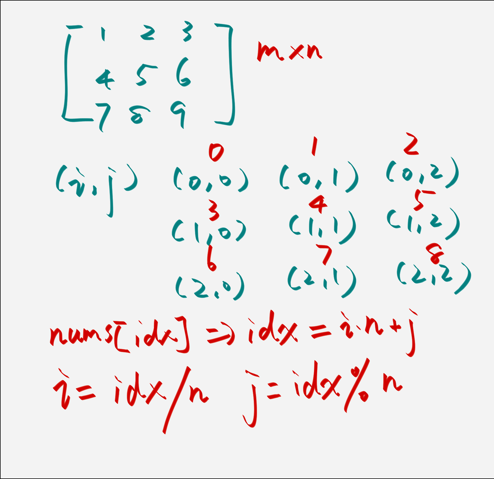

# 1260. 二维网格迁移 

[连接](https://leetcode.cn/problems/shift-2d-grid/submissions/634710526/)

## 解法一
1. 二维数组先转化为一维数组。
2. 可以把这个一维数组看作一个循环一维数组。
3. 起始点是 `start = 0` 然后根据 `k` 循环 `k` 次，`start = ((start - 1) + length) % length`。
4. 然后再将一维数组里的值从 `start` 到 `start - 1` 为止。

```java
public List<List<Integer>> shiftGrid(int[][] grid, int k) {
    int m = grid.length, n = grid[0].length;
    // m * n的二维数组大小
    int size = m * n;
    int[] nums = new int[size];
    int i = 0;
    // 将二维数组转换为一维数组
    for (int[] list : grid) {
        for (int num : list) {
            nums[i] = num;
            i++;
        }
    }

    int start = 0;
    // 找到起始位置
    for (i = 1; i <= k; i++) {
        start = ((start - 1) + nums.length) % nums.length;
    }

    List<List<Integer>> result = new ArrayList<>();
    List<Integer> list = new ArrayList<>();
    while (result.size() < m) {
        if (list.size() == n) {
            result.add(list);
            list = new ArrayList<>();
        }

        list.add(nums[start]);
        start = (start + 1) % size;
    }

    return result;
}
```

## 解法二

可以根据下图的关系:


>[!important]
> 我们以 `(i, j)` 来代表二维数组的下标，这个二维数组是 `m * n` 大小的矩阵，其对应的一维数组下标为 `idx`。
> 
> 关系是 `idx = i * n + j`，`i = idx / n` ，`j = idx % n` 。

```java
public List<List<Integer>> shiftGrid(int[][] grid, int k) {
    int m = grid.length, n = grid[0].length;
    int size = m * n;

    int start = 0;
    for (int i = 1; i <= k; i++) {
        start = ((start - 1) + size) % size;
    }

    List<List<Integer>> result = new ArrayList<>();
    List<Integer> list = new ArrayList<>();
    while (result.size() < m) {
        if (list.size() == n) {
            result.add(list);
            list = new ArrayList<>();
        }

        int i = start / n;
        int j = start % n;
        list.add(grid[i][j]);
        start = (start + 1) % size;
    }
    return result;
}
```

### 解法3
这题的思路是: 
1. 把这个二维数组抽象成一维数组，将一个一维的数组平移 `k` 位，相当于把前 `mn - k` 个元素的位置和后 `k` 个元素的位置对调，也可以分别翻转前 `mn - k` 个元素和后 `k` 个元素，最后反转所有元素，得到的就是最终的结果。

```java
class Solution {
    public List<List<Integer>> shiftGrid(int[][] grid, int k) {
        int m = grid.length, n = grid[0].length;
        int mn = m * n;
        k = k % mn;

        // 翻转 [mn-k, size - 1];
        reverse(grid, mn - k, mn - 1);
        // 翻转 [0, mn - k)
        reverse(grid, 0, mn - k - 1);
        // 全部翻转一次
        reverse(grid, 0, mn - 1);

        List<List<Integer>> collection = new ArrayList<>();
        for (int[] nums : grid) {
            List<Integer> list = new ArrayList<>();
            for (int num : nums) {
                list.add(num);
            }

            collection.add(list);
        }

        return collection;
    }

    public void setGrid(int[][] grid, int index, int value) {
        int n = grid[0].length;
        int i = index / n;
        int j = index % n;

        grid[i][j] = value;
    }

    public int getGrid(int[][] grid, int index) {
        int n = grid[0].length;
        int i = index / n;
        int j = index % n;

        return grid[i][j];
    }

    // 对于 (start, end]区间内的矩阵进行反转
    public void reverse(int[][] grid, int start, int end) {
        int left = start, right = end;
        while (left <= right) {
            int temp = getGrid(grid, left);
            setGrid(grid, left, getGrid(grid, right));
            setGrid(grid, right, temp);

            left++;
            right--;
        }
    }
}
```


